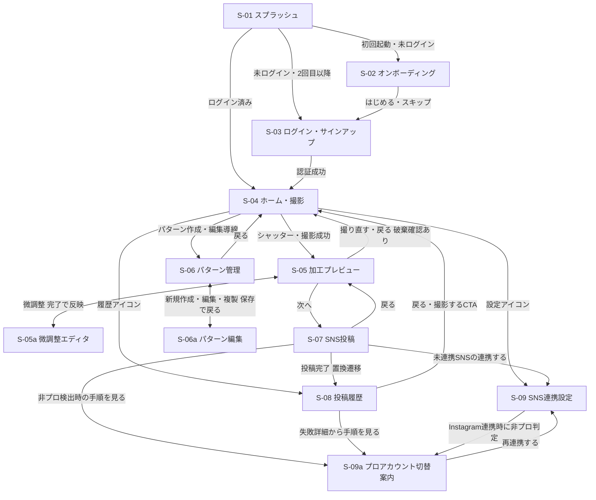
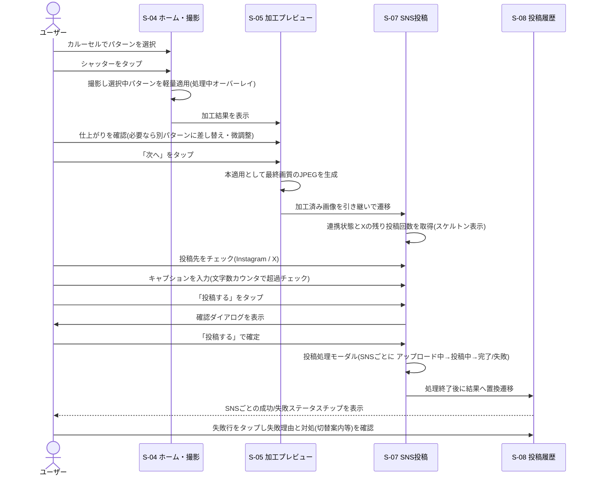
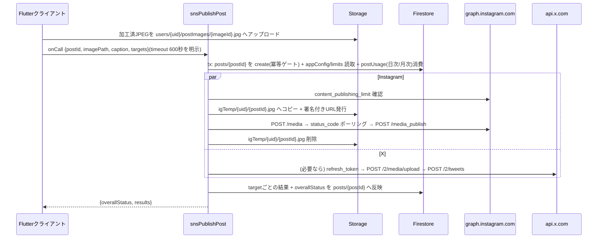
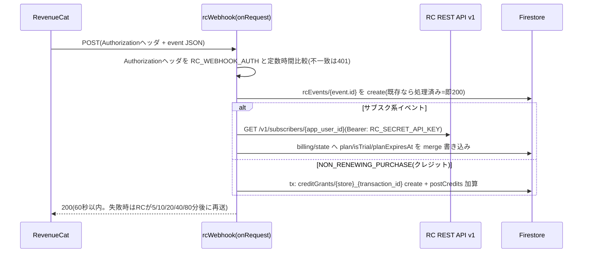
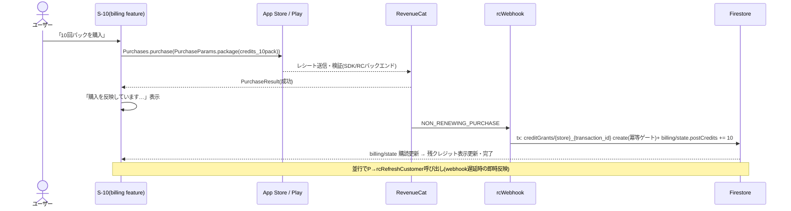
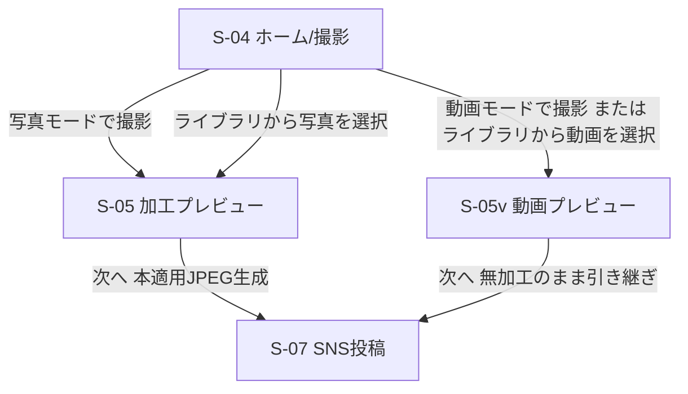

# flutter-camera 詳細設計書

要件定義: [requirements.md](./requirements.md)

本書は要件定義に基づく詳細設計である。第1〜5章はコア機能の設計、第6〜8章は収益化・コスト制御・リテンション要件(要件§3.2/§3.3、案B)の追補設計。各章は分担設計の後、要件カバレッジ・公式API仕様との整合・章間整合のレビューと改訂を経ている。

## 目次

1. アプリアーキテクチャ設計
2. 画面設計・UIフロー
3. カメラ・自動加工パイプライン設計
4. データモデル・ストレージ・セキュリティルール設計
5. SNS連携バックエンド設計(Cloud Functions)
6. 課金(IAP)・ペイウォール設計
7. X投稿枠・クレジット制御設計
8. リテンション機能設計(プリセット/配信/ダッシュボード)
9. 追補による既存章への変更点
10. メディア取り込み・動画対応(追補設計)
11. リリース準備追補(アカウント管理・乱用対策配線・App Check)
12. 未解決事項

## アプリアーキテクチャ設計

### アーキテクチャ全体像

Feature-First 構成 + 3層レイヤード(presentation / domain / data)を採用する。状態管理・DIは Riverpod 3.x(riverpod_annotation によるコード生成)に一本化し、`get_it` 等のサービスロケーターは導入しない。画面遷移は GoRouter、イミュータブルモデルは Freezed、HTTP は Dio、バックエンドアクセスは FlutterFire 各SDK(Functions は `instanceFor(region: 'asia-northeast1')`)を使用する。

- アプリのエントリポイントは `main.dart`(`Firebase.initializeApp` 前の最小処理 + `ProviderScope` + `runApp`)。起動処理本体は `appStartupProvider` に集約し、完了までスプラッシュを表示する。
- OAuth のトークンはクライアントに保持しない(要件どおりトークン交換・保管は Cloud Functions / Firestore 側)。そのため `flutter_secure_storage` 等のクライアント側トークン保管は導入しない。クライアントが扱うのは flutter_appauth で取得した認可コードまで。

### ディレクトリ構造(Feature-First)

要件の features(camera / editor / patterns / posting / sns_accounts / auth / history)に加え、画面1・2 をカバーする `startup`(スプラッシュ+起動処理)と `onboarding` を追加する。

```
lib/
├── main.dart                                  # ProviderScope + runApp
├── firebase_options.dart                      # flutterfire configure 生成物
└── src/
    ├── app.dart                               # MaterialApp.router(goRouterProvider を watch)
    ├── common_widgets/                        # feature 横断の共通ウィジェット
    │   ├── async_value_widget.dart            # AsyncValue の共通描画(data/loading/error)
    │   ├── app_error_view.dart                # エラー表示 + 再試行ボタン
    │   ├── confirm_dialog.dart
    │   └── primary_button.dart
    ├── core/
    │   ├── constants/
    │   │   ├── app_sizes.dart
    │   │   └── app_durations.dart
    │   ├── error/
    │   │   ├── app_exception.dart             # sealed AppException 階層
    │   │   ├── result.dart                    # sealed Result<T>
    │   │   ├── error_mapper.dart              # AppException → 日本語UIメッセージ
    │   │   └── error_listener.dart            # ref.listen 用共通拡張(SnackBar 表示)
    │   ├── firebase/
    │   │   └── firebase_providers.dart        # Auth/Firestore/Storage/Functions(asia-northeast1)
    │   ├── models/
    │   │   └── sns_provider.dart              # enum SnsProvider { instagram, x } ※複数 feature が参照(Firestore の provider フィールドと整合)
    │   ├── network/
    │   │   └── dio_provider.dart              # Dio 生成(タイムアウト・LogInterceptor)
    │   └── utils/
    │       └── app_logger.dart
    ├── routing/
    │   ├── app_router.dart                    # goRouterProvider(redirect / refreshListenable)
    │   ├── app_route.dart                     # enum AppRoute(ルート名・パス定数)
    │   └── go_router_refresh.dart             # redirect 再評価用 ChangeNotifier(認証・起動完了・オンボーディングの変化を合成通知)
    └── features/
        ├── startup/
        │   ├── app_startup_provider.dart      # Firebase 初期化等の起動処理(小規模のため層省略)
        │   └── presentation/
        │       └── splash_screen.dart         # 画面1 スプラッシュ
        ├── onboarding/
        │   ├── presentation/
        │   │   ├── onboarding_screen.dart     # 画面2 オンボーディング(SNS連携・プロアカウント要件案内)
        │   │   └── onboarding_state_provider.dart
        │   └── data/
        │       └── onboarding_repository.dart # shared_preferences で完了フラグ永続化
        ├── auth/
        │   ├── presentation/
        │   │   ├── sign_in_screen.dart        # 画面3 ログイン/サインアップ
        │   │   └── sign_in_controller.dart
        │   ├── domain/
        │   │   ├── app_user.dart              # Freezed
        │   │   └── auth_repository.dart       # abstract interface
        │   └── data/
        │       └── firebase_auth_repository.dart  # 実装 + authRepositoryProvider 定義
        ├── camera/
        │   ├── presentation/
        │   │   ├── camera_screen.dart         # 画面4 ホーム/撮影(プレビュー+パターンカルーセル)
        │   │   ├── camera_controller_notifier.dart
        │   │   └── widgets/
        │   │       └── pattern_carousel.dart  # 中身の詳細は ui 担当
        │   ├── domain/
        │   │   └── captured_photo.dart        # 撮影結果(一時ファイルパス・レンズ向き)
        │   └── data/
        │       └── camera_service.dart        # camera プラグインのラッパ
        ├── editor/
        │   ├── presentation/
        │   │   ├── edit_preview_screen.dart   # 画面5 加工プレビュー
        │   │   └── edit_preview_controller.dart
        │   ├── domain/
        │   │   ├── edited_image.dart          # 加工確定結果(出力 JPEG パス等)
        │   │   └── pattern_apply_service.dart # abstract(実装詳細は imaging 担当)
        │   └── data/
        │       └── pro_image_editor_apply_service.dart
        ├── patterns/
        │   ├── presentation/
        │   │   ├── pattern_list_screen.dart   # 画面6 パターン管理(一覧)
        │   │   ├── pattern_edit_screen.dart   # 画面6 パターン管理(新規/編集)
        │   │   ├── selected_pattern_provider.dart
        │   │   └── pattern_edit_controller.dart
        │   ├── domain/
        │   │   ├── pattern.dart               # Freezed(id/name/ownerType/ownerUid/filterParams/frameAssetPath/stampLayers)
        │   │   ├── filter_params.dart         # Freezed(brightness/contrast/saturation/exposure/hue/temperature/tint/fade/smoothing)
        │   │   ├── stamp_layer.dart           # Freezed(assetPath/cx/cy/widthRatio/rotation)
        │   │   └── pattern_repository.dart
        │   └── data/
        │       └── firestore_pattern_repository.dart  # トップレベル patterns コレクション(プリセット+マイパターン)。スキーマ詳細は data 担当
        ├── posting/
        │   ├── presentation/
        │   │   ├── post_compose_screen.dart   # 画面7 SNS投稿(投稿先選択・キャプション)
        │   │   └── post_compose_controller.dart
        │   ├── domain/
        │   │   ├── post.dart                  # Freezed(id/userId/imageUrl/targets/各 status)
        │   │   ├── post_target_status.dart    # enum(pending/processing/succeeded/failed)
        │   │   └── post_repository.dart
        │   └── data/
        │       ├── functions_post_repository.dart   # 投稿作成の Cloud Functions 呼び出し
        │       └── storage_upload_service.dart      # 加工画像の一時アップロード(公開URL発行用)
        ├── history/
        │   ├── presentation/
        │   │   └── post_history_screen.dart   # 画面8 投稿履歴/ステータス
        │   └── data/
        │       └── firestore_post_history_repository.dart  # Post モデルは posting/domain を参照
        └── sns_accounts/
            ├── presentation/
            │   ├── sns_accounts_screen.dart          # 画面9 SNSアカウント連携設定
            │   ├── instagram_pro_guide_screen.dart   # プロアカウント切替案内(画面9のサブページ)
            │   └── sns_connect_controller.dart
            ├── domain/
            │   ├── sns_connection.dart        # Freezed(provider/接続状態/アカウント名/プロ判定)
            │   └── sns_account_repository.dart
            └── data/
                ├── app_auth_service.dart              # flutter_appauth ラッパ(認可コード+PKCE 取得)
                └── functions_sns_account_repository.dart  # トークン交換 Functions 呼び出し・連携状態購読
```

パターンのデータモデル(`Pattern` / `FilterParams` / `StampLayer`)のフィールド定義・値域(pro_image_editor の tune プリセット準拠)・Firestore スキーマ(トップレベル `patterns` コレクション、`ownerType: 'preset' | 'user'` による運営プリセット対応)は **data セクションの統合スキーマを唯一の正**とする(imaging セクションは参照のみ)。本セクションの記載はファイル配置を示すものであり、フィールドの重複定義を行わない。

テストは `test/` に上記 features 構造をミラーして配置(単体・ウィジェットテスト、mocktail 使用)。E2E コードは `integration_test/` に配置する(結合テストの実施自体は RYO の手動検証)。

### レイヤー責務と依存方向

| レイヤー | 置くもの | 責務 | 禁止事項 |
|---|---|---|---|
| presentation | Screen / Widget / Controller(Riverpod Notifier・AsyncNotifier)/ 画面ローカル状態プロバイダー | UI 描画、ユーザー操作の受付、domain の呼び出し、`AsyncValue` によるロード・エラー状態管理 | data 層クラスの直接 import(必ず domain のインターフェース型で受ける)、ビジネスロジックの実装 |
| domain | Freezed エンティティ、リポジトリ/サービスの abstract インターフェース、値オブジェクト・enum | ビジネスルールと型の定義。Flutter SDK・Firebase SDK に依存しない純 Dart(Freezed/json アノテーションは可) | 他レイヤーへの依存、SDK 型(`DocumentSnapshot` 等)の露出 |
| data | リポジトリ実装、外部 SDK ラッパ(camera / flutter_appauth / pro_image_editor / FlutterFire / Dio)、DTO⇄エンティティ変換 | 外部 I/O の実行、SDK 例外の `AppException` への変換、リポジトリプロバイダーの定義(戻り型は domain のインターフェース) | presentation への依存、UI 関連処理 |

依存方向: `presentation → domain ← data`(依存性逆転)。DI は「data 層のファイル内に `@Riverpod(keepAlive: true)` でインターフェース型を返すプロバイダーを定義し、presentation はそれを watch する」ことで実現する。

feature 間ルール:
- 参照してよいのは他 feature の **domain 層のみ**(例: `history` → `posting/domain/post.dart`)。presentation / data の跨ぎ参照は禁止。
- 3 feature 以上から参照される型(`SnsProvider` 等)は `core/models/` へ昇格する。
- `core` と `common_widgets` はどの feature からも参照可。逆に `core` から `features/` への依存は禁止。

### Riverpod 3.0 プロバイダー設計

riverpod_annotation のコード生成を全面採用する。関数型プロバイダーはデフォルトで autoDispose、常駐が必要なものだけ `@Riverpod(keepAlive: true)` を付ける。副作用の実行(サインイン・保存・投稿など)は `AsyncNotifier` 系の Controller に統一し、UI は `AsyncValue` を watch する。

| プロバイダー名 | 種別(コード生成形) | keepAlive | 責務 | 主な依存 |
|---|---|---|---|---|
| `appStartupProvider` | `@riverpod Future<void>` | ○ | Firebase 初期化・オンボーディングフラグ復元等の起動処理。完了までスプラッシュ表示 | `onboardingStateProvider` |
| `dioProvider` | `@riverpod Dio`(関数) | ○ | Dio 生成(タイムアウト 10s・LogInterceptor) | - |
| `firebaseAuthProvider` | 関数 | ○ | `FirebaseAuth.instance` の提供 | - |
| `firestoreProvider` | 関数 | ○ | `FirebaseFirestore.instance` の提供 | - |
| `firebaseStorageProvider` | 関数 | ○ | `FirebaseStorage.instance` の提供 | - |
| `firebaseFunctionsProvider` | 関数 | ○ | `FirebaseFunctions.instanceFor(region: 'asia-northeast1')` の提供 | - |
| `goRouterProvider` | 関数 | ○ | GoRouter 生成(redirect / refreshListenable 配線。再評価契機は `ref.listen` で合成) | `authStateChangesProvider`, `onboardingStateProvider`, `appStartupProvider` |
| `authRepositoryProvider` | 関数(`AuthRepository` を返す) | ○ | 認証リポジトリ実装の DI | `firebaseAuthProvider`, `firestoreProvider` |
| `authStateChangesProvider` | `@riverpod Stream<AppUser?>` | ○ | 認証状態の購読(ルートガード判定の単一情報源) | `authRepositoryProvider` |
| `signInControllerProvider` | class(`AsyncNotifier<void>`) | - | メール/パスワードのサインイン・サインアップ実行 | `authRepositoryProvider` |
| `onboardingRepositoryProvider` | 関数 | ○ | shared_preferences での完了フラグ読み書き | - |
| `onboardingStateProvider` | class(`Notifier<bool>`) | ○ | 完了フラグの保持と `complete()` での永続化 | `onboardingRepositoryProvider` |
| `availableCamerasProvider` | `@riverpod Future<List<CameraDescription>>` | ○ | 端末カメラの列挙(デバイス構成は不変のため常駐) | `camera` プラグイン |
| `cameraControllerNotifierProvider` | class(`AsyncNotifier<CameraState>`) | - | `CameraController` の初期化・前後切替・撮影・破棄(`ref.onDispose` で解放) | `availableCamerasProvider`, `cameraService` |
| `selectedPatternProvider` | class(`Notifier<Pattern?>`) | - | 撮影フローで選択中のパターン(撮影→加工画面間で共有) | - |
| `patternRepositoryProvider` | 関数 | ○ | パターンリポジトリの DI(マイパターンの CRUD + 運営プリセットの取得) | `firestoreProvider`, `authStateChangesProvider` |
| `presetPatternsProvider` | `@riverpod Stream<List<Pattern>>` | - | 運営プリセット一覧の購読(`ownerType == 'preset'`。編集・削除不可) | `patternRepositoryProvider` |
| `userPatternsProvider` | `@riverpod Stream<List<Pattern>>` | - | ログインユーザーのマイパターン一覧の購読(`ownerType == 'user'` かつ自 uid) | `patternRepositoryProvider` |
| `patternsProvider` | `@riverpod Stream<List<Pattern>>` | - | プリセット+マイパターンの合成一覧(撮影カルーセル・パターン管理一覧の表示用。プリセット→マイパターンの順に連結し、区別は `Pattern.ownerType` で行う) | `presetPatternsProvider`, `userPatternsProvider` |
| `patternEditControllerProvider` | class・family(`patternId?`) | - | パターンの作成・更新・削除の実行(対象はマイパターンのみ。プリセットは編集・削除不可) | `patternRepositoryProvider` |
| `patternApplyServiceProvider` | 関数(`PatternApplyService`) | ○ | pro_image_editor による適用サービスの DI(詳細は imaging 担当) | - |
| `editPreviewControllerProvider` | class(`AsyncNotifier<EditedImage>`) | - | 撮影画像へのパターン適用・微調整・JPEG 確定出力 | `patternApplyServiceProvider`, `selectedPatternProvider` |
| `storageUploadServiceProvider` | 関数 | ○ | 加工画像の一時アップロードと公開 URL 発行(削除は Functions 側) | `firebaseStorageProvider` |
| `postRepositoryProvider` | 関数 | ○ | 投稿作成 Functions 呼び出しと Post ドキュメント購読 | `firebaseFunctionsProvider`, `firestoreProvider` |
| `postComposeControllerProvider` | class(`AsyncNotifier<String?>`=postId) | - | 一括投稿の実行(アップロード→Functions 呼び出し) | `storageUploadServiceProvider`, `postRepositoryProvider`, `snsConnectionsProvider` |
| `postStatusProvider` | `@riverpod Stream<Post>`・family(`postId`) | - | 投稿後の SNS ごとステータス監視 | `postRepositoryProvider` |
| `postHistoryRepositoryProvider` | 関数 | ○ | 履歴取得リポジトリの DI | `firestoreProvider` |
| `postHistoryProvider` | `@riverpod Stream<List<Post>>` | - | 投稿履歴一覧の購読 | `postHistoryRepositoryProvider` |
| `appAuthServiceProvider` | 関数 | ○ | flutter_appauth ラッパ(認可コード + PKCE 取得まで) | - |
| `snsAccountRepositoryProvider` | 関数 | ○ | 連携状態の取得、トークン交換 Functions の呼び出し | `firebaseFunctionsProvider`, `firestoreProvider` |
| `snsConnectionsProvider` | `@riverpod Stream<List<SnsConnection>>` | - | Instagram / X の連携状態購読(プロアカウント判定含む) | `snsAccountRepositoryProvider` |
| `snsConnectControllerProvider` | class・family(`SnsProvider`) | - | 連携(認可コード取得→Functions でトークン交換)/解除の実行 | `appAuthServiceProvider`, `snsAccountRepositoryProvider` |

補足:
- riverpod_annotation 4.0.3 は `riverpod: 3.3.2` を**完全一致でピン留め**している(pubspec で確認済み)。`flutter_riverpod` / `riverpod_annotation` / `riverpod_generator` は必ず同時に更新する。
- テストでは `ProviderContainer.test` + `overrideWithValue` でリポジトリプロバイダーを mocktail のモックに差し替える。

### GoRouter ルーティング設計

要件の 9 画面をすべてカバーする。ログイン後のメイン 4 画面(撮影 / パターン / 履歴 / 設定)は `StatefulShellRoute.indexedStack` のブランチとし、撮影→加工→投稿のフローはボトムナビを隠すため `parentNavigatorKey: rootNavigatorKey` で root ナビゲータに push する。

| 画面 | パス | ルート名(enum AppRoute) | 画面ウィジェット | 表示位置 | ガード/データ受け渡し |
|---|---|---|---|---|---|
| 1 スプラッシュ | `/splash` | `splash` | `SplashScreen` | root | `appStartupProvider` 完了後に redirect で遷移先判定 |
| 2 オンボーディング | `/onboarding` | `onboarding` | `OnboardingScreen` | root | 完了済みなら `/sign-in`(未ログイン)or `/home` へ |
| 3 ログイン/サインアップ | `/sign-in` | `signIn` | `SignInScreen` | root | ログイン済みなら `/home` へ |
| 4 ホーム/撮影 | `/home` | `home` | `CameraScreen` | shell ブランチ1 | 未ログイン→`/sign-in` |
| 5 加工プレビュー | `/home/edit` | `editPreview` | `EditPreviewScreen` | root push | 同上。`extra: CapturedPhoto`(null なら `/home` へ戻す) |
| 7 SNS投稿 | `/home/edit/post` | `postCompose` | `PostComposeScreen` | root push | 同上。`extra: EditedImage` |
| 6 パターン管理(一覧) | `/patterns` | `patterns` | `PatternListScreen` | shell ブランチ2 | 未ログイン→`/sign-in` |
| 6 パターン管理(新規) | `/patterns/new` | `patternNew` | `PatternEditScreen` | root push | 同上 |
| 6 パターン管理(編集) | `/patterns/:patternId` | `patternEdit` | `PatternEditScreen` | root push | 同上。`pathParameters['patternId']` |
| 8 投稿履歴 | `/history` | `history` | `PostHistoryScreen` | shell ブランチ3 | 未ログイン→`/sign-in` |
| 9 SNS連携設定 | `/settings/sns` | `snsAccounts` | `SnsAccountsScreen` | shell ブランチ4 | 未ログイン→`/sign-in` |
| 9-補 プロアカウント切替案内 | `/settings/sns/instagram-guide` | `instagramProGuide` | `InstagramProGuideScreen` | root push | 同上(Instagram 連携時に非プロ判定ならここへ誘導) |

リダイレクト(`app_router.dart`)は次の優先順で判定する。redirect の再評価契機は認証状態の変化だけでは不足する(起動完了・オンボーディング完了でも遷移判定が変わる)ため、`routing/go_router_refresh.dart` の `GoRouterRefreshNotifier`(単純な `ChangeNotifier`)に **認証状態・`appStartupProvider` の完了・`onboardingStateProvider` の変化** の 3 つを `ref.listen` で合成して `refreshListenable` に渡す。これにより起動処理完了時(スプラッシュ解除)およびオンボーディング画面で `complete()` を呼んだ時にも redirect が自動で再評価される。**splash / onboarding の画面側で `context.go` による明示的な遷移は行わない**(画面は表示に専念し、遷移の責務は redirect に一元化する)。

```dart
// routing/go_router_refresh.dart
class GoRouterRefreshNotifier extends ChangeNotifier {
  void notify() => notifyListeners();
}
```

```dart
@Riverpod(keepAlive: true)
GoRouter goRouter(Ref ref) {
  final refresh = GoRouterRefreshNotifier();
  ref.onDispose(refresh.dispose);
  // redirect 再評価契機の合成: 認証状態・起動処理の完了・オンボーディング完了
  ref.listen(authStateChangesProvider, (_, __) => refresh.notify());
  ref.listen(appStartupProvider, (_, __) => refresh.notify());
  ref.listen(onboardingStateProvider, (_, __) => refresh.notify());

  return GoRouter(
    initialLocation: '/splash',
    navigatorKey: rootNavigatorKey,
    refreshListenable: refresh,
    redirect: (context, state) {
      final startup = ref.read(appStartupProvider);
      final loc = state.matchedLocation;
      // 1. 起動処理が未完了なら splash に固定
      if (startup.isLoading || startup.hasError) {
        return loc == '/splash' ? null : '/splash';
      }
      final onboarded = ref.read(onboardingStateProvider);
      final signedIn =
          ref.read(authStateChangesProvider).valueOrNull != null;
      // 2. オンボーディング未完了なら /onboarding に固定
      if (!onboarded) return loc == '/onboarding' ? null : '/onboarding';
      // 3. 未ログインなら /sign-in に固定
      if (!signedIn) return loc == '/sign-in' ? null : '/sign-in';
      // 4. ログイン済みが公開ルートに居たら /home へ
      const public = {'/splash', '/onboarding', '/sign-in'};
      if (public.contains(loc)) return '/home';
      return null;
    },
    routes: [ /* 上表のとおり */ ],
  );
}
```

redirect 内は `ref.read` で現在値を参照するのみとし(watch はしない)、再評価のトリガーは上記の `ref.listen` → `refreshListenable` 経路に一元化する。これによりプロバイダー表の「主な依存」(`authStateChangesProvider` / `onboardingStateProvider` / `appStartupProvider`)と実装が一致する。

ディープリンク要件はないため、撮影画像・加工結果は `extra`(`CapturedPhoto` / `EditedImage`)で受け渡す。`extra` が null の場合は該当ルートの `redirect` で `/home` へ戻し、クラッシュさせない。

### エラーハンドリング方針

方針は「**失敗の第一級表現は sealed な `AppException`。非同期フローでは throw して `AsyncValue.error` に載せ、値として分岐が必要な箇所だけ `Result<T>` を使う**」。

```dart
// core/error/app_exception.dart
sealed class AppException implements Exception {
  const AppException(this.message); // 開発者向けメッセージ(ログ用)
  final String message;
}

final class NetworkException extends AppException {
  const NetworkException(super.message, {this.statusCode});
  final int? statusCode;
}
final class AuthException extends AppException {
  const AuthException(super.message, {required this.code}); // FirebaseAuth エラーコード
  final String code;
}
final class SnsAuthException extends AppException {
  const SnsAuthException(super.message, {required this.provider, this.requiresProAccount = false});
  final SnsProvider provider;
  final bool requiresProAccount; // Instagram 非プロアカウント判定
}
final class SnsPostException extends AppException {
  const SnsPostException(super.message, {required this.provider, this.apiErrorCode});
  final SnsProvider provider;
  final String? apiErrorCode;
}
final class RateLimitException extends AppException {
  const RateLimitException(super.message, {required this.provider}); // IG 100件/24h・X 上限超過
  final SnsProvider provider;
}
final class ImageProcessingException extends AppException {
  const ImageProcessingException(super.message);
}
final class StorageException extends AppException {
  const StorageException(super.message);
}
final class CameraAccessException extends AppException {
  const CameraAccessException(super.message, {this.permissionDenied = false});
  final bool permissionDenied;
}
```

```dart
// core/error/result.dart
sealed class Result<T> {
  const Result();
}
final class Success<T> extends Result<T> {
  const Success(this.value);
  final T value;
}
final class Failure<T> extends Result<T> {
  const Failure(this.exception);
  final AppException exception;
}
```

使い分けルール:

| 状況 | 手段 |
|---|---|
| Repository / Service の I/O 失敗 | SDK 例外を data 層で `AppException` に変換して **throw** → Riverpod が `AsyncValue.error` として保持 |
| 入力バリデーション等、呼び出し側で分岐したい同期処理 | `Result<T>` を返し `switch` 式で網羅処理 |
| 一括投稿の部分成功(IG 成功 / X 失敗) | 例外にせず**値**で表現。`Post.targets` 内の `PostTargetStatus`(pending/processing/succeeded/failed + failureReason)を UI がそのまま描画 |
| プログラミングバグ(`Error` 系) | 握りつぶさない。`FlutterError.onError` / `PlatformDispatcher.instance.onError` で `AppLogger` に集約 |

ユーザー向け表示の共通機構:

- `core/error/error_mapper.dart`: `AppException` → 日本語 UI メッセージへの変換を一元化(例: `RateLimitException(provider: SnsProvider.x)` → 「本日のX投稿上限に達しました」、`SnsAuthException(requiresProAccount: true)` → 「Instagramのプロアカウントが必要です」+ ガイド画面への導線)。ここ以外で UI 文言を組み立てない。
- `core/error/error_listener.dart`: Controller の `AsyncValue` を監視して SnackBar を出す共通拡張。各画面はこれを 1 行呼ぶだけにする。

```dart
extension AsyncErrorListener on WidgetRef {
  void listenAppError(
    ProviderListenable<AsyncValue<Object?>> provider,
    BuildContext context,
  ) {
    listen(provider, (prev, next) {
      if (next case AsyncError(:final error)) {
        ScaffoldMessenger.of(context).showSnackBar(
          SnackBar(content: Text(ErrorMapper.toUserMessage(error))),
        );
      }
    });
  }
}
```

- 一覧・詳細系の読み取りエラーは `common_widgets/async_value_widget.dart` が `AppErrorView`(メッセージ + 再試行 = `ref.invalidate`)を表示する。

### pubspec.yaml 依存パッケージ

バージョンはすべて 2026-07-04 時点の pub.dev 最新安定版を確認済み。

```yaml
name: flutter_camera
publish_to: none

environment:
  sdk: ^3.7.0   # riverpod_annotation 4.0.3 の要求下限(pubspec で確認済み)

dependencies:
  flutter:
    sdk: flutter
  # 状態管理
  flutter_riverpod: ^3.3.2
  riverpod_annotation: ^4.0.3
  # ルーティング
  go_router: ^17.3.0
  # モデル
  freezed_annotation: ^3.1.0
  json_annotation: ^4.12.0
  # ネットワーク
  dio: ^5.10.0
  # カメラ・画像
  camera: ^0.12.0+1
  pro_image_editor: ^13.0.0
  cached_network_image: ^3.4.1   # フレーム/スタンプのサムネイル表示
  path_provider: ^2.1.6          # 撮影・加工画像の一時ファイル置き場
  # OAuth(認可コード取得まで。トークン交換は Cloud Functions)
  flutter_appauth: ^12.0.2
  # Firebase
  firebase_core: ^4.11.0
  firebase_auth: ^6.5.4
  cloud_firestore: ^6.6.0
  firebase_storage: ^13.4.3
  cloud_functions: ^6.3.3
  # ローカル永続化(オンボーディング完了フラグ)
  shared_preferences: ^2.5.5

dev_dependencies:
  flutter_test:
    sdk: flutter
  # コード生成
  build_runner: ^2.15.0
  riverpod_generator: ^4.0.4
  freezed: ^3.2.5
  json_serializable: ^6.14.0
  # Lint
  flutter_lints: ^6.0.0
  custom_lint: ^0.8.1
  riverpod_lint: ^3.1.4
  # テスト
  mocktail: ^1.0.5
```

`analysis_options.yaml` は `flutter_lints` を include し、`analyzer.plugins: [custom_lint]` で riverpod_lint を有効化する。生成物(`**.g.dart` / `**.freezed.dart`)は `analyzer.exclude` に指定する。

### コード生成(build_runner)運用方針

- 生成対象: riverpod_generator(`*.g.dart`)、freezed(`*.freezed.dart`)、json_serializable(`*.g.dart`、Freezed の `fromJson` 用)。
- 基本コマンド(全生成で常に `--delete-conflicting-outputs` を付ける):
  - 一括生成: `dart run build_runner build --delete-conflicting-outputs`
  - 開発中の常駐: `dart run build_runner watch --delete-conflicting-outputs`
- `build.yaml` で生成対象を `lib/src/**` に限定してビルド時間を短縮する:

```yaml
targets:
  $default:
    builders:
      riverpod_generator:
        generate_for: ['lib/src/**.dart']
      freezed:
        generate_for: ['lib/src/**.dart']
      json_serializable:
        generate_for: ['lib/src/**.dart']
```

- 生成物の Git 管理: **コミットする**。理由: (1) CI・レビュー環境で build_runner 実行を省略でき、生成器バージョン差による差分事故を防げる (2) `flutter pub get` 直後にビルド可能になる。レビューノイズ対策として `.gitattributes` に以下を追加する:

```
*.g.dart linguist-generated=true
*.freezed.dart linguist-generated=true
```

- CI の検証順序: `flutter pub get` → `dart run build_runner build --delete-conflicting-outputs` → `git diff --exit-code`(生成物のコミット漏れ検出) → `flutter analyze` → `dart run custom_lint` → `flutter test`。
- バージョン更新規約: `flutter_riverpod` / `riverpod_annotation` / `riverpod_generator` / `riverpod_lint` は同一 PR で同時更新する(riverpod_annotation が riverpod を完全一致ピンしているため)。`freezed` と `freezed_annotation`、`json_serializable` と `json_annotation` も同様にペアで更新する。

## 画面設計・UIフロー

### 画面一覧と画面ID

| ID | 画面名 | 種別 |
|---|---|---|
| S-01 | スプラッシュ | 起動時のみ |
| S-02 | オンボーディング | 初回起動時のみ |
| S-03 | ログイン/サインアップ | 認証 |
| S-04 | ホーム/撮影画面 | アプリのルート画面 |
| S-05 | 加工プレビュー画面 | 撮影フロー |
| S-05a | 微調整エディタ(pro_image_editor) | S-05のサブ画面(全画面モーダル) |
| S-06 | パターン管理画面 | 一覧 |
| S-06a | パターン編集画面(新規作成/編集共用) | S-06のサブ画面 |
| S-07 | SNS投稿画面 | 撮影フロー |
| S-08 | 投稿履歴/ステータス画面 | 一覧 |
| S-09 | SNSアカウント連携設定画面 | 設定 |
| S-09a | Instagramプロアカウント切替案内画面 | S-09のサブ画面 |

※要件の9画面に対し、S-05a / S-06a / S-09a は親画面に属するサブ画面として扱う(独立した機能追加ではない)。

### 共通UI状態の設計方針

すべてのデータ取得画面は次の4状態を必ず持つ(Riverpodの`AsyncValue`の3状態+ドメイン固有のempty)。

| 状態 | 表示ルール |
|---|---|
| loading | 一覧系はスケルトン(グレーのプレースホルダ)、単発処理はボタン内スピナー+操作無効化。0.3秒未満で完了した場合はちらつき防止のため表示しない |
| error | 「何が起きたか」+「次に取る行動」の2文+再試行ボタン。画面全体が使えない場合は全面エラー、部分的な失敗はSnackBar |
| empty | イラストなしのシンプルな1行説明+主要アクションへのCTAボタン |
| data | 通常表示 |

破壊的操作(削除・連携解除・投稿実行・編集破棄)は必ず確認ダイアログを挟む。

### 各画面設計

#### S-01 スプラッシュ

| 項目 | 内容 |
|---|---|
| 目的 | Firebase初期化・認証状態の判定・遷移振り分け。ユーザー操作は受け付けない |
| 主要UI要素 | アプリロゴ(中央)/起動処理が1秒を超えた場合のみ`CircularProgressIndicator`を表示 |
| 状態 | loading(既定)/ error: Firebase初期化失敗・ネットワーク不通時に「起動に失敗しました。通信環境を確認して再試行してください。」+「再試行」ボタン |
| 画面内アクション | なし(エラー時の再試行のみ) |
| 遷移先 | 未ログイン+オンボーディング未閲覧 → S-02 / 未ログイン+閲覧済み → S-03 / ログイン済み → S-04(すべて置換遷移、戻る不可) |

#### S-02 オンボーディング

| 項目 | 内容 |
|---|---|
| 目的 | アプリ価値の説明と、SNS連携の前提条件(Instagramプロアカウント要件・X投稿回数上限)を連携前に必ず伝える |
| 主要UI要素 | 横スワイプ`PageView` 3ページ+ページインジケータ+「スキップ」(右上)+「次へ」/最終ページ「はじめる」ボタン。<br>ページ1「撮って、選ぶだけ。パターンで自動加工」/ページ2「InstagramとXへまとめて投稿」/ページ3「連携の前に:Instagramはプロアカウント(ビジネス/クリエイター)のみ投稿できます。Xへの投稿は1日の回数上限があります」 |
| 状態 | 静的画面のためloading/error/emptyなし(画像はアプリ同梱アセット) |
| 画面内アクション | スワイプ/次へ/スキップ/はじめる。閲覧済みフラグを保存 |
| 遷移先 | はじめる・スキップ → S-03(置換遷移) |

#### S-03 ログイン/サインアップ

| 項目 | 内容 |
|---|---|
| 目的 | Firebase Authによる認証。ログインと新規登録を1画面で切替 |
| 主要UI要素 | 「ログイン/新規登録」切替タブ/メールアドレス入力(`keyboardType: emailAddress`、`autofillHints`)/パスワード入力(表示切替アイコン付き)/実行ボタン/「パスワードをお忘れの方」リンク(再設定メール送信ダイアログ) |
| 状態 | idle / submitting(ボタン内スピナー+入力無効化)/ error: `FirebaseAuthException`のコード別日本語文言(例: `wrong-password`・`user-not-found`→「メールアドレスまたはパスワードが正しくありません。」、`email-already-in-use`→「このメールアドレスは登録済みです。ログインをお試しください。」、`network-request-failed`→「通信に失敗しました。電波状況を確認して再試行してください。」)。文言はフォーム直下にインライン表示 |
| 画面内アクション | 認証実行/タブ切替/パスワード再設定 |
| 遷移先 | 認証成功 → S-04(置換遷移、認証スタックを破棄) |

#### S-04 ホーム/撮影画面

| 項目 | 内容 |
|---|---|
| 目的 | カメラプレビューを見ながらパターンを選び、自撮りを撮影する。アプリのハブ画面 |
| 主要UI要素 | ①`CameraPreview`全画面(初期はフロントカメラ)<br>②上部バー(半透明黒スクリム上): 連携設定アイコン(歯車)/投稿履歴アイコン(時計)<br>③右上: カメラ切替ボタン(イン/アウト)<br>④下部: パターン選択カルーセル(横スクロール。先頭に「加工なし」、続いて運営プリセット(タイル左上に「プリセット」バッジ)、その後にマイパターンのサムネイル+名前。選択中は枠線+チェックマーク。末尾に「+ パターンを作る」タイル)<br>⑤中央下: シャッターボタン(直径72dp)<br>⑥カルーセル右端: 「編集」テキストボタン(パターン管理へ) |
| 状態 | camera-loading: カメラ初期化中は黒背景+スピナー / permission-denied: 「カメラへのアクセスが許可されていません。撮影には許可が必要です。」+「設定を開く」(OS設定へ)/ camera-error: `CameraException`時「カメラを起動できませんでした。」+「再試行」/ パターンカルーセル: loading=スケルトンタイル(プリセット・マイパターン共通)、empty(マイパターン0件)=「加工なし」+運営プリセット+「+ パターンを作る」を表示、error=「パターンを読み込めませんでした」+再読込タイル |
| 画面内アクション | パターン選択(タップ。プリセット/マイパターンとも選択・適用可)/カメラ切替/シャッター(撮影→選択中パターンを自動適用) |
| 遷移先 | シャッター成功 → S-05 / 「+」「編集」 → S-06 / 歯車 → S-09 / 時計 → S-08 |

#### S-05 加工プレビュー画面

| 項目 | 内容 |
|---|---|
| 目的 | パターン適用結果の確認・パターンの差し替え・微調整・投稿フローへの確定 |
| 主要UI要素 | ①加工後画像のプレビュー(画面上部大。軽量適用によるプレビュー表示で、この時点では最終JPEGを生成しない)/②下部パターンカルーセル(S-04と同一コンポーネント。タップで別パターンを軽量適用で即時再適用)/③「微調整」ボタン(pro_image_editorをフルスクリーンで起動=S-05a。現在の適用内容を`initStateHistory`として引き継ぐ。Tune=明るさ・コントラスト・彩度、Filter、Sticker/Emojiエディタを有効化、i18nで日本語化)/④「撮り直す」テキストボタン/⑤「次へ」プライマリボタン(タップ時に本適用として最終画質のJPEGを生成してからS-07へ渡す) |
| 状態 | processing: パターン適用・再適用(軽量プレビュー)のレンダリング中はプレビュー上に半透明オーバーレイ+スピナー(操作ブロック)/ exporting: 「次へ」タップ後の本適用(JPEG生成)中は「次へ」ボタン内スピナー+全操作無効化 / error: 加工失敗時「画像の加工に失敗しました。」+「再試行」「撮り直す」 |
| 画面内アクション | パターン差し替え/微調整(S-05aで編集→適用結果に反映)/撮り直す/次へ |
| 遷移先 | 撮り直す・戻る → 破棄確認ダイアログ「編集内容を破棄して撮影に戻りますか?」→ S-04 / 次へ → S-07(本適用で生成した加工済み画像を引き継ぐ) |

※加工パイプラインとの対応: S-05のプレビューとカルーセルによる再適用は軽量適用(imagingセクションの軽量プレビュー適用方式)で行い、pro_image_editor(S-05a)の起動は「微調整」タップ時のみ、最終画質のJPEG生成は「次へ」確定時の1回とする。imagingセクションの加工パイプラインもこの3段構成(軽量適用→微調整時のみエディタ起動→確定時に本適用)に合わせて定義する。

#### S-06 パターン管理画面

| 項目 | 内容 |
|---|---|
| 目的 | パターン(加工プリセット)の一覧(運営プリセット+マイパターン)・新規作成・編集・削除。編集・削除できるのはマイパターンのみで、運営プリセット(ownerType='preset')は閲覧・複製のみ |
| 主要UI要素 | 「プリセット」「マイパターン」の2セクションに分けた2列グリッド(サムネイル+パターン名。プリセットタイルには「プリセット」バッジ)/新規作成FAB(「+」)/マイパターンタイルのオーバーフローメニュー(編集・削除)/プリセットタイルのオーバーフローメニュー(「複製」のみ。編集・削除は表示しない) |
| 状態 | loading: グリッドスケルトン / empty: マイパターンが0件のとき、マイパターンセクションに「まだマイパターンがありません。最初のパターンを作りましょう。」+「パターンを作る」CTA(プリセットセクションは通常表示) / error: 全面エラー+再試行 / 削除中: 対象タイルにスピナー |
| 画面内アクション | マイパターンのタイルタップ or メニュー「編集」→ S-06a / プリセットのタイルタップ or メニュー「複製」→ S-06a(プリセット内容を初期値とした新規作成) / 「削除」(マイパターンのみ)→ 確認ダイアログ「『(パターン名)』を削除しますか?この操作は取り消せません。」→ 削除実行(失敗時SnackBar) |
| 遷移先 | FAB・CTA → S-06a(新規)/ 編集 → S-06a(既存値をロード)/ 複製 → S-06a(プリセット値を初期値にロードし、新規マイパターンとして保存)/ 戻る → 呼び出し元(S-04) |

#### S-06a パターン編集画面(新規作成/編集共用)

| 項目 | 内容 |
|---|---|
| 目的 | パターンの内容(名前・フィルターパラメータ・フレーム・スタンプ)の作成と編集。統合後のデータモデル`Pattern`(name / filterParams(9項目) / frameAssetPath / stampLayers)に1:1対応(dataセクションの統合スキーマを参照)。編集対象はマイパターンのみで、運営プリセットはS-06の「複製」から新規マイパターンとして開く |
| 主要UI要素 | ①上部: プレビュー(ベース画像に編集中パターンを即時適用。ベース画像は直近の撮影画像、なければアプリ同梱のプレビュー用画像)<br>②名前入力(必須、最大30文字、重複可)<br>③タブ切替「フィルター/フレーム/スタンプ」<br> - フィルター: 縦スクロールのスライダーリスト9本(filterParams 9項目に1:1対応)=明るさ(brightness)/コントラスト(contrast)/彩度(saturation)/露出(exposure)/色相(hue)/色温度(temperature)/ティント(tint)/フェード(fade)/美肌補正(smoothing)。各スライダーに数値表示+リセットアイコン。UI表示値は-100〜+100(美肌補正のみ0〜100)・初期値はすべて0とし、保存時はimagingセクションのFilterParams定義(pro_image_editorのtuneプリセット準拠の値域)へ線形マッピングする<br> - フレーム: 横スクロール選択(先頭「なし」+フレームアセット一覧、単一選択。選択結果は`frameAssetPath`として保存)<br> - スタンプ: アセットグリッドから複数選択、プレビュー上でドラッグ移動・ピンチで拡大縮小・2本指で回転、選択中スタンプに削除ボタン。各スタンプの配置情報(中心座標cx/cy・幅比率widthRatio・回転rotation)は`stampLayers`として保存する<br>④「保存」プライマリボタン |
| 状態 | アセット一覧loading/error(タブ内で個別表示)/ 保存中(ボタンスピナー)/ バリデーションエラー(名前未入力=「パターン名を入力してください」)/ 保存失敗(SnackBar+再試行) |
| 画面内アクション | 各パラメータ編集(プレビューへ即時反映)/保存 |
| 遷移先 | 保存成功 → S-06(SnackBar「パターンを保存しました」)/ 戻る(未保存変更あり)→ 破棄確認ダイアログ → S-06 |

#### S-07 SNS投稿画面

| 項目 | 内容 |
|---|---|
| 目的 | 投稿先(Instagram/X)のチェックボックス選択・キャプション入力・一括投稿の実行 |
| 主要UI要素 | ①加工済み画像サムネイル(タップで拡大)<br>②投稿先リスト(各行=SNSロゴ+アカウント名+チェックボックス):<br> - Instagram行: 連携済み(プロ)=チェック可/未連携=チェック不可+「連携する」ボタン/非プロ検出済み=チェック不可+警告アイコン+「プロアカウントへの切り替えが必要です」+「手順を見る」リンク<br> - X行: 連携済み=チェック可+残り回数バッジ「本日あと◯回」/未連携=「連携する」/上限到達=チェック不可(詳細は「投稿回数上限到達時のUI挙動」参照)<br>③キャプション入力(複数行、両SNS共通1本)+文字数カウンタ: Instagram選択時は2,200文字・ハッシュタグ30個・@タグ20個(Graph API仕様)、X選択時は加重280文字(日本語等CJK=2、URL=一律23、絵文字=2。公式推奨のtwitter-text互換カウント)。両方選択時は厳しい方(X)の残数を表示し、超過時は赤字+投稿ボタン無効<br>④「投稿する」プライマリボタン(選択0件・カウンタ超過時disabled) |
| 状態 | loading: 連携状態とX残り回数の取得中(投稿先リストをスケルトン化)/ error: 取得失敗=「投稿先の状態を確認できませんでした」+再試行 / posting: 全画面モーダルでSNSごとの進捗行(Instagram: 画像アップロード中→投稿中→完了・失敗 / X: 投稿中→完了・失敗)。モーダル表示中は閉じられない(誤操作防止) |
| 画面内アクション | チェック切替/キャプション入力/「投稿する」→ 確認ダイアログ「選択したSNSに投稿します。よろしいですか?」→ 実行 |
| 遷移先 | 「連携する」→ S-09 / 「手順を見る」→ S-09a / 投稿完了(全成功・一部失敗とも)→ S-08へ置換遷移(撮影フローのスタックを破棄)/ 戻る → S-05 |

#### S-08 投稿履歴/ステータス画面

| 項目 | 内容 |
|---|---|
| 目的 | 過去投稿の一覧と、SNSごとの成功/失敗ステータスの確認(データモデル`Post`のtargetsごとのstatusを可視化) |
| 主要UI要素 | ①新しい順の時系列リスト。各行=サムネイル+投稿日時+SNSごとのステータスチップ(成功=緑チェック「Instagram 成功」/失敗=赤バツ「X 失敗」/処理中=グレースピナー「投稿中」。色+アイコン+テキストの3重表現)<br>②行タップで詳細ボトムシート: 画像・キャプション全文・SNSごとの結果と失敗理由(日本語変換済み文言。例:「Instagramの24時間の投稿上限(100件)に達しています」「Xの本日の投稿上限に達しています」「プロアカウントではないため投稿できませんでした」) |
| 状態 | loading: リストスケルトン / empty: 「まだ投稿がありません。撮影してみましょう。」+「撮影する」CTA / error: 全面エラー+再試行 / 投稿処理中の項目はステータスが自動更新される |
| 画面内アクション | 行タップ(詳細表示)/プルリフレッシュ |
| 遷移先 | 戻る・CTA → S-04 / 詳細内の「プロアカウント切替の手順を見る」(該当失敗時のみ)→ S-09a |

#### S-09 SNSアカウント連携設定画面

| 項目 | 内容 |
|---|---|
| 目的 | Instagram/Xの連携・解除と連携状態の確認。Instagramプロアカウント要件の判定結果の提示 |
| 主要UI要素 | ①Instagramセクション: 未連携=説明文「投稿にはプロアカウント(ビジネス/クリエイター)が必要です」+「Instagramと連携する」ボタン/連携済み=ユーザー名+アカウント種別バッジ(ビジネス/クリエイター)+「連携を解除」/非プロ検出=赤色警告カード「このアカウントはプロアカウントではないため投稿できません」+「切り替え手順を見る」ボタン<br>②Xセクション: 未連携=「Xと連携する」/連携済み=ユーザー名+「本日あと◯回投稿できます」+「連携を解除」<br>③注記: 「連携は外部ブラウザで各SNSのログイン画面が開きます」 |
| 状態 | loading: セクションごとにスケルトン / connecting: flutter_appauthで外部認可画面へ遷移中(該当セクションにスピナー+「連携処理中…」)/ 連携キャンセル: SnackBar「連携をキャンセルしました」(エラー扱いにしない)/ 連携エラー: 原因別文言+再試行 / Instagram非プロ判定: 連携完了直後に判定し、S-09aへ自動遷移 / 解除中: ボタンスピナー |
| 画面内アクション | 連携開始(flutter_appauth→認可コード取得→バックエンドでトークン交換→結果反映)/連携解除 → 確認ダイアログ「(SNS名)との連携を解除しますか?このアプリからの投稿ができなくなります。」 |
| 遷移先 | 非プロ判定・「切り替え手順を見る」→ S-09a / 戻る → 呼び出し元(S-04またはS-07) |

### 画面遷移図

ナビゲーション方針: ボトムナビゲーションバーは採用しない。S-04(ホーム/撮影)を単一のハブとするpush型遷移で統一し、S-06/S-08/S-09はrootナビゲータへのpushルートとして定義する(各画面から「戻る」で常にS-04へ戻る)。architectureセクションのルーティングは`StatefulShellRoute.indexedStack`によるブランチ構成を廃し、この方針に合わせて改訂する。



### 中核フロー: 撮影→パターン適用→プレビュー→SNS選択→一括投稿→結果表示(ユーザー視点)



### Instagramプロアカウント切替案内画面(S-09a)の内容

要件の確定方針「非対応アカウントはエラー表示+切替手順案内」に対応する画面。連携時の非プロ判定直後に自動表示するほか、S-07・S-08の失敗理由からも到達できる。

| 要素 | 内容 |
|---|---|
| エラー表示(上部) | 警告アイコン+見出し「Instagramプロアカウントへの切り替えが必要です」+本文「Instagramの仕様により、このアプリから投稿できるのはプロアカウント(ビジネスまたはクリエイター)のみです。連携されたアカウントは個人アカウントのため投稿できません。」 |
| 安心情報 | 「切り替えは無料で、いつでも個人アカウントに戻せます。」 |
| 切替手順(番号付きステップ、各ステップにアイコン) | 1. Instagramアプリでプロフィールを開き、右上のメニューから「設定とアクティビティ」を開く<br>2. 「アカウントの種類とツール」をタップ<br>3. 「プロアカウントに切り替える」をタップ<br>4. カテゴリを選び、「クリエイター」または「ビジネス」を選択して完了<br>5. このアプリに戻り「再連携する」をタップ |
| 注記 | 「メニューの名称はInstagramアプリの更新により変わる場合があります。最新の手順は公式ヘルプをご確認ください。」 |
| ボタン | ①「Instagram公式ヘルプで手順を見る」(外部ブラウザで help.instagram.com/502981923235522 を開く)/②「再連携する」プライマリボタン(→S-09の連携フローを再実行)/③「あとで」テキストボタン(→呼び出し元へ戻る) |
| 状態 | 静的画面のためloading等なし。「再連携する」タップ後はS-09のconnecting状態に準ずる |

### 投稿回数上限到達時のUI挙動

X(運営コスト負担のためCloud Functions側でユーザー単位の上限を集計・制限)と、Instagram(プラットフォーム制限: 24時間の移動窓で100件)の2系統を扱う。上限の具体値・リセット周期はバックエンドが返す値をそのまま表示し、クライアントに定数をハードコードしない。

| 場面 | 挙動 |
|---|---|
| S-07表示時(X残り0回) | X行のチェックボックスをdisabled+グレーアウト。サブテキスト「本日の投稿上限に達しました。(バックエンドが返すリセット日時)以降に投稿できます」。Instagramのみでの投稿は引き続き可能 |
| S-07表示時(X残りわずか) | 残り回数バッジ「本日あと◯回」を常時表示(上限接近の事前警告を兼ねる) |
| 投稿実行時にサーバー側で上限超過が判明した場合(表示後に他端末等で消費された競合) | 投稿処理モーダル内でX行のみ「失敗: 本日の投稿上限に達しました」とし、他SNSの処理は継続。結果はS-08に「X 失敗(上限超過)」として記録 |
| Instagramの24時間100件制限にAPIエラーで到達した場合 | 該当投稿を「Instagram 失敗」とし、失敗理由に「Instagramの24時間の投稿上限(100件)に達しています。時間をおいて再度お試しください。」を表示 |
| S-09(連携設定) | Xセクションに常時「本日あと◯回投稿できます」を表示し、0回時は「本日の上限に達しています」に切替 |

### 日本語UI文言の方針

- 文体: です・ます体で統一。命令形・体言止めのエラー文言は使わない。
- SNS名は正式表記「Instagram」「X」。「インスタ」「Twitter」は使用しない。
- ボタンラベルは動詞で終える: 「投稿する」「連携する」「作成する」「保存する」「再試行」「撮り直す」。
- エラー文言は必ず「何が起きたか」+「次に取る行動」の2文構成。HTTPステータスやAPIエラーコード等の技術情報はユーザーには表示しない(ログにのみ記録)。
- 用語統一表(表記ゆれ禁止): パターン(「フィルター設定」と呼ばない)/運営提供のパターンは「プリセット」、ユーザー作成のパターンは「マイパターン」と表記して区別する/連携・連携解除(「ログイン」「接続」と呼ばない)/投稿先/加工/微調整/撮り直す。
- 文字数カウンタ・残回数など数値表示は「あと◯文字」「本日あと◯回」の形式で統一。
- pro_image_editorのUI文字列はi18n機能で全文日本語化する(英語のまま露出させない)。

### アクセシビリティ配慮

- Semantics:
  - アイコンのみのボタン(シャッター・カメラ切替・設定・履歴・削除等)全てに`Semantics`ラベルを付与(例: シャッター=「撮影」、歯車=「SNS連携設定」)。
  - パターンカルーセルの各タイルは「パターン名+選択状態」を`selected`フラグ付きで通知(例: 「ナチュラル、選択中」)。
  - S-07/S-08のステータスチップは「Instagram、投稿成功」「X、投稿失敗、本日の投稿上限に達しました」のように結果と理由を読み上げ可能にする。
  - 投稿処理モーダルの進捗更新は`Semantics(liveRegion: true)`でスクリーンリーダーに自動通知。
  - 装飾画像は`excludeSemantics`、意味のある画像(投稿サムネイル等)は「◯月◯日の投稿画像」等のラベルを付与。
- コントラスト: WCAG 2.2 AA準拠。通常テキスト4.5:1以上、大テキスト(18pt/太字14pt以上)とUIコンポーネント3:1以上。カメラプレビュー上のアイコン・テキストは背景が不定のため、不透明度40%の黒スクリムを敷いて比率を担保する。
- タップ領域: すべての操作要素は最小48x48dp(Materialガイドライン)。シャッターボタンは72dp。カルーセルタイル間は8dp以上の間隔を確保し誤タップを防ぐ。
- 色以外の手掛かり: 成功/失敗/処理中はアイコン+テキストを必ず併記し、色のみで判別させない(色覚多様性対応)。
- 文字拡大: `MediaQuery.textScaler`に追従し、1.3倍まではレイアウト崩れなく表示できることを検証対象とする。カウンタ・バッジは省略(ellipsis)ではなく折り返しで対応。
- フォーカス順序: フォーム画面(S-03、S-06a、S-07)は視覚順=フォーカス順とし、エラー発生時は先頭のエラーフィールドへフォーカス移動する。

## カメラ・自動加工パイプライン設計

### 対象範囲と前提バージョン

本セクションはカメラ撮影と「パターン」自動加工(フィルター+フレーム/スタンプ合成)の処理設計を定義する。画面ID・画面名はui担当セクションの表記に従う: **S-04(ホーム/撮影画面 = `CameraScreen`)・S-05(加工プレビュー画面)・S-05a(微調整エディタ、フルスクリーンモーダル)・S-06(パターン管理画面)**。feature名はarchitecture担当の `camera` に合わせる。S-04/S-05のUIレイアウトはui担当、加工後画像のアップロード・投稿はbackend/data担当のセクションを参照。

| パッケージ | 確認バージョン | 確認元 |
|---|---|---|
| `camera` | 0.12.0+1(Flutter公式、Android実装は endorsed の `camera_android_camerax`) | pub.dev/packages/camera |
| `pro_image_editor` | 13.0.0 | pub.dev/packages/pro_image_editor |
| `firebase_storage` | アセットダウンロードに `Reference.writeToFile()`、世代照合に `Reference.getMetadata()`(`FullMetadata.generation`)を使用 | firebase.google.com/docs/storage/flutter/download-files、pub.dev/documentation/firebase_storage |

補足: 一時ファイル・キャッシュディレクトリ取得のため `path_provider` の追加が必要(技術選定リスト外のユーティリティ依存。openQuestions参照)。

---

### 1. カメラ撮影のライフサイクル設計

#### 1.1 プラットフォーム設定

**iOS(`ios/Runner/Info.plist`)** — camera 0.12.x READMEの指示どおり2キーを記載する(最低iOSバージョンは13.0):

```xml
<key>NSCameraUsageDescription</key>
<string>自撮りの撮影のためにカメラを使用します。</string>
<key>NSMicrophoneUsageDescription</key>
<string>本アプリは写真撮影のみを行い、音声の録音・送信は行いません。</string>
```

本アプリは静止画のみのため `CameraController(enableAudio: false)` とし、マイク権限ダイアログは表示させない(キー記載はREADME要件として残す)。

**Android**:
- `android/app/build.gradle` の `minSdkVersion` を **24** 以上にする(camera 0.12.x要件)。
- `android.permission.CAMERA` / `android.hardware.camera.any` は `camera_android_camerax` プラグイン側のAndroidManifestで宣言済みで、マニフェストマージにより自動で有効になる。アプリ側での追記は不要。
- プラグインは `android.permission.RECORD_AUDIO` も宣言するが本アプリでは未使用のため、ストア審査上不要権限を削る場合はアプリ側マニフェストに `tools:node="remove"` を追記できる:

```xml
<uses-permission android:name="android.permission.RECORD_AUDIO" tools:node="remove"/>
```

#### 1.2 権限リクエストフロー

`camera` プラグインは `CameraController.initialize()` 呼び出し時にOSの権限ダイアログを表示し、拒否時は `CameraException` を投げる(README記載のエラーコードに準拠)。追加の権限系パッケージなしで以下の状態機械を構成する。

| `CameraException.code` | 発生条件 | アプリ側の遷移 |
|---|---|---|
| `CameraAccessDenied` | ユーザーがカメラ権限を拒否 | `permissionDenied(canRetry: true)` — 説明UI+「再試行」(再`initialize()`) |
| `CameraAccessDeniedWithoutPrompt` | iOSのみ。過去拒否済みで再プロンプト不可 | `permissionDenied(canRetry: false)` — 「設定アプリでカメラを許可してください」ガイド表示 |
| `CameraAccessRestricted` | iOSのみ。ペアレンタルコントロール等 | `restricted` — 制限中である旨の案内(再試行不可) |
| 上記以外 | 初期化失敗等 | `error(code)` — 汎用エラー+再試行 |

`AudioAccessDenied` 系は `enableAudio: false` のため発生しない。

フロー:

1. カメラ画面(S-04)初回表示 → プリパーミッション説明(ボトムシート。文言・見た目はui担当)→「カメラを開始」タップ
2. `availableCamerasProvider`(architecture担当定義のkeepAliveプロバイダー。内部で `availableCameras()` を一度だけ実行し全画面で共有)を解決 → `lensDirection == CameraLensDirection.front` のカメラを選択(なければ先頭)
3. `CameraController(desc, ResolutionPreset.veryHigh, enableAudio: false)` → `initialize()`(ここでOSダイアログ)
4. 成功 → `lockCaptureOrientation(DeviceOrientation.portraitUp)` → `ready`
5. `CameraException` → 上表のとおり分岐。恒久拒否時のOS設定画面への直接遷移は`camera`単体では不可(openQuestions参照)

#### 1.3 初期化・カメラ切替・dispose(Riverpod 3.0 コード生成)

カメラリソースは `@riverpod` の autoDispose Notifier(`CameraSession` / `cameraSessionProvider`)が単独所有する。`CameraController` をwidget側で直接生成・破棄しない。カメラ列挙はarchitecture担当定義の `availableCamerasProvider`(keepAlive)経由に一本化し、Notifier内で `availableCameras()` を直接呼ばない。

```dart
// camera_session.dart (feature: camera)
@riverpod
class CameraSession extends _$CameraSession {
  CameraController? _controller;
  CameraDescription? _current;

  @override
  Future<CameraSessionState> build() async {
    ref.onDispose(() {
      _controller?.dispose(); // 画面離脱(GoRouter pop/push)で自動解放
      _controller = null;
    });
    return _initialize(preferFront: true);
  }

  Future<CameraSessionState> _initialize({required bool preferFront}) async {
    // カメラ列挙は availableCamerasProvider(architecture担当定義、keepAlive)経由
    final cameras = await ref.read(availableCamerasProvider.future);
    final desc = cameras.firstWhere(
      (c) => c.lensDirection ==
          (preferFront ? CameraLensDirection.front : CameraLensDirection.back),
      orElse: () => cameras.first,
    );
    final controller =
        CameraController(desc, ResolutionPreset.veryHigh, enableAudio: false);
    try {
      await controller.initialize();
      await controller.lockCaptureOrientation(DeviceOrientation.portraitUp);
      _controller = controller;
      _current = desc;
      return CameraSessionState.ready(
          controller: controller, lens: desc.lensDirection);
    } on CameraException catch (e) {
      await controller.dispose();
      return _mapCameraException(e); // 1.2の表に対応
    }
  }

  /// フロント/バック切替: controllerを維持したまま setDescription を使う
  Future<void> switchCamera() async {
    final cameras = await ref.read(availableCamerasProvider.future);
    final next = cameras.firstWhere(
      (c) => c.lensDirection != _current?.lensDirection,
      orElse: () => _current!,
    );
    try {
      await _controller!.setDescription(next); // camera公式API
      _current = next;
    } on CameraException {
      // フォールバック: 再生成
      await _controller?.dispose();
      state = AsyncData(await _initialize(
          preferFront: next.lensDirection == CameraLensDirection.front));
    }
  }

  /// AppLifecycle: inactiveで解放 / resumedで再初期化(camera README準拠)
  Future<void> suspend() async {
    await _controller?.dispose();
    _controller = null;
    state = const AsyncData(CameraSessionState.suspended());
  }

  Future<void> resume() async {
    if (_controller != null) return;
    state = AsyncData(await _initialize(
        preferFront: _current?.lensDirection != CameraLensDirection.back));
  }

  Future<XFile> capture() => _controller!.takePicture(); // JPEG一時ファイルを返す
}
```

- **`ResolutionPreset.veryHigh`(約1080p)を採用。** 4:5クロップ後は約1080×1350pxとなり、Instagramの最小幅320px/最大幅1440px(§5)の範囲内。`ultraHigh`(約2160p)はデコード時のメモリが約4倍(§6)になるため採用しない。
- 切替は `setDescription()` を第一手段とし、失敗時のみ dispose→再生成にフォールバック。
- 加工プレビュー画面(S-05)へ遷移するとカメラ画面(S-04)がpopされ、autoDisposeにより `dispose()` が走る(編集中のメモリをカメラが占有しない)。戻ると `build()` で再初期化。

#### 1.4 AppLifecycleState対応

camera README掲載パターン(inactiveで `dispose()`、resumedで再初期化)をそのまま踏襲し、画面側 `ConsumerStatefulWidget`(`CameraScreen`)で `WidgetsBindingObserver` を実装して Notifier に委譲する:

```dart
class _CameraScreenState extends ConsumerState<CameraScreen>
    with WidgetsBindingObserver {
  @override
  void initState() {
    super.initState();
    WidgetsBinding.instance.addObserver(this);
  }

  @override
  void dispose() {
    WidgetsBinding.instance.removeObserver(this);
    super.dispose();
  }

  @override
  void didChangeAppLifecycleState(AppLifecycleState state) {
    final notifier = ref.read(cameraSessionProvider.notifier);
    switch (state) {
      case AppLifecycleState.inactive:
        notifier.suspend(); // カメラリソース解放(README準拠)
      case AppLifecycleState.resumed:
        notifier.resume(); // 直前のlensDirectionで再初期化
      default:
        break;
    }
  }
}
```

---

### 2. パターンの filterParams 定義

#### 2.1 パラメータ一覧

値域は pro_image_editor 13.0.0 の Tuneエディタ標準プリセット(`tune_presets.dart`、id・レンジとも実装から確認済み)に一致させる。これによりインポートした値がエディタの微調整スライダーにそのまま反映される。

| パラメータ | Dart型 | 値域 | 初期値 | UIステップ | 変換先(pro_image_editor) |
|---|---|---|---|---|---|
| `brightness`(明るさ) | double | -0.5 〜 0.5 | 0.0 | 0.05 | `ColorFilterAddons.brightness(v)` / tune id `brightness` |
| `contrast`(コントラスト) | double | -0.5 〜 0.5 | 0.0 | 0.05 | `ColorFilterAddons.contrast(v)` / tune id `contrast` |
| `saturation`(彩度) | double | -0.5 〜 0.5 | 0.0 | 0.05 | `ColorFilterAddons.saturation(v)` / tune id `saturation` |
| `exposure`(露出) | double | -1.0 〜 1.0 | 0.0 | 0.1 | `ColorFilterAddons.exposure(v)` / tune id `exposure` |
| `hue`(色相) | double | -0.25 〜 0.25 | 0.0 | 0.025 | `ColorFilterAddons.hue(v)` / tune id `hue` |
| `temperature`(色温度) | double | -0.5 〜 0.5 | 0.0 | 0.05 | `ColorFilterAddons.temperature(v)` / tune id `temperature` |
| `tint`(ティント) | double | -0.5 〜 0.5 | 0.0 | 0.05 | `ColorFilterAddons.tint(v)` / tune id `tint` |
| `fade`(フェード) | double | -1.0 〜 1.0 | 0.0 | 0.1 | `ColorFilterAddons.fade(v)` / tune id `fade` |
| `smoothing`(美肌) | double | 0.0 〜 1.0 | 0.0 | 0.1 | BlurEditorの全面ブラー: `blur = smoothing * 2.0`(σ、最大2.0。エディタ既定 `maxBlur: 5.0` の範囲内) |

- 各 `ColorFilterAddons.*` は5×4(20要素)のカラー行列 `List<double>` を返す(公式APIとして `ColorFilterAddons` クラスがエクスポートされていることを確認済み)。
- **`smoothing` は「全面ソフトフォーカス」による近似**である。pro_image_editorに顔領域限定の美肌機能は存在しないため、σ上限を2.0に抑えて輪郭の破綻を防ぐ。顔検出ベースの本格実装は未決定(openQuestions)。

#### 2.2 モデル定義の参照(data担当セクションに一本化)

`FilterParams` / `StampLayer` / `Pattern` の**Freezedモデル定義・Firestoreスキーマ・Security Rulesはdata担当セクションを正とし、そちらに一本化する**(本セクションでは二重定義しない)。本セクションの処理設計は以下のフィールド契約を前提とする:

| モデル | フィールド契約 | 備考 |
|---|---|---|
| `FilterParams` | §2.1の9項目(すべて `double`、`@Default(0.0)`。ただし `smoothing` は 0.0..1.0) | 値域・初期値・UIステップは§2.1の表が正 |
| `StampLayer` | `assetPath`(String、Storageフルパス)/ `cx`, `cy`(0.0..1.0、キャンバス左上原点で正規化したスタンプ中心座標)/ `widthRatio`(0.05..1.0、スタンプ幅÷キャンバス幅)/ `rotation`(ラジアン、既定0.0)/ `flipX`, `flipY`(既定false) | 座標系の定義と変換式は§4.2 |
| `Pattern` | `id` / `ownerType`("preset" \| "user")/ `ownerUid`(ownerType == "user" の場合のみ)/ `name` / `filterParams` / `frameAssetPath`(String?、フレームは常に全面1枚)/ `stampLayers`(下→上の順)/ `createdAt` / `updatedAt` | 運営プリセットは `ownerType: "preset"` でクライアントから読み取り専用 |

要件定義の `stampAssetIds` は、合成に配置情報が必須であるため `stampLayers`(assetPath+相対座標)に拡張して保持する(この拡張はdata担当セクションのスキーマ・Rulesと同一定義であること)。

#### 2.3 Firestoreスキーマ(Patternドキュメント)

コレクションは**data担当定義のトップレベル `patterns/{patternId}`** に統一する(ユーザー配下のサブコレクションは使用しない)。運営プリセットとユーザー作成パターンを `ownerType` / `ownerUid` で区別する。Security Rules・インデックス定義はdata担当セクションを正とする。

```
patterns/{patternId}
{
  "ownerType": "user",             // "preset"(運営プリセット) | "user"
  "ownerUid": "<uid>",             // ownerType == "user" の場合のみ
  "name": "ナチュラル盛り",
  "filterParams": {
    "brightness": 0.1, "contrast": 0.05, "saturation": 0.08,
    "exposure": 0.0, "hue": 0.0, "temperature": 0.05,
    "tint": 0.0, "fade": 0.1, "smoothing": 0.4
  },
  "frameAssetPath": "users/<uid>/patternAssets/frames/frame_spring01.png",
  "stampLayers": [
    { "assetPath": "presetAssets/stamps/stamp_heart01.png", "cx": 0.82, "cy": 0.12,
      "widthRatio": 0.22, "rotation": 0.26, "flipX": false, "flipY": false }
  ],
  "createdAt": <Timestamp>, "updatedAt": <Timestamp>
}
```

- 運営プリセット(`ownerType: "preset"`)はクライアントから読み取り専用(編集・削除不可)。アセットは `presetAssets/…` を参照する。
- アセット参照は**StorageフルパスをPatternドキュメントに直接保持する方式**(data担当方式)に統一する。`assets/{assetId}` のようなアセット用Firestoreコレクションは設けない(§4.3)。

---

### 3. フィルター適用の実装方式(pro_image_editor)

#### 3.1 適用パイプライン全体

```
takePicture() → XFile(JPEG)
  → [A] 撮影画像の正規化(4:5センタークロップ+幅1440上限, dart:ui, ルートisolate)→ PNG一時ファイル
  → [B] S-05(加工プレビュー画面, ui担当の独自画面): §3.3の軽量適用(ColorFiltered+Stack)で
        パターン適用結果を即時表示。パターン差し替えカルーセル(S-04と同一コンポーネント)で切替
  → [C] 「微調整」タップ時のみ: Pattern(+微調整差分) → ImportStateHistory マップ生成(純Dart, Isolate.run)
        → ProImageEditor.file(...) を initStateHistory 付きで S-05a(フルスクリーンモーダル)として起動
  → [D] S-05a完了(doneEditing) → pro_image_editor内蔵のisolateパイプラインがJPEG生成
        → onImageEditingComplete(Uint8List) = 確定候補として保持 + exportStateHistory をS-05へ反映 → モーダルclose
  → [E] S-05「次へ」→ pattern_apply_service が最終JPEGを確定
        (確定候補があれば再利用 / なければ Offstage の ProImageEditor で captureEditorImage())
  → [F] サイズ検証(≤8MB)→ 一時JPEGファイル保存 → 投稿フロー(backend/data担当)へパス受け渡し
```

- **S-05はui担当の独自画面であり、`ProImageEditor` を埋め込まない**(ui/architectureの「S-05独自画面+S-05aモーダル」構成に整合)。写真部分には§3.3の軽量適用(ColorFiltered+Stack)を用い、パターン差し替えカルーセル(S-04と同一コンポーネント)を備える。「微調整」タップ時のみ `ProImageEditor` をS-05aとしてフルスクリーンモーダル起動する。
- **S-05a完了時の反映**: done時に内蔵isolateパイプラインが最終JPEGを生成し `onImageEditingComplete(Uint8List)` で受け取り、**確定候補**として保持する。以降S-05は軽量適用の再合成ではなく確定候補JPEGをそのまま表示する(クロップ等、軽量適用で表現できない編集も正しく反映される)。併せて `exportStateHistory(configs: ExportEditorConfigs(historySpan: ExportHistorySpan.current))` を取得・保持し、再度「微調整」を開く際の initStateHistory として使用する(tune値は§2.1のid一致、レイヤーは§4.2の逆変換によりパターン保存にも転用できる)。カルーセルでパターンを切り替えた場合は微調整差分と確定候補を破棄し、切替先パターンの初期値から軽量適用に戻る。
- **最終生成(`pattern_apply_service`、architecture担当定義)**: S-05「次へ」時に最終JPEGを確定する。S-05a由来の確定候補が有効ならそれを使用し再生成しない。未生成の場合は、S-05aと同一構成(initStateHistory+`ImageGenerationConfigs`)の `ProImageEditor` を `Offstage` でマウントし、初期化完了後に `captureEditorImage()`(`ProImageEditorState` の公式API、`Future<Uint8List>`。最終エディタ画像を生成する)で最終画像を取得する。これにより最終出力のレンダリングエンジンをpro_image_editorに一本化し、軽量プレビューとの乖離を防ぐ(`captureEditorImage()` の出力仕様の検証事項はopenQuestions参照)。

#### 3.2 自動適用の仕組み: `StateHistoryConfigs.initStateHistory`

pro_image_editorはエディタ状態のエクスポート/インポート(`ExportStateHistory` / `ImportStateHistory`)を公式サポートしており、**パターンをインポート用状態マップに変換して初期状態として注入する**。マップスキーマは pro_image_editor 13.0.0 の実装(`minified_keys.dart`、`FilterState.fromMap`、`TuneAdjustmentMatrix.fromMap`、`WidgetLayerExportConfigs`、公式サンプル `import_history_*.dart`)から確認済み。

```dart
/// Pattern → ImportStateHistory 用マップ(スキーマ ver 6.5.0 = pro_image_editor >= 11.1.0)
Map<String, dynamic> buildPatternImportMap({
  required Pattern pattern,
  required double imgW, // 正規化後画像の実寸px(例: 1080)
  required double imgH, // 例: 1350
}) {
  final p = pattern.filterParams;
  final tune = <Map<String, dynamic>>[
    {'id': 'brightness', 'value': p.brightness, 'matrix': ColorFilterAddons.brightness(p.brightness)},
    {'id': 'contrast', 'value': p.contrast, 'matrix': ColorFilterAddons.contrast(p.contrast)},
    {'id': 'saturation', 'value': p.saturation, 'matrix': ColorFilterAddons.saturation(p.saturation)},
    {'id': 'exposure', 'value': p.exposure, 'matrix': ColorFilterAddons.exposure(p.exposure)},
    {'id': 'hue', 'value': p.hue, 'matrix': ColorFilterAddons.hue(p.hue)},
    {'id': 'temperature', 'value': p.temperature, 'matrix': ColorFilterAddons.temperature(p.temperature)},
    {'id': 'tint', 'value': p.tint, 'matrix': ColorFilterAddons.tint(p.tint)},
    {'id': 'fade', 'value': p.fade, 'matrix': ColorFilterAddons.fade(p.fade)},
  ];

  final references = <String, dynamic>{};
  final layerRefs = <Map<String, dynamic>>[];
  var i = 0;

  // レイヤー順序: [0]=フレーム(最下層・操作不可) → [1..]=スタンプ(上層・操作可)
  if (pattern.frameAssetPath != null) {
    references['L$i'] = {
      'x': 0.0, 'y': 0.0, 'rotation': 0.0, 'scale': 1.0,
      'flipX': false, 'flipY': false,
      'interaction': {'enableMove': false, 'enableScale': false,
                      'enableRotate': false, 'enableSelection': false},
      'type': 'widget',
      'exportConfigs': {'id': 'frame:${pattern.frameAssetPath}'},
    };
    layerRefs.add({'id': 'L$i'});
    i++;
  }
  for (final s in pattern.stampLayers) {
    references['L$i'] = {
      'x': (s.cx - 0.5) * imgW,  // 相対→中心原点px(§4.2)
      'y': (s.cy - 0.5) * imgH,
      'rotation': s.rotation,
      'scale': 1.0,              // 実寸はwidgetLoader側でwidthRatioから確定
      'flipX': s.flipX, 'flipY': s.flipY,
      'interaction': {'enableMove': true, 'enableScale': true,
                      'enableRotate': true, 'enableSelection': true},
      'type': 'widget',
      'exportConfigs': {'id': 'stamp:${s.assetPath}',
                        'meta': {'widthRatio': s.widthRatio}},
    };
    layerRefs.add({'id': 'L$i'});
    i++;
  }

  return {
    'version': '6.5.0',
    'position': 1,
    'imgSize': {'width': imgW, 'height': imgH},
    'history': [
      {
        'layers': layerRefs,
        'tune': tune,
        'filters': <Map<String, dynamic>>[], // FilterModelプリセット未使用(tuneで表現)
        if (p.smoothing > 0) 'blur': p.smoothing * 2.0,
      },
    ],
    'references': references,
  };
}
```

エディタ起動(S-05a 微調整エディタ。`pattern_apply_service` のOffstage最終生成も同一構成を使う):

```dart
ProImageEditor.file(
  File(normalizedPngPath),
  configs: ProImageEditorConfigs(
    stateHistory: StateHistoryConfigs(
      initStateHistory: ImportStateHistory.fromMap(
        importMap,
        configs: ImportEditorConfigs(
          recalculateSizeAndPosition: true,
          widgetLoader: patternWidgetLoader, // §4.3
        ),
      ),
    ),
    imageGeneration: const ImageGenerationConfigs(
      outputFormat: OutputFormat.jpg,      // 既定もjpg
      jpegQuality: 90,                     // §5
      maxOutputSize: Size(1440, 1800),     // §5(既定は2000x2000)
      processorConfigs: ProcessorConfigs(processorMode: ProcessorMode.auto),
      // enableIsolateGeneration: true(既定) / enableBackgroundGeneration: 既定
    ),
    cropRotateEditor: const CropRotateEditorConfigs(
      initAspectRatio: 4 / 5,
      aspectRatios: [ // Instagram許容比のみに制限(§5)
        AspectRatioItem(text: '4:5', value: 4 / 5),
        AspectRatioItem(text: '1:1', value: 1),
        AspectRatioItem(text: '1.91:1', value: 1.91),
      ],
    ),
  ),
  callbacks: ProImageEditorCallbacks(
    onImageEditingComplete: (Uint8List bytes) async {
      // 確定候補として保持。8MB検証→一時JPEG保存は§5
      await editedImageService.persist(bytes);
    },
    onCloseEditor: (mode) => context.pop(), // S-05aモーダルを閉じてS-05へ戻る
  ),
);
```

- tuneエントリのidが標準プリセットidと一致するため、微調整時にTuneスライダーへ現在値が反映される。
- パターン管理画面(S-06)での「エディタ上で配置して保存」は、`GlobalKey<ProImageEditorState>` 経由で `exportStateHistory(configs: ExportEditorConfigs(historySpan: ExportHistorySpan.current))` → `toMap()` を呼び、レイヤーの `x/y/scale/rotation` を§4.2の逆変換で相対座標化して `Pattern` に保存する。S-05a完了時のS-05への反映(§3.1)も同じエクスポート経路を使う。**インポートマップは常に自前生成し、エクスポートJSONを生のままFirestoreに保存しない**(スキーマバージョン差異への耐性を確保。同一セッション内でのS-05a再オープンに限りエクスポート結果のメモリ内再利用を許容する)。

#### 3.3 プレビュー用の軽量適用と保存用の本適用

| 用途 | 方式 | 処理コスト |
|---|---|---|
| S-04ライブビュー/パターン選択カルーセルのサムネイル、S-05(加工プレビュー画面)本体の表示 | Flutter標準の `ColorFiltered(colorFilter: ColorFilter.matrix(20要素))` を写真部分にネスト適用 + `ImageFiltered(ImageFilter.blur)`(smoothing) + `Stack` でフレーム/スタンプPNGを重ねる。画像は `cacheWidth` でダウンサンプル(§6) | GPU合成のみ。CPUでの画素処理なし |
| S-05a(微調整エディタ) | `ProImageEditor` 自体のリアルタイムレンダリング(initStateHistory適用済み) | エディタ内部で最適化済み |
| 保存用の本適用 | pro_image_editorの画像生成パイプライン(S-05aの `doneEditing()` → `onImageEditingComplete`、または `pattern_apply_service` の `captureEditorImage()`。`enableIsolateGeneration: true` 既定=ネイティブでは専用isolate、`ProcessorConfigs` で並列度制御)が全行列・レイヤー合成・JPEGエンコードを実施 | UIスレッド非ブロック |

`ColorFilterAddons.*` が返す行列は `ColorFilter.matrix` と同じ5×4形式のため、**軽量プレビューと本適用で同一の行列定義を共有**でき、見た目の乖離が発生しない。ライブビューでは `CameraPreview` を `ColorFiltered` でラップして選択中パターンの色調を即時反映できる(フレーム/スタンプは `Stack` 重畳)。

```dart
Widget applyLightweightFilter(Widget photo, FilterParams p) {
  var w = photo;
  for (final m in [
    if (p.brightness != 0) ColorFilterAddons.brightness(p.brightness),
    if (p.contrast != 0) ColorFilterAddons.contrast(p.contrast),
    if (p.saturation != 0) ColorFilterAddons.saturation(p.saturation),
    if (p.exposure != 0) ColorFilterAddons.exposure(p.exposure),
    if (p.hue != 0) ColorFilterAddons.hue(p.hue),
    if (p.temperature != 0) ColorFilterAddons.temperature(p.temperature),
    if (p.tint != 0) ColorFilterAddons.tint(p.tint),
    if (p.fade != 0) ColorFilterAddons.fade(p.fade),
  ]) {
    w = ColorFiltered(colorFilter: ColorFilter.matrix(m), child: w);
  }
  if (p.smoothing > 0) {
    final sigma = p.smoothing * 2.0;
    w = ImageFiltered(
        imageFilter: ui.ImageFilter.blur(sigmaX: sigma, sigmaY: sigma), child: w);
  }
  return w;
}
```

#### 3.4 `Isolate.run()` の適用箇所

公式ドキュメント(docs.flutter.dev/perf/isolates)により、**spawnされたisolateでは `dart:ui`・widget処理・`rootBundle` が使用不可**。したがって画像のデコード/Canvas描画をIsolate.runに移してはならない。適用箇所は純Dart処理に限定する:

| 処理 | isolate | 理由 |
|---|---|---|
| 画素処理・JPEGエンコード(本適用) | pro_image_editor内蔵isolate(`enableIsolateGeneration`, `ProcessorConfigs`) | パッケージが管理。二重ラップ禁止 |
| `buildPatternImportMap` の生成と `jsonEncode`/`jsonDecode`(行列8本×20要素+レイヤー。パターン数が多い一覧同期時) | `Isolate.run()` | 純Dart。リスト同期時のジャンク防止 |
| ダウンロード済みアセットの整合性チェック(バイト列ハッシュ等を導入する場合) | `Isolate.run()` | 純Dart |
| 撮影画像の正規化(§5の4:5クロップ: `instantiateImageCodec`/`Canvas`/`toByteData`) | ルートisolateで実行 | `dart:ui` 制約。実際の重い処理はFlutterエンジン側スレッドで行われる |
| `XFile.readAsBytes`、一時ファイル書き出し | ルートisolate(async I/O) | I/Oは非ブロッキング |

---

### 4. フレーム/スタンプ合成

#### 4.1 レイヤー順序

描画は下から順に:

```
[0] 背景 = 正規化済み撮影画像(tune行列・blurはここに適用される)
[1] フレーム(WidgetLayer, 全面, BoxFit.cover, interaction全無効)
[2..] スタンプ(WidgetLayer, stampLayersの配列順 = 下→上, 微調整で移動/拡縮/回転可)
```

- フィルター/tuneは背景画像に作用し、フレーム・スタンプの色は変化しない。
- フレームは常に1枚・キャンバス全面固定。中央透過のPNG(アルファ付き)を前提とする。
- `history` の `layers` 配列順がそのままz順になる。

#### 4.2 座標系(相対座標)と変換式

Firestoreにはデバイス・解像度非依存の相対座標を保存し、適用時にpx座標へ変換する。

- 保存形式(`StampLayer`): `cx, cy ∈ [0,1]`(キャンバス左上原点、スタンプ中心位置)/ `widthRatio ∈ (0,1]`(スタンプ幅÷キャンバス幅)/ `rotation`(ラジアン)
- pro_image_editorのレイヤー `x/y` は**画像中心を原点とするpxオフセット**(公式サンプルのエクスポートデータで `x:0, y:0` が中央配置であることを確認。APIリファレンス上の明文はないためopenQuestions参照)

変換式(キャンバス実寸 `imgW × imgH`、常に4:5):

```
適用時:  x = (cx - 0.5) * imgW,   y = (cy - 0.5) * imgH,   scale = 1.0
保存時:  cx = 0.5 + x / imgW,     cy = 0.5 + y / imgH,
         widthRatio' = widthRatio_初期 × scale_エクスポート値
```

スタンプの実寸は `scale` に頼らず、widgetLoaderが `SizedBox(width: imgW * widthRatio)` で確定させる(`scale` は常に1.0で往復させる)。これによりpro_image_editor内部のscale基準サイズ仕様に依存しない。すべての撮影画像は§5で4:5に正規化されるため、パターン作成時と適用時でキャンバス比が一致し、座標の再解釈が不要になる(サイズ差は `ImportEditorConfigs(recalculateSizeAndPosition: true)` が吸収)。

#### 4.3 アセットの取得元とローカルキャッシュ

**取得元**: フレーム/スタンプ画像(アルファ付きPNG)はFirebase Storageに配置し、**Patternドキュメントが直接保持するStorageフルパス(`frameAssetPath` / `stampLayers[].assetPath`)で参照する**(data担当方式に統一)。アセット用のFirestoreメタデータコレクション(`assets/{assetId}` 等)は設けない。

```
presetAssets/{frames|stamps}/{name}.png               … 運営プリセット用アセット
users/{uid}/patternAssets/{frames|stamps}/{name}.png  … ユーザー作成パターン用アセット
```

(Storageのパス構成・Security Rulesはdata担当セクションを正とする)

- プレビューでのアスペクト計算等に必要な画像実寸は、ダウンロード済みPNGのデコード時に取得する。専用のメタデータコレクションが必要になった場合は、data担当側にSecurity Rules込みで追加定義する。

**ローカルキャッシュ(`AssetCacheService`)**:

- キャッシュキーは **Storageフルパス+オブジェクト世代(generation)**。保存先: `{getApplicationSupportDirectory()}/pattern_assets/{storagePath}/{generation}.png`(Storageパスをそのままディレクトリ階層にミラーする)
- 世代照合: precache時に `Reference.getMetadata()` で `FullMetadata.generation`(公式API、`String?`)を取得し、ローカル保持世代と一致すれば再利用、異なれば再ダウンロードして旧世代ファイルを即削除(ハッシュ計算なしで更新検知)。`getMetadata()` が失敗した場合(オフライン等)はキャッシュ済みファイルへフォールバックする。
- ダウンロード: `FirebaseStorage.instance.ref(storagePath).writeToFile(file)`(公式API。`DownloadTask` で進捗監視)。同一storagePathの同時要求はin-flight Futureを共有して重複DLを防止。並列数は最大4。
- **precache契約**: パターン適用(S-05)・S-05a起動・パターン編集(S-06)でエディタ/プレビューを開く前に、`frameAssetPath + stampLayers[].assetPath` の全ファイル存在を保証する(`Future<void> precache(Pattern)`)。未取得があればローディング表示→失敗時はリトライUI。widgetLoaderは同期関数のため、この事前保証が必須。
- 破棄方針: 合計200MB上限のLRU(最終アクセス日時の古い順に削除)。SNS投稿用一時JPEG(§5)はキャッシュ対象外で投稿完了時に削除。

**widgetLoader(インポート時のwidget解決)**:

```dart
Widget patternWidgetLoader(String id, {Map<String, dynamic>? meta}) {
  final sep = id.indexOf(':');
  final kind = id.substring(0, sep);          // 'frame' | 'stamp'
  final storagePath = id.substring(sep + 1);  // Storageフルパス(§3.2のexportConfigs.id)
  final file = assetCache.localFileSync(storagePath); // precache済み前提

  switch (kind) {
    case 'frame':
      return SizedBox(
        width: canvas.width, height: canvas.height,
        child: Image.file(file, fit: BoxFit.cover),
      );
    case 'stamp':
      final ratio = (meta?['widthRatio'] as num?)?.toDouble() ?? 0.3;
      return SizedBox(
        width: canvas.width * ratio,
        child: Image.file(file, fit: BoxFit.contain),
      );
    default:
      throw ArgumentError('unknown layer id: $id');
  }
}
```

---

### 5. 出力仕様

Instagram Graph APIのコンテナ作成(`image_url`)要件(developers.facebook.com IG User Mediaリファレンスで確認)に合わせる:

| 項目 | Instagram要件(出典: IG User Media Reference) | 本アプリの出力設定 |
|---|---|---|
| 形式 | JPEGのみ(MPO/JPS不可) | `OutputFormat.jpg` |
| ファイルサイズ | 最大8MB | `jpegQuality: 90`(1440×1800・q90で実測1〜2MB程度を想定)。生成後に `bytes.length <= 8 * 1024 * 1024` をアサートし、超過時はq80で再生成 |
| アスペクト比 | 4:5(0.8)〜1.91:1の範囲 | 既定4:5。ユーザーの再クロップも `aspectRatios: [4:5, 1:1, 1.91:1]` に制限 |
| 幅 | 最小320px(未満は拡大される)/最大1440px(超過は縮小される) | `maxOutputSize: Size(1440, 1800)`。撮影正規化で幅≤1440を保証 |
| 色空間 | sRGB(他色空間はIG側で自動変換) | クライアント側の変換処理は行わない |

**撮影後の正規化(4:5センタークロップ)** — カメラは4:5で撮影できない(センサーは4:3/16:9)ため、エディタ投入前にdart:uiで確定的にクロップする:

```dart
Future<String> normalizeCapture(XFile shot) async {
  final bytes = await shot.readAsBytes();

  // 1) 実寸取得(フルデコード前にImageDescriptorで寸法だけ読む)
  final buffer = await ui.ImmutableBuffer.fromUint8List(bytes);
  final descriptor = await ui.ImageDescriptor.encoded(buffer);
  final needsDownscale = descriptor.width > 1440;

  // 2) 幅1440上限でダウンサンプルデコード(§6)
  final codec = await descriptor.instantiateCodec(
      targetWidth: needsDownscale ? 1440 : descriptor.width);
  final frame = await codec.getNextFrame();
  final image = frame.image;

  // 3) 4:5 (width/height = 0.8) センタークロップ
  final srcW = image.width.toDouble(), srcH = image.height.toDouble();
  double cropW = srcW, cropH = srcW * 5 / 4;
  if (cropH > srcH) { cropH = srcH; cropW = srcH * 4 / 5; }
  final src = Rect.fromLTWH((srcW - cropW) / 2, (srcH - cropH) / 2, cropW, cropH);

  final recorder = ui.PictureRecorder();
  Canvas(recorder)
    ..drawImageRect(image, src, Rect.fromLTWH(0, 0, cropW, cropH),
        Paint()..filterQuality = FilterQuality.high);
  final cropped =
      await recorder.endRecording().toImage(cropW.round(), cropH.round());
  final png = await cropped.toByteData(format: ui.ImageByteFormat.png); // 中間はロスレスPNG
  image.dispose();
  cropped.dispose();

  final dir = await getTemporaryDirectory();
  final path = '${dir.path}/capture_${DateTime.now().millisecondsSinceEpoch}.png';
  await File(path).writeAsBytes(png!.buffer.asUint8List(), flush: true);
  return path; // ProImageEditor.file への入力
}
```

- 中間フォーマットをPNG(ロスレス)にすることでJPEG二重圧縮を回避し、劣化はエディタ出力時の1回のみ。
- `veryHigh`(1080×1920想定)→ 正規化後1080×1350 → 出力もそのまま1080×1350(`maxOutputSize` は上限キャップであり拡大しない)。
- 最終生成で確定したJPEG(S-05aの `onImageEditingComplete`、または `pattern_apply_service` の `captureEditorImage()` の戻り値。§3.1)は `getTemporaryDirectory()` 配下に `edited_{uuid}.jpg` として保存し、以降はファイルパスで受け渡す。Storageへの一時アップロード・公開URL発行・投稿後削除はbackend/data担当セクションを参照。
- X投稿にも同一JPEGを流用する(X側の画像上限仕様の確認はopenQuestions)。

---

### 6. メモリ管理

| 対策 | 実装 |
|---|---|
| フルデコードの回避 | `ui.ImageDescriptor.encoded` で寸法のみ取得し、`instantiateCodec(targetWidth: 1440)` でダウンサンプルデコード。1080p撮影なら常駐ビットマップは約1080×1350×4B ≈ 5.6MB |
| `ui.Image` の即時解放 | `normalizeCapture` 内で `frame.image.dispose()` / `cropped.dispose()` を必ず実行。`ui.Image` を状態(Riverpod state)に保持しない |
| バイト列を状態に持たない | 撮影・正規化・編集結果はすべて**一時ファイルのパス**で受け渡す(`Uint8List` をproviderに保持しない)。エディタ入力も `ProImageEditor.file()` を使用 |
| カメラと編集の同時保持禁止 | カメラ画面(S-04)pop時にautoDisposeで `CameraController.dispose()`(§1.3)。編集中にカメラバッファを保持しない |
| サムネイルのダウンサンプリング | カルーセル等は `Image.file(file, cacheWidth: 216)`(表示幅×devicePixelRatioを上限)で `ImageCache` に縮小版のみ載せる。パターン一覧のプレビューも同様 |
| 生成パイプラインの多重度制御 | `ProcessorConfigs(processorMode: ProcessorMode.auto)`(既定)。`maximum` は過負荷の恐れがあるため使用しない |
| 先行サムネイルによる体感高速化 | `ImageGenerationConfigs.maxThumbnailSize`(既定100×100)+ `ProImageEditorCallbacks.onThumbnailGenerated` を利用し、フル解像度生成の完了前にサムネイルで次画面(投稿画面)へ遷移可能にする |
| Offstage最終生成の単一実行 | `pattern_apply_service` のOffstage `ProImageEditor`(§3.1)は同時に1インスタンスのみマウントし、`captureEditorImage()` 完了後に即座にアンマウントする |
| 一時ファイルの掃除 | `capture_*.png` はエディタclose時に削除。`edited_*.jpg` は投稿フロー完了通知(backend担当)で削除。起動時に `getTemporaryDirectory()` 配下の自アプリ生成ファイルで24時間超のものを削除 |
| ImageCacheの明示evict | 加工プレビューを閉じる際、当該 `FileImage` を `PaintingBinding.instance.imageCache.evict()` |

## データモデル・ストレージ・セキュリティルール設計

### 全体方針

- クライアント(Flutter)が直接読み書きするのは「ユーザープロフィール」「パターン」「アセットメタデータ(読み取りのみ)」「自分の投稿履歴(読み取りのみ)」「自分の投稿回数カウンタ(読み取りのみ)」「アプリ設定(読み取りのみ)」に限定する。
- SNSアクセストークン・投稿ステータス・投稿回数カウンタの**書き込みはすべてCloud Functions(Admin SDK)経由**とする。Admin SDKはSecurity Rulesをバイパスするため、Rules側ではこれらを `allow write: if false;` として全面拒否できる。
- Instagram用の一時公開画像は「バケットを公開しない」方針とし、Cloud Functionsが発行するV4署名付きURLのみを公開経路にする(署名付きURLはアカウントの有無に関係なくURL保持者がアクセス可能、最大有効期間は604800秒=7日。出典: [Cloud Storage: Signed URLs](https://docs.cloud.google.com/storage/docs/access-control/signed-urls))。

---

### Firestore コレクション設計

#### パス一覧

```text
(default) database — region: asia-northeast1
├─ users/{uid}                            … ユーザープロフィール
│   └─ snsConnections/{provider}         … SNS連携メタデータ(provider = 'instagram' | 'x')
├─ snsTokens/{uid}_{provider}             … SNSトークン(暗号化済み・クライアントアクセス禁止)
├─ assets/{assetId}                       … 運営提供フレーム/スタンプ素材メタデータ(クライアント読み取り専用)
├─ patterns/{patternId}                   … 加工パターン(運営プリセット + ユーザー作成を1コレクションに集約)
├─ posts/{postId}                         … 投稿とSNSごとのステータス
├─ postUsage/{uid}_x_{periodKey}          … X投稿回数カウンタ(periodKey = 'd20260704' | 'm202607')
└─ appConfig/limits                       … 投稿上限などの運用設定(1ドキュメント固定)
```

#### `users/{uid}`

ドキュメントID = Firebase AuthのUID。クライアントがサインアップ直後に作成する。

| フィールド | 型 | 説明 |
|---|---|---|
| `uid` | string | Firebase Auth UID(ドキュメントIDと同値。Rulesで一致を強制) |
| `displayName` | string | 表示名(1〜30文字) |
| `photoUrl` | string \| null | プロフィール画像URL |
| `createdAt` | timestamp | 作成日時(`FieldValue.serverTimestamp()`) |
| `updatedAt` | timestamp | 更新日時(`FieldValue.serverTimestamp()`) |

SNS連携状態は`users`ドキュメント内には持たない。クライアントが自由に更新できる`users`本体に連携フラグを置くと偽装できてしまうため、連携状態はCloud Functionsのみが書き込む下記サブコレクションに分離する。

#### `users/{uid}/snsConnections/{provider}`

ドキュメントID = `'instagram'` または `'x'`。**書き込みはCloud Functionsのみ**(OAuthトークン交換成功時に作成、解除時に削除)。クライアントは読み取りのみで、連携設定画面の表示に使う。トークン本体は一切含まない。

| フィールド | 型 | 説明 |
|---|---|---|
| `provider` | string | `'instagram'` \| `'x'`(ドキュメントIDと同値) |
| `status` | string | `'connected'` \| `'expired'` \| `'revoked'` \| `'error'` |
| `username` | string | SNS側の表示用ユーザー名(IG: username / X: handle) |
| `externalUserId` | string | SNS側ユーザーID(IG User ID / X User ID) |
| `accountType` | string \| null | IGアカウント種別(Graph APIの`account_type`生値をそのまま保存)。Xは`null`。プロアカウント判定・ガイド画面表示に使用 |
| `scopes` | array\<string\> | 許可されたスコープ一覧 |
| `connectedAt` | timestamp | 連携完了日時 |
| `expiresAt` | timestamp \| null | アクセストークン有効期限(UIの再連携促し表示用メタデータ) |
| `updatedAt` | timestamp | 更新日時 |

#### `snsTokens/{uid}_{provider}`(トークン本体の器)

ドキュメントID = `{uid}_{provider}`(例: `abc123_instagram`)。**クライアントは読み書きとも全面禁止**(Rulesで`if false`)。読み書きするのはCloud Functions(Admin SDK)のみ。`users`のサブコレクションにしないのは、`users`配下に再帰ワイルドカードのルールを書いた際に誤って許可が波及する事故を構造的に防ぐため。

| フィールド | 型 | 説明 |
|---|---|---|
| `uid` | string | 所有ユーザーのUID |
| `provider` | string | `'instagram'` \| `'x'` |
| `accessTokenCiphertext` | string | 暗号化済みアクセストークン(base64)。**平文は保存しない** |
| `refreshTokenCiphertext` | string \| null | 暗号化済みリフレッシュトークン(X OAuth 2.0用)。IGの長期トークンのように存在しない場合は`null` |
| `tokenType` | string | 例: `'bearer'` |
| `scopes` | array\<string\> | トークンに紐づくスコープ |
| `expiresAt` | timestamp \| null | アクセストークン有効期限 |
| `encKeyRef` | string | 暗号鍵の参照子(KMS鍵名+バージョン等)。ローテーション時の復号判別用 |
| `createdAt` | timestamp | 作成日時 |
| `updatedAt` | timestamp | 更新日時(リフレッシュ時に更新) |

**暗号化アルゴリズム・鍵管理・トークン交換/リフレッシュのフローはbackendセクション参照。** 本セクションはスキーマ(器)の定義のみを規定する。方針として (1) クライアントにトークンを一切渡さない、(2) Firestoreに置く値は暗号化済みcipher textのみ、(3) Security Rulesで二重に遮断、の3層で保護する。

#### `assets/{assetId}`(運営提供フレーム/スタンプ素材メタデータ)

imaging §4.3のアセットモデル(assetId + メタデータコレクション方式)に対応する器。ドキュメントIDは自動ID。**書き込みは運営(Admin SDK/コンソール)のみ**、クライアントは認証済みなら全件読み取り可。`updatedAt`はimaging §4.3のAssetCacheServiceがキャッシュのバージョン照合(更新検知)に使う。パターン(`patterns`)からは`frameAssetId` / `stampLayers[].assetId`でこのドキュメントIDを参照する。

| フィールド | 型 | 説明 |
|---|---|---|
| `type` | string | `'frame'` \| `'stamp'` |
| `name` | string | 表示名(素材選択UI用) |
| `storagePath` | string | 画像本体のStorageパス(`assets/frames/{assetId}.png` / `assets/stamps/{assetId}.png`) |
| `width` | number | 画像の幅(px)。合成時のスケール計算に使用 |
| `height` | number | 画像の高さ(px) |
| `sortOrder` | number | 素材一覧の表示順 |
| `createdAt` | timestamp | 作成日時 |
| `updatedAt` | timestamp | 更新日時(画像差し替え時に更新。クライアントキャッシュの更新検知キー) |

#### `patterns/{patternId}`

運営プリセットとユーザー作成パターンを1コレクションに集約し、`ownerType`で区別する。ドキュメントIDは自動ID。プリセットは運営がAdmin SDK/コンソールから投入し、クライアントからは読み取り専用。

`filterParams`はimagingセクションの加工パイプライン(pro_image_editorのtuneプリセット8項目 + カスタムの美肌補正)に準拠した9パラメータとする。値域はpro_image_editorのtuneプリセット定義に一致させる(出典: [pro_image_editor `tune_presets.dart`](https://github.com/hm21/pro_image_editor/blob/stable/lib/features/tune_editor/utils/tune_presets.dart))。UIスライダーの表示値(-100〜+100)とモデル値域の変換はpro_image_editorのlabelMultiplier(±0.5系は×200、hueは×400)に従う(具体的な変換規則はuiセクションのS-06aに規定)。

スタンプはStorageパスの配列ではなく、**配置情報付きの`stampLayers`**(imaging §4.2の合成パイプラインが要求する形式)で保持する。

| フィールド | 型 | 説明 |
|---|---|---|
| `ownerType` | string | `'preset'`(運営) \| `'user'`(ユーザー作成) |
| `ownerUid` | string \| null | 作成ユーザーのUID。プリセットは`null` |
| `name` | string | パターン名(1〜50文字) |
| `filterParams` | map | フィルターパラメータ(下記9項目) |
| `filterParams.brightness` | number | 明るさ(-0.5〜0.5、0が無補正) |
| `filterParams.contrast` | number | コントラスト(-0.5〜0.5) |
| `filterParams.saturation` | number | 彩度(-0.5〜0.5) |
| `filterParams.exposure` | number | 露出(-1.0〜1.0) |
| `filterParams.hue` | number | 色相(-0.25〜0.25) |
| `filterParams.temperature` | number | 色温度(-0.5〜0.5) |
| `filterParams.tint` | number | ティント(-0.5〜0.5) |
| `filterParams.fade` | number | フェード(-1.0〜1.0) |
| `filterParams.smoothing` | number | 美肌補正強度(0.0〜1.0)。pro_image_editorのtune外のカスタムパラメータ(実装はimagingセクション参照) |
| `frameAssetId` | string \| null | フレーム素材のアセットID(`assets/{assetId}`のドキュメントID)。フレームなしは`null` |
| `stampLayers` | array\<map\> | スタンプレイヤー(最大10件。配列順 = 重ね順) |
| `stampLayers[].assetId` | string | スタンプ素材のアセットID(`assets/{assetId}`のドキュメントID) |
| `stampLayers[].cx` | number | スタンプ中心のX座標(基準画像に対する正規化座標 0.0〜1.0) |
| `stampLayers[].cy` | number | スタンプ中心のY座標(同上) |
| `stampLayers[].widthRatio` | number | 基準画像幅に対するスタンプ幅の比(0.0〜1.0) |
| `stampLayers[].rotation` | number | 回転角(ラジアン)。座標系の詳細セマンティクスはimaging §4.2に従う |
| `stampLayers[].flipX` | boolean | 左右反転 |
| `stampLayers[].flipY` | boolean | 上下反転 |
| `sortOrder` | number | プリセットの表示順。ユーザー作成は`0`固定 |
| `createdAt` | timestamp | 作成日時 |
| `updatedAt` | timestamp | 更新日時 |

#### `posts/{postId}`

**作成・更新はCloud Functions(callable関数 `snsPublishPost`。関数仕様はbackendセクション参照)のみ**。クライアントは自分の投稿のみ読み取り(履歴画面)。要件のデータモデル概略では`imageUrl`だったが、有効期限のあるURLを永続化せず**Storageパス**を保存し、表示時にSDKで解決する設計とする。

`targets`には`'instagram'` / `'x'`の**両キーを常に保持**し、ユーザーが投稿先として選択したかを`selected`で表す(非選択のターゲットは`status: 'skipped'`で確定)。`status`の値集合と遷移はbackendセクションの状態機械(`pending → publishing → succeeded | failed_retryable | failed_unknown | failed_permanent`、非選択は`skipped`)と同一とする。UI表示では`failed_retryable` / `failed_unknown` / `failed_permanent`を「失敗」に集約する(マッピングはarchitecture/uiセクションのerror_mapperに規定)。

| フィールド | 型 | 説明 |
|---|---|---|
| `userId` | string | 投稿ユーザーのUID |
| `imagePath` | string | 加工済み画像のStorageパス(`users/{uid}/postImages/{imageId}.jpg`) |
| `caption` | string | キャプション(両SNS共通) |
| `targets` | map | 投稿先ごとのステータス。キーは `'instagram'` / `'x'`(両キーを常に保持) |
| `targets.{provider}.provider` | string | `'instagram'` \| `'x'` |
| `targets.{provider}.selected` | boolean | ユーザーが投稿先として選択したか。`false`のターゲットは`status: 'skipped'` |
| `targets.{provider}.status` | string | `'pending'` \| `'publishing'` \| `'succeeded'` \| `'failed_retryable'` \| `'failed_unknown'` \| `'failed_permanent'` \| `'skipped'`(backendの状態機械と同一の値集合) |
| `targets.{provider}.errorCode` | string \| null | 失敗時の分類コード。backendセクションのreason一覧と同一の大文字コード体系(例: `'IG_NOT_PROFESSIONAL_ACCOUNT'`, `'X_QUOTA_EXCEEDED'`, `'TOKEN_EXPIRED'`)。callable関数が返す`HttpsError.details.reason`とここに保存する値は同一コード体系・同一値とする |
| `targets.{provider}.errorMessage` | string \| null | 失敗時の表示用メッセージ |
| `targets.{provider}.publishedId` | string \| null | 成功時のIG Media ID / XポストID |
| `targets.{provider}.postedAt` | timestamp \| null | 成功日時 |
| `overallStatus` | string | `'processing'`(いずれか未確定) \| `'succeeded'`(全成功) \| `'partial'`(一部成功) \| `'failed'`(全失敗)。**`selected == true`のターゲットのみで判定**(`skipped`は集計対象外) |
| `createdAt` | timestamp | 投稿受付日時 |
| `updatedAt` | timestamp | 最終ステータス更新日時 |

#### `postUsage/{uid}_x_{periodKey}`(X従量課金の上限制御カウンタ)

X投稿はアプリ運営がコスト負担するため、Cloud Functionsが**トランザクション内で「上限チェック→インクリメント→X API呼び出し」**を行うためのカウンタ。日次・月次の2粒度を別ドキュメントで持つ。ドキュメントIDが決定的(`{uid}_x_d20260704` / `{uid}_x_m202607`)なので、クライアントは直接`get`して残量表示に使える。当該期間にまだ投稿がなくドキュメントが存在しない場合、`get`はnot-found(`snapshot.exists == false`)として正常に返り、クライアントは「未投稿=残量満タン」として扱う(後述のRulesで所有者判定を`resource.data`に依存しないドキュメントIDベースにしているため、不存在ドキュメントでも評価エラー=permission-deniedにならない)。**クライアント書き込みは全面禁止**。期間の基準タイムゾーンはJST(Asia/Tokyo)とする。

| フィールド | 型 | 説明 |
|---|---|---|
| `uid` | string | 対象ユーザーのUID |
| `provider` | string | `'x'`(将来他SNSの従量制限にも流用可能な形) |
| `periodType` | string | `'daily'` \| `'monthly'` |
| `period` | string | `'20260704'`(daily) / `'202607'`(monthly)。JST基準 |
| `count` | number | 当該期間の投稿成功数(CFがトランザクションでインクリメント) |
| `lastPostedAt` | timestamp | 最終投稿日時 |
| `updatedAt` | timestamp | 更新日時 |

#### `appConfig/limits`(運用設定・単一ドキュメント)

上限値をアプリにハードコードせず運用で変更できるようにする。読み取りは認証済みユーザー全員、書き込みは運営のみ(クライアント禁止)。

| フィールド | 型 | 説明 |
|---|---|---|
| `xDailyPostLimit` | number | ユーザーあたりX日次投稿上限(具体値は未確定 → openQuestions) |
| `xMonthlyPostLimit` | number | ユーザーあたりX月次投稿上限(同上) |
| `igDailyPostLimit` | number | IG側API上限(24時間100投稿)のミラー値。UX表示用 |
| `updatedAt` | timestamp | 更新日時 |

#### クエリと複合インデックス

想定クエリ(Rulesの読み取り条件を満たすため、クライアントは必ず下記フィルタを付与する):

| 画面 | クエリ |
|---|---|
| パターン選択(プリセット) | `patterns.where('ownerType', isEqualTo: 'preset').orderBy('sortOrder')` |
| パターン選択(マイパターン) | `patterns.where('ownerUid', isEqualTo: uid).orderBy('updatedAt', descending: true)` |
| パターン編集(素材選択)・アセットprecache | `assets.where('type', isEqualTo: 'frame').orderBy('sortOrder')` / `assets.where('type', isEqualTo: 'stamp').orderBy('sortOrder')` |
| 投稿履歴 | `posts.where('userId', isEqualTo: uid).orderBy('createdAt', descending: true)` |
| 残投稿数表示 | `postUsage/{uid}_x_d{today}` を直接 `get`(インデックス不要) |

`firestore.indexes.json`:

```json
{
  "indexes": [
    {
      "collectionGroup": "posts",
      "queryScope": "COLLECTION",
      "fields": [
        { "fieldPath": "userId", "order": "ASCENDING" },
        { "fieldPath": "createdAt", "order": "DESCENDING" }
      ]
    },
    {
      "collectionGroup": "patterns",
      "queryScope": "COLLECTION",
      "fields": [
        { "fieldPath": "ownerUid", "order": "ASCENDING" },
        { "fieldPath": "updatedAt", "order": "DESCENDING" }
      ]
    },
    {
      "collectionGroup": "patterns",
      "queryScope": "COLLECTION",
      "fields": [
        { "fieldPath": "ownerType", "order": "ASCENDING" },
        { "fieldPath": "sortOrder", "order": "ASCENDING" }
      ]
    },
    {
      "collectionGroup": "assets",
      "queryScope": "COLLECTION",
      "fields": [
        { "fieldPath": "type", "order": "ASCENDING" },
        { "fieldPath": "sortOrder", "order": "ASCENDING" }
      ]
    }
  ],
  "fieldOverrides": []
}
```

---

### Firebase Storage 構成

#### パス設計

| パス | 用途 | 書き込み | 読み取り |
|---|---|---|---|
| `assets/frames/{assetId}.png` | 運営提供フレーム素材(`assets/{assetId}.storagePath`が指す実体) | 運営のみ(Admin SDK/コンソール) | 認証済みユーザー全員 |
| `assets/stamps/{assetId}.png` | 運営提供スタンプ素材(同上) | 運営のみ(Admin SDK/コンソール) | 認証済みユーザー全員 |
| `users/{uid}/postImages/{imageId}.jpg` | 加工済み投稿画像(履歴サムネイル兼、IG転送のコピー元)。`imageId`はクライアント生成のUUID v4 | 本人(createのみ・`image/jpeg`・10MB未満) | 本人 |
| `igTemp/{uid}/{postId}.jpg` | **Instagram用一時公開画像**(Cloud Functionsが`postImages`からコピー) | Cloud Functionsのみ | クライアント禁止。署名付きURL経由のみ |

パターンのフレーム/スタンプ素材は運営提供アセット(`assets`コレクション + 上記`assets/`プレフィックス)からの選択方式に統一する(imaging §4.3のアセットモデルと同一)。ユーザー独自素材のアップロードは本設計のスコープ外とし、対応要否はopenQuestionsに挙げる。

#### Instagram用一時公開画像の公開方法とライフサイクル

Instagramのメディアコンテナ作成(`POST /{ig-user-id}/media`)は、`image_url`で渡した画像を**投稿試行時点で公開アクセス可能なサーバー**からcURL取得する仕様(JPEGのみ。出典: [Instagram Content Publishing](https://developers.facebook.com/docs/instagram-platform/content-publishing/))。これを「バケットもオブジェクトも非公開のまま」満たすため、**V4署名付きURL**を採用する。

フロー:

1. クライアントが加工済みJPEGを `users/{uid}/postImages/{imageId}.jpg` にアップロードし、callable関数 `snsPublishPost`(backendセクションの関数一覧と同名)を呼び出す。
2. Cloud Functions(Admin SDK)が対象オブジェクトを `igTemp/{uid}/{postId}.jpg` にコピーする。
3. Cloud Functionsが**有効期限60分のV4署名付きURL**を発行し、`image_url` としてGraph APIに渡す(コンテナ作成→`media_publish`は同一関数内で連続実行するため60分で十分。V4署名付きURLの上限は604800秒=7日)。
4. `media_publish` の成功・失敗が確定したら、`finally`ブロックで `igTemp/{uid}/{postId}.jpg` を**必ず削除**する。
5. **削除失敗・関数クラッシュ時の保険(TTL的クリーンアップ)**: バケットにGCSオブジェクトライフサイクルルール(`matchesPrefix: ["igTemp/"]` + `age: 1`日 + `Delete`)を設定し、取り残されたオブジェクトを自動削除する(`age`は日単位が最小粒度。出典: [Object Lifecycle Management](https://docs.cloud.google.com/storage/docs/lifecycle))。署名付きURL自体も60分で失効するため、削除が遅延しても公開経路は最長60分で閉じる。

`lifecycle.json`(バケットへ適用。`firebase deploy`では設定できないため`gcloud`で適用する):

```json
{
  "lifecycle": {
    "rule": [
      {
        "action": { "type": "Delete" },
        "condition": { "age": 1, "matchesPrefix": ["igTemp/"] }
      }
    ]
  }
}
```

```bash
gcloud storage buckets update gs://<バケット名> --lifecycle-file=lifecycle.json
```

採用しない案とその理由:
- **`getDownloadURL()`(ダウンロードトークンURL)**: トークンを失効させない限り無期限に有効なため、一時公開の用途に不適。
- **バケット/プレフィックスの`allUsers`公開**: 削除失敗時に画像が恒久公開され続けるリスクがあるため不採用。

---

### Firestore Security Rules 全文

`firestore.rules`:

```text
rules_version = '2';

service cloud.firestore {
  match /databases/{database}/documents {

    // ---------- 共通関数 ----------
    function isSignedIn() {
      return request.auth != null;
    }

    function isOwner(uid) {
      return isSignedIn() && request.auth.uid == uid;
    }

    // filterParamsはimagingセクション(pro_image_editorのtuneプリセット準拠)の
    // 9パラメータ・値域と同一
    function isValidFilterParams(p) {
      return p.keys().hasOnly(
          ['brightness', 'contrast', 'saturation', 'exposure', 'hue',
           'temperature', 'tint', 'fade', 'smoothing'])
        && p.brightness  is number && p.brightness  >= -0.5  && p.brightness  <= 0.5
        && p.contrast    is number && p.contrast    >= -0.5  && p.contrast    <= 0.5
        && p.saturation  is number && p.saturation  >= -0.5  && p.saturation  <= 0.5
        && p.exposure    is number && p.exposure    >= -1.0  && p.exposure    <= 1.0
        && p.hue         is number && p.hue         >= -0.25 && p.hue         <= 0.25
        && p.temperature is number && p.temperature >= -0.5  && p.temperature <= 0.5
        && p.tint        is number && p.tint        >= -0.5  && p.tint        <= 0.5
        && p.fade        is number && p.fade        >= -1.0  && p.fade        <= 1.0
        && p.smoothing   is number && p.smoothing   >=  0.0  && p.smoothing   <= 1.0;
    }

    // 注意: Rules言語はリスト要素の反復検証をサポートしないため、
    // stampLayers各要素(assetId/cx/cy/widthRatio/rotation/flipX/flipY)の
    // 構造検証は型・件数チェックにとどめ、要素の厳密検証は
    // クライアント実装(書き込み時)とFreezedデシリアライズ(読み取り時)で担保する。
    // 書き込めるのは本人のパターンのみのため影響範囲は本人に限定される。
    function isValidPattern(data) {
      return data.name is string
        && data.name.size() >= 1 && data.name.size() <= 50
        && data.filterParams is map
        && isValidFilterParams(data.filterParams)
        && (!('frameAssetId' in data)
            || data.frameAssetId == null
            || data.frameAssetId is string)
        && data.stampLayers is list
        && data.stampLayers.size() <= 10;
    }

    // ---------- users: 本人のみ ----------
    match /users/{uid} {
      allow get: if isOwner(uid);
      allow list: if false;
      allow create: if isOwner(uid)
        && request.resource.data.keys().hasOnly(
             ['uid', 'displayName', 'photoUrl', 'createdAt', 'updatedAt'])
        && request.resource.data.uid == uid
        && request.resource.data.displayName is string
        && request.resource.data.displayName.size() >= 1
        && request.resource.data.displayName.size() <= 30
        && (request.resource.data.photoUrl == null
            || request.resource.data.photoUrl is string)
        && request.resource.data.createdAt == request.time
        && request.resource.data.updatedAt == request.time;
      allow update: if isOwner(uid)
        && request.resource.data.diff(resource.data).affectedKeys()
             .hasOnly(['displayName', 'photoUrl', 'updatedAt'])
        && request.resource.data.displayName is string
        && request.resource.data.displayName.size() >= 1
        && request.resource.data.displayName.size() <= 30
        && request.resource.data.updatedAt == request.time;
      allow delete: if false; // 退会処理はCloud Functions経由

      // SNS連携メタデータ: 読み取りのみ。書き込みはCloud Functions(Admin SDK)のみ
      match /snsConnections/{provider} {
        allow read: if isOwner(uid);
        allow write: if false;
      }
    }

    // ---------- snsTokens: クライアントアクセス全面禁止 ----------
    // 読み書きはCloud Functions(Admin SDK)のみ。暗号化方針はbackendセクション参照
    match /snsTokens/{tokenId} {
      allow read, write: if false;
    }

    // ---------- assets: 運営提供素材メタデータ。認証済み全員が読み取り可 ----------
    match /assets/{assetId} {
      allow read: if isSignedIn();
      allow write: if false; // 投入は運営(Admin SDK / コンソール)のみ
    }

    // ---------- patterns: プリセットは全員読取、ユーザー作成は本人のみ ----------
    match /patterns/{patternId} {
      // list時はクエリに ownerType == 'preset' または ownerUid == 自UID の
      // フィルタが必須(付けないクエリは拒否される)
      allow read: if isSignedIn()
        && (resource.data.ownerType == 'preset'
            || resource.data.ownerUid == request.auth.uid);
      allow create: if isSignedIn()
        && request.resource.data.keys().hasOnly(
             ['ownerType', 'ownerUid', 'name', 'filterParams',
              'frameAssetId', 'stampLayers', 'sortOrder',
              'createdAt', 'updatedAt'])
        && request.resource.data.ownerType == 'user'
        && request.resource.data.ownerUid == request.auth.uid
        && request.resource.data.sortOrder == 0
        && isValidPattern(request.resource.data)
        && request.resource.data.createdAt == request.time
        && request.resource.data.updatedAt == request.time;
      allow update: if isSignedIn()
        && resource.data.ownerType == 'user'
        && resource.data.ownerUid == request.auth.uid
        // ownerType / ownerUid / sortOrder / createdAt の変更を禁止
        && request.resource.data.diff(resource.data).affectedKeys()
             .hasOnly(['name', 'filterParams', 'frameAssetId',
                       'stampLayers', 'updatedAt'])
        && isValidPattern(request.resource.data)
        && request.resource.data.updatedAt == request.time;
      allow delete: if isSignedIn()
        && resource.data.ownerType == 'user'
        && resource.data.ownerUid == request.auth.uid;
    }

    // ---------- posts: 本人の読み取りのみ。作成・更新はCloud Functionsのみ ----------
    match /posts/{postId} {
      // list時はクエリに userId == 自UID のフィルタが必須
      allow read: if isSignedIn()
        && resource.data.userId == request.auth.uid;
      allow create, update, delete: if false;
    }

    // ---------- postUsage: 本人の読み取りのみ。書き込みはCloud Functionsのみ ----------
    match /postUsage/{usageId} {
      // ドキュメントIDは {uid}_{provider}_{periodKey} 形式(Firebase Authの標準
      // プロバイダが発行するUIDは英数字のみで '_' を含まない)。
      // resource.data を参照しないID前方一致判定にすることで、当該期間に未投稿で
      // ドキュメントが存在しない場合も評価エラー(permission-denied)にならず、
      // getはnot-found(snapshot.exists == false)として正常に返る。
      // String.split はRules標準メソッド
      // (出典: https://firebase.google.com/docs/reference/rules/rules.String)
      allow get: if isSignedIn()
        && usageId.split('_')[0] == request.auth.uid;
      allow list: if false; // ドキュメントIDが決定的なためgetのみで足りる
      allow write: if false;
    }

    // ---------- appConfig: 認証済み全員が読み取り可。書き込みは運営のみ ----------
    match /appConfig/{docId} {
      allow read: if isSignedIn();
      allow write: if false;
    }

    // ---------- デフォルト拒否 ----------
    match /{document=**} {
      allow read, write: if false;
    }
  }
}
```

要点:
- **トークンドキュメント(`snsTokens`)とカウンタ(`postUsage`)はクライアント書き込み不可**。Cloud FunctionsのAdmin SDKはRulesの対象外なのでサーバー処理は成立する。
- `posts`はクライアント作成も禁止(callable関数 `snsPublishPost` が作成)。これにより`targets.*.status`の偽装・改ざんを構造的に防ぐ。
- `postUsage`の`get`はドキュメントIDベースの所有者判定のため、未投稿でドキュメントが存在しなくてもnot-foundとして読める(S-07/S-09の残り回数表示の初期状態が成立する)。
- `createdAt == request.time`のチェックにより、クライアントは`FieldValue.serverTimestamp()`での書き込みを強制される。

---

### Storage Security Rules 全文

`storage.rules`:

```text
rules_version = '2';

service firebase.storage {
  match /b/{bucket}/o {

    function isSignedIn() {
      return request.auth != null;
    }

    function isOwner(uid) {
      return isSignedIn() && request.auth.uid == uid;
    }

    // 運営提供のフレーム/スタンプ素材: 認証済みユーザーは読み取りのみ
    match /assets/{allPaths=**} {
      allow read: if isSignedIn();
      allow write: if false; // 投入は運営(Admin SDK / コンソール)のみ
    }

    // 加工済み投稿画像: 本人がアップロード、以後は不変
    match /users/{uid}/postImages/{fileName} {
      allow read: if isOwner(uid);
      allow create: if isOwner(uid)
        && request.resource.contentType == 'image/jpeg' // IGはJPEGのみ対応
        && request.resource.size < 10 * 1024 * 1024;
      allow update, delete: if false; // 削除はCloud Functions/運用のみ
    }

    // Instagram用一時公開画像: クライアントアクセス全面禁止
    // (Cloud Functionsが署名付きURLを発行して公開する)
    match /igTemp/{allPaths=**} {
      allow read, write: if false;
    }

    // デフォルト拒否
    match /{allPaths=**} {
      allow read, write: if false;
    }
  }
}
```

---

### Freezedモデル定義(Dart)

Freezed 3.x(安定版)の構文(`sealed class` + `with _$X`)で定義する。前提設定:

- **本セクションのFreezedモデル定義を唯一の正とする**。imaging/architectureセクションは本定義を参照し、同名モデルを二重定義しない。
- SNS種別enumは`SnsProvider`に統一する(Firestoreの`provider`フィールド・ドキュメントID `'instagram'` / `'x'` と一対一対応)。architectureセクションの旧`SnsTarget`(`core/models/sns_target.dart`)は`core/models/sns_provider.dart`の本enumに置き換え、`AppException`階層等の型参照も`SnsProvider`へ揃える(architectureセクション参照)。
- `build.yaml` でネストしたFreezedクラス・Mapのシリアライズのため `explicit_to_json` を有効化する:

```yaml
targets:
  $default:
    builders:
      json_serializable:
        options:
          explicit_to_json: true
```

- ドキュメントIDの扱い: `Asset.id` / `Pattern.id` / `Post.id` は `@JsonKey(includeToJson: false)` でFirestoreドキュメントには保存せず、読み取り時にリポジトリ層で `Model.fromJson({...doc.data()!, 'id': doc.id})` のようにマージする。`AppUser.uid` はRulesで検証するためドキュメントにも保存する。
- `createdAt` / `updatedAt` は書き込み時にリポジトリ層で `FieldValue.serverTimestamp()` に差し替える(Rulesの `== request.time` チェックと対応)。

#### `converters.dart`

```dart
import 'package:cloud_firestore/cloud_firestore.dart';
import 'package:freezed_annotation/freezed_annotation.dart';

/// Firestore Timestamp <-> DateTime 変換
class TimestampConverter implements JsonConverter<DateTime, Timestamp> {
  const TimestampConverter();

  @override
  DateTime fromJson(Timestamp json) => json.toDate();

  @override
  Timestamp toJson(DateTime object) => Timestamp.fromDate(object);
}

class NullableTimestampConverter
    implements JsonConverter<DateTime?, Timestamp?> {
  const NullableTimestampConverter();

  @override
  DateTime? fromJson(Timestamp? json) => json?.toDate();

  @override
  Timestamp? toJson(DateTime? object) =>
      object == null ? null : Timestamp.fromDate(object);
}
```

#### `enums.dart`

```dart
import 'package:freezed_annotation/freezed_annotation.dart';

/// SNS種別の統一enum(旧 SnsTarget を置き換える。配置は
/// core/models/sns_provider.dart。architectureセクション参照)
enum SnsProvider {
  @JsonValue('instagram')
  instagram,
  @JsonValue('x')
  x,
}

enum SnsConnectionStatus {
  @JsonValue('connected')
  connected,
  @JsonValue('expired')
  expired,
  @JsonValue('revoked')
  revoked,
  @JsonValue('error')
  error,
}

enum AssetType {
  @JsonValue('frame')
  frame,
  @JsonValue('stamp')
  stamp,
}

enum PatternOwnerType {
  @JsonValue('preset')
  preset,
  @JsonValue('user')
  user,
}

/// backendセクションの状態機械と同一の値集合。
/// UI表示では failedRetryable / failedUnknown / failedPermanent を
/// 「失敗」に集約する(error_mapper参照)
enum PostTargetStatus {
  @JsonValue('pending')
  pending,
  @JsonValue('publishing')
  publishing,
  @JsonValue('succeeded')
  succeeded,
  @JsonValue('failed_retryable')
  failedRetryable,
  @JsonValue('failed_unknown')
  failedUnknown,
  @JsonValue('failed_permanent')
  failedPermanent,
  @JsonValue('skipped')
  skipped,
}

enum PostOverallStatus {
  @JsonValue('processing')
  processing,
  @JsonValue('partial')
  partial,
  @JsonValue('succeeded')
  succeeded,
  @JsonValue('failed')
  failed,
}
```

#### `app_user.dart`

```dart
import 'package:freezed_annotation/freezed_annotation.dart';

import 'converters.dart';

part 'app_user.freezed.dart';
part 'app_user.g.dart';

/// users/{uid}
///
/// firebase_auth パッケージの `User` との名前衝突を避けるため
/// `AppUser` とする(別名importは不要)。
@freezed
sealed class AppUser with _$AppUser {
  const factory AppUser({
    /// Firebase Auth UID(ドキュメントIDと同値。Rules検証のため保存もする)
    required String uid,
    required String displayName,
    String? photoUrl,
    @TimestampConverter() required DateTime createdAt,
    @TimestampConverter() required DateTime updatedAt,
  }) = _AppUser;

  factory AppUser.fromJson(Map<String, Object?> json) =>
      _$AppUserFromJson(json);
}
```

#### `sns_connection.dart`

```dart
import 'package:freezed_annotation/freezed_annotation.dart';

import 'converters.dart';
import 'enums.dart';

part 'sns_connection.freezed.dart';
part 'sns_connection.g.dart';

/// users/{uid}/snsConnections/{provider}
/// トークン本体は含まない(トークンは snsTokens コレクション。クライアント不可視)
@freezed
sealed class SnsConnection with _$SnsConnection {
  const factory SnsConnection({
    required SnsProvider provider,
    required SnsConnectionStatus status,
    /// SNS側の表示用ユーザー名(IG: username / X: handle)
    required String username,
    /// SNS側ユーザーID(IG User ID / X User ID)
    required String externalUserId,
    /// IGの account_type 生値。Xはnull。プロアカウント判定に使用
    String? accountType,
    @Default(<String>[]) List<String> scopes,
    @TimestampConverter() required DateTime connectedAt,
    /// アクセストークン有効期限(再連携促しのUI表示用メタデータ)
    @NullableTimestampConverter() DateTime? expiresAt,
    @TimestampConverter() required DateTime updatedAt,
  }) = _SnsConnection;

  factory SnsConnection.fromJson(Map<String, Object?> json) =>
      _$SnsConnectionFromJson(json);
}
```

#### `asset.dart`

```dart
import 'package:freezed_annotation/freezed_annotation.dart';

import 'converters.dart';
import 'enums.dart';

part 'asset.freezed.dart';
part 'asset.g.dart';

/// assets/{assetId}(運営提供フレーム/スタンプ素材メタデータ。クライアント読み取り専用)
@freezed
sealed class Asset with _$Asset {
  const factory Asset({
    /// ドキュメントID(Firestoreには保存しない。読み取り時に付与)
    @JsonKey(includeToJson: false) required String id,
    required AssetType type,
    /// 表示名(素材選択UI用)
    required String name,
    /// 画像本体のStorageパス(assets/frames/{assetId}.png 等)
    required String storagePath,
    /// 画像の幅(px)
    required int width,
    /// 画像の高さ(px)
    required int height,
    @Default(0) int sortOrder,
    @TimestampConverter() required DateTime createdAt,
    /// 画像差し替え時に更新。AssetCacheServiceのバージョン照合キー(imaging §4.3)
    @TimestampConverter() required DateTime updatedAt,
  }) = _Asset;

  factory Asset.fromJson(Map<String, Object?> json) => _$AssetFromJson(json);
}
```

#### `filter_params.dart`

```dart
import 'package:freezed_annotation/freezed_annotation.dart';

part 'filter_params.freezed.dart';
part 'filter_params.g.dart';

/// patterns/{patternId}.filterParams
///
/// 9パラメータ・値域はpro_image_editorのtuneプリセットに準拠
/// (imagingセクション参照)。smoothingのみtune外のカスタムパラメータ。
@freezed
sealed class FilterParams with _$FilterParams {
  const factory FilterParams({
    /// 明るさ: -0.5〜0.5(0.0 = 無補正)
    @Default(0.0) double brightness,
    /// コントラスト: -0.5〜0.5
    @Default(0.0) double contrast,
    /// 彩度: -0.5〜0.5
    @Default(0.0) double saturation,
    /// 露出: -1.0〜1.0
    @Default(0.0) double exposure,
    /// 色相: -0.25〜0.25
    @Default(0.0) double hue,
    /// 色温度: -0.5〜0.5
    @Default(0.0) double temperature,
    /// ティント: -0.5〜0.5
    @Default(0.0) double tint,
    /// フェード: -1.0〜1.0
    @Default(0.0) double fade,
    /// 美肌補正強度: 0.0〜1.0(カスタム実装。imagingセクション参照)
    @Default(0.0) double smoothing,
  }) = _FilterParams;

  factory FilterParams.fromJson(Map<String, Object?> json) =>
      _$FilterParamsFromJson(json);
}
```

#### `stamp_layer.dart`

```dart
import 'package:freezed_annotation/freezed_annotation.dart';

part 'stamp_layer.freezed.dart';
part 'stamp_layer.g.dart';

/// patterns/{patternId}.stampLayers[]
/// 座標系・合成順序の詳細セマンティクスはimaging §4.2に従う
@freezed
sealed class StampLayer with _$StampLayer {
  const factory StampLayer({
    /// スタンプ素材のアセットID(assets/{assetId}のドキュメントID)
    required String assetId,
    /// スタンプ中心のX座標(基準画像に対する正規化座標 0.0〜1.0)
    required double cx,
    /// スタンプ中心のY座標(正規化座標 0.0〜1.0)
    required double cy,
    /// 基準画像幅に対するスタンプ幅の比(0.0〜1.0)
    required double widthRatio,
    /// 回転角(ラジアン)
    @Default(0.0) double rotation,
    /// 左右反転
    @Default(false) bool flipX,
    /// 上下反転
    @Default(false) bool flipY,
  }) = _StampLayer;

  factory StampLayer.fromJson(Map<String, Object?> json) =>
      _$StampLayerFromJson(json);
}
```

#### `pattern.dart`

```dart
import 'package:freezed_annotation/freezed_annotation.dart';

import 'converters.dart';
import 'enums.dart';
import 'filter_params.dart';
import 'stamp_layer.dart';

part 'pattern.freezed.dart';
part 'pattern.g.dart';

/// patterns/{patternId}
///
/// 注意: dart:core の `Pattern` と同名だが、Dartでは非プラットフォーム
/// ライブラリの宣言がプラットフォームライブラリ(dart:core)の同名宣言を
/// 優先解決するため、importするだけで衝突エラーにはならない。
@freezed
sealed class Pattern with _$Pattern {
  const factory Pattern({
    /// ドキュメントID(Firestoreには保存しない。読み取り時に付与)
    @JsonKey(includeToJson: false) required String id,
    required PatternOwnerType ownerType,
    /// プリセットの場合は null
    String? ownerUid,
    required String name,
    required FilterParams filterParams,
    /// フレーム素材のアセットID(assets/{assetId}のドキュメントID)。フレームなしはnull
    String? frameAssetId,
    /// スタンプレイヤー(最大10件。配列順 = 重ね順)
    @Default(<StampLayer>[]) List<StampLayer> stampLayers,
    /// プリセットの表示順。ユーザー作成は0固定
    @Default(0) int sortOrder,
    @TimestampConverter() required DateTime createdAt,
    @TimestampConverter() required DateTime updatedAt,
  }) = _Pattern;

  factory Pattern.fromJson(Map<String, Object?> json) =>
      _$PatternFromJson(json);
}
```

#### `post_target.dart`

```dart
import 'package:freezed_annotation/freezed_annotation.dart';

import 'converters.dart';
import 'enums.dart';

part 'post_target.freezed.dart';
part 'post_target.g.dart';

/// posts/{postId}.targets.{provider}
@freezed
sealed class PostTarget with _$PostTarget {
  const factory PostTarget({
    required SnsProvider provider,
    /// ユーザーが投稿先として選択したか(falseのターゲットは status = skipped)
    required bool selected,
    @Default(PostTargetStatus.pending) PostTargetStatus status,
    /// 失敗時の分類コード。backendセクションのreason一覧と同一の大文字コード体系
    /// (例: 'IG_NOT_PROFESSIONAL_ACCOUNT', 'X_QUOTA_EXCEEDED', 'TOKEN_EXPIRED')
    String? errorCode,
    /// 失敗時の表示用メッセージ
    String? errorMessage,
    /// 成功時のIG Media ID / XポストID
    String? publishedId,
    @NullableTimestampConverter() DateTime? postedAt,
  }) = _PostTarget;

  factory PostTarget.fromJson(Map<String, Object?> json) =>
      _$PostTargetFromJson(json);
}
```

#### `post.dart`

```dart
import 'package:freezed_annotation/freezed_annotation.dart';

import 'converters.dart';
import 'enums.dart';
import 'post_target.dart';

part 'post.freezed.dart';
part 'post.g.dart';

/// posts/{postId}(クライアントは読み取り専用。作成・更新はCloud Functionsの
/// callable関数 snsPublishPost)
@freezed
sealed class Post with _$Post {
  const factory Post({
    /// ドキュメントID(Firestoreには保存しない。読み取り時に付与)
    @JsonKey(includeToJson: false) required String id,
    required String userId,
    /// 加工済み画像のStorageパス(users/{uid}/postImages/{imageId}.jpg)。
    /// URLは永続化せず、表示時にFirebase SDKで解決する
    required String imagePath,
    @Default('') String caption,
    /// key: 'instagram' | 'x'(両キーを常に保持。selectedで投稿対象かを判別)
    required Map<String, PostTarget> targets,
    /// selected == true のターゲットのみで判定(skippedは集計対象外)
    required PostOverallStatus overallStatus,
    @TimestampConverter() required DateTime createdAt,
    @TimestampConverter() required DateTime updatedAt,
  }) = _Post;

  factory Post.fromJson(Map<String, Object?> json) => _$PostFromJson(json);
}
```

## SNS連携バックエンド設計(Cloud Functions)

### 全体方針とランタイム構成

- ランタイム: Cloud Functions for Firebase **v2 / TypeScript / Node.js 22**。`setGlobalOptions({ region: 'asia-northeast1' })` で全関数を東京リージョンに固定する。
- 役割: ①OAuthトークン交換・リフレッシュ(クライアントシークレット保護)、②Instagram / X API呼び出しの代行、③X投稿回数の集計・制限、④一時公開画像のライフサイクル管理。
- クライアント(Flutter)は `flutter_appauth` の **`authorize()`**(トークン交換を行わず認可コードのみ取得するAPI。`AuthorizationResponse` に `authorizationCode` と PKCE の `codeVerifier` が含まれることを [pub.dev](https://pub.dev/packages/flutter_appauth) で確認済み)で認可コードを取得し、onCall関数へ渡す。トークンがクライアントに渡ることは一切ない。
- onCall関数は全て **Firebase Auth 必須(`request.auth` 検証)+ App Check 強制(`enforceAppCheck: true`)**。onSchedule関数はサービス実行でユーザー認証なし。
- SNS API呼び出しは Node.js 組み込みの `fetch` / `FormData` / `Blob` を使用(追加HTTPライブラリ不要)。

```ts
// functions/src/index.ts(共通設定の骨子)
import { setGlobalOptions } from 'firebase-functions/v2';
import { onCall, HttpsError } from 'firebase-functions/v2/https';
import { onSchedule } from 'firebase-functions/v2/scheduler';
import { defineSecret, defineString } from 'firebase-functions/params';

setGlobalOptions({ region: 'asia-northeast1' });
```

#### 参照するFirestoreコレクション(data確定定義準拠)

コレクション名・ドキュメントID・スキーマ・enum語彙は**data担当の確定定義に準拠**する。本設計がFirestoreへ書き込む公開語彙(ステータス値・errorCode)もすべてdata定義の値を使用し、backend固有の内部分類は別フィールド(後述の `failureKind`)に分離する。

| パス | 用途 | クライアントアクセス |
|---|---|---|
| `users/{uid}/snsConnections/{provider}` | SNS連携状態(`SnsConnectionStatus: 'connected' \| 'expired' \| 'revoked' \| 'error'`、username、accountType等)。usersドキュメント本体には連携フラグを置かない(data方針) | read: 本人のみ / write: Functionsのみ |
| `posts/{postId}` | 投稿ドキュメント。`targets.<provider>` のターゲット別ステータス(`PostTargetStatus`)+集約 `overallStatus` | read: 本人のみ / write: Functionsのみ |
| `snsTokens/{uid}_{provider}` | 暗号化済みトークン保管(プロバイダ別ドキュメント) | **全面拒否(Admin SDKのみ)** |
| `postUsage/{uid}_x_{periodKey}` | X投稿回数カウンタ(日次・月次の2ドキュメント。クライアントは決定的IDで直接getして残量表示) | read: 本人のみ / write: Functionsのみ |
| `appConfig/limits` | X投稿上限値(`xDailyPostLimit` / `xMonthlyPostLimit`)の**単一情報源**(運用で変更可能) | read: 認証ユーザー / write: 運営のみ |

`snsTokens` の全クライアント拒否、および上記の read/write 制限はdata定義のSecurity Rulesで担保される(ルール定義自体はdata担当の管轄)。

### 関数一覧

| 関数名 | 種別 | 主な入力 | 主な出力 | 認証要件 |
|---|---|---|---|---|
| `igExchangeToken` | onCall | `{ code, redirectUri }` | `{ igUserId, username, accountType, tokenExpiresAt }` | Firebase Auth + App Check |
| `xExchangeToken` | onCall | `{ code, codeVerifier, redirectUri }` | `{ xUserId, username, scope }` | Firebase Auth + App Check |
| `snsDisconnect` | onCall | `{ provider: 'instagram' \| 'x' }`(値はdataの `SnsProvider` と一致) | `{ disconnected: true }` | Firebase Auth + App Check |
| `snsPublishPost` | onCall | `{ postId, imagePath, caption, targets: { instagram: bool, x: bool }, force?: bool }` | `{ postId, overallStatus, results: { instagram?, x? } }` | Firebase Auth + App Check |
| `snsGetQuota` | onCall | なし | `{ x: { daily: { limit, used, remaining }, monthly: { limit, used, remaining }, resetAt }, instagram: { quotaUsage, quotaTotal, quotaDuration } }` | Firebase Auth + App Check |
| `igRefreshTokens` | onSchedule | `schedule: 'every day 03:00', timeZone: 'Asia/Tokyo'` | なし(Firestore更新+ログ) | サービス実行 |
| `tempImageCleanup` | onSchedule | `schedule: 'every 60 minutes'` | なし | サービス実行 |

- `snsPublishPost` は `{ secrets: [...], timeoutSeconds: 540, memory: '512MiB' }` を指定(Instagramコンテナのステータスポーリング最大5分+余裕を担保)。
- **クライアント側タイムアウト(必須設定)**: Flutterの `cloud_functions` プラグインは `HttpsCallableOptions` の既定タイムアウトが**60秒**([pub.dev APIリファレンス](https://pub.dev/documentation/cloud_functions/latest/cloud_functions/HttpsCallableOptions-class.html)で「Defaults timeout to 60 seconds」を確認)。`snsPublishPost` はIGポーリングにより応答まで最大約6分かかり得るため、既定のままでは必ずクライアント側でタイムアウトする。呼び出し側は **`HttpsCallableOptions(timeout: Duration(seconds: 600))` を明示する**こと(architecture担当への反映依頼: `functions_post_repository` の `HttpsCallable` 取得時に設定)。なお、ターゲット別ステータスは処理中に `posts/{postId}` へ逐次書き込まれるため、onCall応答を受け取れない異常時(ネットワーク断等)でも最終結果はFirestoreのリアルタイム購読で確定できる。
- onCallのエラーは `HttpsError(code, message, details)` で返し、`details.reason` に後述のアプリ内エラーコード(大文字)を載せる。Firestoreへ永続化する `errorCode` はdata準拠の小文字スネークケースであり、両者の対応表は「onCallエラーコード一覧」を参照。

### Instagram連携設計(Instagram API with Instagram Login / Business Login)

出典: [Business Login for Instagram](https://developers.facebook.com/docs/instagram-platform/instagram-api-with-instagram-login/business-login) / [Get Started](https://developers.facebook.com/docs/instagram-platform/instagram-api-with-instagram-login/get-started) / [Content Publishing](https://developers.facebook.com/docs/instagram-platform/content-publishing)。

#### 前提条件: Meta App Review(権限審査)

- 本設計が使用するスコープ **`instagram_business_basic` / `instagram_business_content_publish` はMetaのApp Review(権限審査)の対象**。審査完了までアプリは開発モード相当の動作範囲となり、認可フロー・投稿は**アプリに登録したテスター(役割を付与したInstagramアカウント)に限定**される。
- 一般ユーザーへの提供(本番リリース)はApp Review通過が前提条件。開発・結合テストはテスターアカウントで実施できるが、審査リードタイムはリリース計画に直結する未確定事項として引き継ぐ(openQuestions参照)。

#### 認可フロー

1. **クライアント**: `flutter_appauth.authorize()` で以下の認可URLを開く。
   - エンドポイント: `https://www.instagram.com/oauth/authorize`
   - パラメータ: `client_id`(Instagram App ID)/ `redirect_uri`(App Dashboard登録値と完全一致)/ `response_type=code` / `scope=instagram_business_basic,instagram_business_content_publish` / `state`(CSRF対策のランダム値。クライアント生成し関数側で照合はしない=AppAuthが照合)
   - 注意: Business LoginにPKCEの規定はない(公式ドキュメントに `code_challenge` の記載なし)。AppAuthが自動付与する `code_challenge` パラメータは無視される想定だが、実機確認が必要(openQuestions参照)。
2. **クライアント**: リダイレクトで受け取った認可コード(**有効期限1時間・1回限り使用可**)を `igExchangeToken` に渡す。
3. **`igExchangeToken`(Functions)**: 短期トークン交換 → 長期トークン交換 → プロアカウント判定 → 保存、を1呼び出しで行う。

```
(a) 短期トークン取得
POST https://api.instagram.com/oauth/access_token
  Content-Type: application/x-www-form-urlencoded
  client_id, client_secret(=IG_APP_SECRET), grant_type=authorization_code, redirect_uri, code
→ { access_token(短期・有効期限1時間), user_id, permissions }

(b) 長期トークンへ交換(即時実行。短期は保存しない)
GET https://graph.instagram.com/access_token
  ?grant_type=ig_exchange_token&client_secret=<IG_APP_SECRET>&access_token=<短期トークン>
→ { access_token(長期・60日有効), expires_in }

(c) プロアカウント判定
GET https://graph.instagram.com/v25.0/me
  ?fields=user_id,username,account_type&access_token=<長期トークン>
```

#### プロアカウント(Business/Creator)判定

- `account_type` フィールドの取り得る値は公式ドキュメント上 **`Business` / `Media_Creator`** の2種([Get Started](https://developers.facebook.com/docs/instagram-platform/instagram-api-with-instagram-login/get-started) で確認)。
- 判定ロジック: `account_type` を大文字小文字を区別せず `BUSINESS` / `MEDIA_CREATOR` と比較。**どちらでもない場合はトークンを保存せず破棄**し、`HttpsError('failed-precondition', ..., { reason: 'IG_NOT_PROFESSIONAL_ACCOUNT' })` を返す。UI側はこれを受けてプロアカウント切替ガイド画面へ誘導(事業方針どおり)。
- 判定OKなら: 長期トークンをKMS暗号化して `snsTokens/{uid}_instagram` に保存(`accessTokenCiphertext` / `expiresAt` / `encKeyRef`。後述)し、`users/{uid}/snsConnections/instagram` に `{ provider: 'instagram', username, accountType, status: 'connected' }` を書く(確定フィールドはdata定義の `SnsConnection` に従う)。

#### トークンのライフサイクル(短期→長期→リフレッシュ)

| 種別 | 有効期限 | 取得方法 |
|---|---|---|
| 認可コード | 1時間・1回限り | 認可フロー |
| 短期トークン | 1時間 | `POST api.instagram.com/oauth/access_token` |
| 長期トークン | 60日 | `GET graph.instagram.com/access_token`(`grant_type=ig_exchange_token`) |
| リフレッシュ後 | 60日(更新) | `GET graph.instagram.com/refresh_access_token`(`grant_type=ig_refresh_token`) |

- リフレッシュ条件(公式): トークンが**発行から24時間以上経過**しており、**未失効**であること。
- `igRefreshTokens`(onSchedule, 毎日03:00 JST)が `snsTokens` を `provider == 'instagram' かつ expiresAt < now + 10日` の条件で走査し(プロバイダ別ドキュメントのため単一クエリで抽出可能)、`https://graph.instagram.com/refresh_access_token?grant_type=ig_refresh_token&access_token=<長期トークン>` を実行。成功時は新トークンを再暗号化保存し `expiresAt` / `encKeyRef` を更新。失敗(失効済み)時は後述の再連携フローへ。
- 10日マージンにより、スケジューラ障害が数日続いてもトークン失効前に回復できる。

#### 投稿フロー(コンテナ作成→ステータス確認→publish)

すべて `graph.instagram.com`(Instagram Loginのホスト)に対して長期トークンで実行。

```
(1) 事前チェック: 24h/100件制限
GET https://graph.instagram.com/v25.0/<IG_USER_ID>/content_publishing_limit
  ?fields=quota_usage,config
→ quota_usage >= config.quota_total(=100)なら中断: reason 'IG_QUOTA_EXCEEDED'
   (config.quota_duration=86400 を resetヒントとしてUIへ返す)

(2) コンテナ作成
POST https://graph.instagram.com/v25.0/<IG_USER_ID>/media
  image_url=<一時公開画像の署名付きURL>, caption=<キャプション>
→ { id: <IG_CONTAINER_ID> }

(3) ステータス確認
GET https://graph.instagram.com/v25.0/<IG_CONTAINER_ID>?fields=status_code
→ FINISHED / IN_PROGRESS / ERROR / EXPIRED / PUBLISHED

(4) 公開
POST https://graph.instagram.com/v25.0/<IG_USER_ID>/media_publish
  creation_id=<IG_CONTAINER_ID>
→ { id: <IG_MEDIA_ID> } → posts/{postId}.targets.instagram.publishedId に保存
```

- ポーリング設計: 画像コンテナは通常数秒で完了するため、まず**5秒間隔で最大60秒**確認し、未完なら公式推奨(「1分に1回・最大5分」)に従い**60秒間隔で最大5分**まで継続。`ERROR` / `EXPIRED` は即時失敗。5分超過は `IG_CONTAINER_TIMEOUT` として失敗(コンテナ自体は24時間有効だが、本アプリは同期投稿UXのため打ち切る)。
- 画像要件: **JPEGのみ**(MPO/JPS不可)、アスペクト比 **4:5〜1.91:1**、公開サーバーから直接取得可能なURLであること(Instagram側がURLをフェッチする)。加工パイプライン側(ui/データ担当)はJPEG出力・アスペクト比制約をここに合わせる必要がある。
- コンテナは**未公開のまま24時間で失効**するため、リトライ時はコンテナを作り直す(コンテナIDの再利用はしない)。

#### 画像の公開URL(Storage一時公開画像)との組み合わせ

- クライアントは加工済みJPEGを非公開の恒久パス **`users/{uid}/postImages/{imageId}.jpg`**(data確定定義。`imageId` はクライアント生成UUIDで、data定義のStorageルールはこのパスのみcreateを許可)にアップロード後、そのパスを `snsPublishPost` の `imagePath` に渡す。`postId`(冪等キー)と `imageId`(画像ファイルID)は独立したUUIDであり、Functionsは `imagePath` が `users/{request.auth.uid}/postImages/` 配下であることを検証する(他ユーザー画像の指定防止)。
- `snsPublishPost` はInstagramターゲット処理時に、恒久オブジェクトを **`igTemp/{uid}/{postId}.jpg`**(data確定定義の一時公開パス)へサーバー側コピーし、**V4署名付きURL(有効期限1時間)**を発行して `image_url` に渡す。
  - バケットを公開設定にせず、URL自体が自己失効する(削除漏れ時の保険)。
  - 署名付きURL発行には、FunctionsのサービスアカウントにIAM `roles/iam.serviceAccountTokenCreator`(signBlob権限)を付与する。
- 削除タイミングは「一時公開画像のライフサイクル」節を参照。

### X連携設計(OAuth 2.0 Authorization Code with PKCE)

出典: [OAuth 2.0 Authorization Code Flow with PKCE](https://docs.x.com/resources/fundamentals/authentication/oauth-2-0/authorization-code) / [User access token](https://docs.x.com/resources/fundamentals/authentication/oauth-2-0/user-access-token) / [Create Post](https://docs.x.com/x-api/posts/create-post) / [Media Upload](https://docs.x.com/x-api/media/upload-media)。

#### 認可フロー

- Xアプリは **Confidential Client(Web App, Automated App or Bot)** として登録する。トークン交換をFunctionsで行うため、クライアントシークレットをサーバー側に置ける(Basic認証必須)。PKCEはクライアント種別に関わらず必須。
- **クライアント**: `flutter_appauth.authorize()` で認可URLを開く。
  - エンドポイント: `https://x.com/i/oauth2/authorize`
  - パラメータ: `response_type=code` / `client_id` / `redirect_uri`(App設定のCallback URLと一致)/ `scope=tweet.read tweet.write users.read media.write offline.access` / `state`(最大500文字)/ `code_challenge` / `code_challenge_method=S256`(AppAuthが自動生成)
  - スコープの根拠: `POST /2/tweets` の必須スコープは **`tweet.read` + `tweet.write` + `users.read`**(Create Postリファレンスで確認)。メディアアップロードに **`media.write`**、リフレッシュトークン取得に **`offline.access`**。
- **クライアント**: `AuthorizationResponse.authorizationCode` と `AuthorizationResponse.codeVerifier` を `xExchangeToken` へ渡す(PKCEの検証子はトークン交換時に必要なため、TLS上のonCall経由でFunctionsへ送る)。
- **`xExchangeToken`(Functions)**:

```
POST https://api.x.com/2/oauth2/token
  Authorization: Basic base64(<X_CLIENT_ID>:<X_CLIENT_SECRET>)   ← Confidential Client
  Content-Type: application/x-www-form-urlencoded
  code, grant_type=authorization_code, redirect_uri, code_verifier
→ { access_token, refresh_token(offline.accessにより発行), expires_in, scope, token_type }

続けてプロフィール取得(UI表示用):
GET https://api.x.com/2/users/me   → { data: { id, username, name } }
```

- `access_token` / `refresh_token` をKMS暗号化して `snsTokens/{uid}_x` に保存(`accessTokenCiphertext` / `refreshTokenCiphertext` / `expiresAt = now + expires_in` / `scopes` / `encKeyRef`。`expires_in` は固定値を仮定せずレスポンス値を必ず使う。公式記載ではアクセストークンは約2時間有効)。`users/{uid}/snsConnections/x` に `{ provider: 'x', username, status: 'connected' }` を書く。

#### リフレッシュトークン運用

```
POST https://api.x.com/2/oauth2/token
  Authorization: Basic base64(client_id:client_secret)
  Content-Type: application/x-www-form-urlencoded
  grant_type=refresh_token, refresh_token=<保存値>, client_id
```

- 実行タイミング: **オンデマンド**。X APIを呼ぶ直前に `expiresAt - 5分 < now` ならリフレッシュしてから呼ぶ(Xはスケジュールリフレッシュ不要。IGと異なりリフレッシュトークンで随時再取得できるため)。
- **ローテーション防御**: リフレッシュトークンが単回使用(ローテーション)かどうかは公式ドキュメントに明記がない(openQuestions参照)。そのため**レスポンスに `refresh_token` が含まれていたら必ず旧値を上書き保存**する実装とし、単回使用でも再使用可能でも壊れないようにする。同一ユーザーのリフレッシュ競合を防ぐため、`snsTokens/{uid}_x` ドキュメント上のFirestoreトランザクションで「読み取り→更新」を直列化する。
- リフレッシュ失敗(`invalid_grant` 等)時は再連携フローへ。
- 連携解除(`snsDisconnect`)時は `POST https://api.x.com/2/oauth2/revoke` でトークンを失効させてから `snsTokens/{uid}_x` を削除し、`users/{uid}/snsConnections/x` を `status: 'revoked'` に更新する(Instagramは失効APIの規定がないため `snsTokens/{uid}_instagram` の削除+`status: 'revoked'` 更新のみ)。

#### 投稿フロー(メディアアップロード→ポスト作成)

```
(1) 画像アップロード(ワンショット、チャンク不要)
POST https://api.x.com/2/media/upload
  Authorization: Bearer <USER_ACCESS_TOKEN>
  multipart/form-data:
    media=<JPEGバイナリ(Storageの恒久オブジェクトをAdmin SDKで読み込み)>
    media_category=tweet_image
    media_type=image/jpeg
→ { data: { id: <MEDIA_ID>, media_key, expires_after_secs, ... } }
   ※画像は通常 processing_info なしで即利用可。processing_info が返った場合のみ
     check_after_secs に従い STATUS 確認してから次へ進む。

(2) ポスト作成
POST https://api.x.com/2/tweets
  Authorization: Bearer <USER_ACCESS_TOKEN>
  Content-Type: application/json
  { "text": "<キャプション>", "media": { "media_ids": ["<MEDIA_ID>"] } }
→ 201 { data: { id: <POST_ID>, text } } → posts/{postId}.targets.x.publishedId に保存
```

- Xはバイナリを直接アップロードするため**公開URLは不要**。一時公開画像はInstagram専用。
- **キャプションのURL禁止(コスト制御)**: X APIの従量課金はURL付きポストが**$0.200/件**(通常$0.015/件の約13倍。要件§3の料金制約)のため、**Xターゲットを選択した投稿ではキャプションにURLを含めることを禁止**する。`snsPublishPost` はXクォータ消費前にキャプションをURLパターン(`http(s)://` やドメイン形式)で検査し、検出時は `HttpsError('invalid-argument', ..., { reason: 'X_URL_NOT_ALLOWED' })` で拒否する(枠は消費しない)。UI側のキャプション入力(S-07)にも同じ制約の事前バリデーション・注意表示を反映する(ui担当への依頼事項)。

### シークレット管理(Secret Manager / defineSecret)

出典: [Configure your environment(2nd gen)](https://firebase.google.com/docs/functions/config-env?gen=2nd)。

| 名前 | 種別 | 内容 |
|---|---|---|
| `IG_APP_SECRET` | `defineSecret` | Instagram App Secret(トークン交換・長期交換で使用) |
| `X_CLIENT_SECRET` | `defineSecret` | X OAuth 2.0 Client Secret(Basic認証で使用) |
| `IG_APP_ID` | `defineString` | Instagram App ID(秘匿不要のためパラメータ) |
| `X_CLIENT_ID` | `defineString` | X Client ID(同上) |
| `KMS_KEY_NAME` | `defineString` | トークン暗号鍵のリソース名 |

- **X投稿上限値はデプロイ時パラメータにしない**: 上限値(日次・月次)は `appConfig/limits`(Firestore)を単一情報源とし、Functionsが実行時に読み込む(「コスト制御」節参照)。`defineInt` によるデプロイ時注入は値変更のたびに再デプロイが必要となり、data/uiの「運用で変更可能・クライアントにハードコードしない」方針と両立しないため採用しない。

```ts
const IG_APP_SECRET = defineSecret('IG_APP_SECRET');
const X_CLIENT_SECRET = defineSecret('X_CLIENT_SECRET');

export const snsPublishPost = onCall(
  { secrets: [IG_APP_SECRET, X_CLIENT_SECRET], enforceAppCheck: true,
    timeoutSeconds: 540, memory: '512MiB' },
  async (request) => {
    if (!request.auth) throw new HttpsError('unauthenticated', 'Sign-in required');
    const igSecret = IG_APP_SECRET.value(); // 実行時のみ取得可能
    // ...
  },
);
```

- 登録: `firebase functions:secrets:set IG_APP_SECRET` / `firebase functions:secrets:set X_CLIENT_SECRET`(デプロイ時に新しいシークレットは対話プロンプトでも設定可能)。
- シークレットは**使用する関数の `secrets: [...]` に明示的にバインドした関数のみ**アクセス可能。ローテーション後は不要バージョンを `firebase functions:secrets:destroy` / prune で破棄する。
- デプロイ時設定(グローバルオプション等)にはシークレット値を使用できない(実行時までは値が隠蔽されるという公式制約)。

### ユーザーのアクセストークン保管と暗号化

#### 保存先: Firestore `snsTokens/{uid}_{provider}`(data確定定義)+ Cloud KMS 直接暗号化

- **Secret Managerは不採用**: Secret Managerはアプリ単位の少数シークレット向けの機構であり、ユーザー数に比例してシークレット/バージョンが増える保管用途はコスト・運用(バージョン管理、IAM粒度)の面で不適。ユーザートークンはFirestoreに**暗号文のみ**保存する。
- **暗号化方式**: Cloud KMS の対称鍵による**直接暗号化**(`cryptoKeys.encrypt`)。KMSのencrypt APIは「plaintextは64KiB以下」という制約([API reference](https://docs.cloud.google.com/kms/docs/reference/rest/v1/projects.locations.keyRings.cryptoKeys/encrypt)で確認)であり、OAuthトークンは高々数KBなので**封筒暗号化(DEK方式)は不要**。実装が単純で鍵管理点が1つになる。
- 鍵リソース: `projects/<PROJECT_ID>/locations/asia-northeast1/keyRings/sns-tokens/cryptoKeys/token-key`(自動ローテーション90日。旧バージョンでも復号可能なためローテーションで再暗号化不要)。
- **`encKeyRef` の保存**: KMS `encrypt` のレスポンス `name` は**暗号化に使用されたCryptoKeyVersionのリソース名**(上記API referenceで確認)であり、これを `encKeyRef` として暗号文と併せて保存する(data定義のフィールド)。対称鍵の復号はバージョン指定不要だが、鍵ローテーション後にどの鍵バージョンで暗号化されたかを判別でき、旧バージョン無効化・破棄前の再暗号化対象の特定に使う。
- **AAD(additionalAuthenticatedData)** に `"${uid}:${provider}"` を指定し、復号時にも同値を渡す。これにより暗号文を別ユーザーのドキュメントへコピーしても復号できず、暗号文の流用を防止する(AADの仕様は上記API referenceで確認)。
- IAM: Functionsのサービスアカウントにのみ `roles/cloudkms.cryptoKeyEncrypterDecrypter` を付与。

```ts
// @google-cloud/kms
const [res] = await kms.encrypt({
  name: KMS_KEY_NAME.value(),
  plaintext: Buffer.from(accessToken),
  additionalAuthenticatedData: Buffer.from(`${uid}:x`),
});
// snsTokens/{uid}_x へ保存:
//   accessTokenCiphertext = res.ciphertext(base64)
//   encKeyRef = res.name(暗号化に使用されたCryptoKeyVersionのリソース名)
```

`snsTokens/{uid}_{provider}` ドキュメント構造(フィールド名はdata確定定義に従う):

```
snsTokens/{uid}_instagram:
  { uid, provider: 'instagram', accessTokenCiphertext,
    expiresAt, encKeyRef, igUserId, updatedAt }

snsTokens/{uid}_x:
  { uid, provider: 'x', accessTokenCiphertext, refreshTokenCiphertext,
    expiresAt, scopes, encKeyRef, xUserId, updatedAt }
```

#### トークン失効時の再連携フロー

1. 検知: (a) API呼び出しがトークン無効系エラー(HTTP 401 / OAuth例外)を返し、かつ X ではリフレッシュも `invalid_grant` で失敗、IG では `refresh_access_token` が失敗、(b) `igRefreshTokens` のスケジュール実行で失効検知。
2. Functionsは `snsTokens/{uid}_{provider}` を削除し、`users/{uid}/snsConnections/{provider}` を **`status: 'expired'`** に更新する(dataの `SnsConnectionStatus` に再連携専用の値はないため、トークン失効起因の再連携要求は `'expired'` で表現する。ユーザー操作による解除は `'revoked'`、SNS側の権限剥奪等その他の異常は `'error'`。このマッピングはdata担当と合意の上で確定する)。進行中の投稿ターゲットは `status: 'failed'` + `failureKind: 'permanent'` + `errorCode: 'token_expired'` にする。
3. UIは `snsConnections` の購読(または投稿結果の `token_expired`)で再連携バナー/導線をSNSアカウント連携設定画面に表示。ユーザーが再度認可フローを完走すると `status: 'connected'` に戻る。再連携は新規連携と同一の関数(`igExchangeToken` / `xExchangeToken`)で行い、既存レコードを上書きする。

### 一括投稿の実行設計(`snsPublishPost`)



#### 冪等性(同一投稿の二重実行防止)

- `postId` は**クライアント生成のUUID v4**とし、Firestoreドキュメント・onCall入力・一時公開画像パス(`igTemp/{uid}/{postId}.jpg`)で共通の冪等キーにする。恒久画像は独立したUUID `imageId`(`users/{uid}/postImages/{imageId}.jpg`)で管理し、`imagePath` としてonCall入力に渡す。
- 初回実行はFirestoreトランザクションで `posts/{postId}` を `create()`(存在時は失敗)し、`overallStatus: 'processing'` を確立。既存ドキュメントがある呼び出しは「リトライ」として扱い、**ターゲット別ステータスに基づいて実行可否を判定**する。
- **ターゲット状態機械(Firestore公開語彙はdata定義に準拠)**: `targets.<provider>.status` にはdataのenum **`PostTargetStatus`(`pending → processing → succeeded | failed` の4値)のみ**を保存する。リトライ可否・結果不明といったbackend固有の失敗分類は、併設フィールド **`targets.<provider>.failureKind: 'retryable' | 'permanent' | 'unknown'`**(`status == 'failed'` のときのみ設定)で表現する。`failureKind` はクライアントモデル(`PostTarget`)にnullableフィールドとして追加する(data担当への追加依頼。既存4値enumは変更しない)。
  - `processing` への遷移は**API送信前にトランザクションでCAS更新**(既に `processing` / `succeeded` なら実行しない)。これで同時二重呼び出し(連打・ネットワーク再送)でも投稿APIは高々1回しか発火しない。
  - クォータ超過時: そのターゲットは実行せず `status: 'failed'` + `failureKind: 'retryable'` + `errorCode`(`x_quota_exceeded` / `ig_quota_exceeded`)とする(旧設計の `skipped` 状態はdataのenumに存在しないため使用しない)。
  - 投稿API(`media_publish` / `POST /2/tweets`)**送信後**の通信断・関数クラッシュは結果不明のため、`processing` のまま残ったターゲットを次回呼び出しで `status: 'failed'` + `failureKind: 'unknown'` に落とし、**自動では再実行しない**(at-most-once優先。二重投稿防止)。UIには「SNS側で投稿済みか確認の上、再試行してください」と表示し、`force: true` 付きの明示リトライでのみ再実行を許可する。

#### 部分失敗の扱いと `posts` ドキュメントへのステータス反映

- InstagramとXは `Promise.allSettled` で**独立に実行**。一方の失敗が他方をブロック/ロールバックしない(Instagram成功+X失敗は正常な部分結果)。
- ターゲットごとに `posts/{postId}.targets.<provider>` へ `{ selected, status, failureKind?, publishedId?, errorCode?, errorMessage?, updatedAt }` を逐次書き込み(UIはこれを購読して投稿履歴/ステータス画面に表示)。`errorCode` はdata準拠の小文字スネークケース(「onCallエラーコード一覧」の対応表参照)。
- 集約ステータスの導出(フィールド名はdata定義の **`overallStatus`**): 全成功=`succeeded` / 全失敗=`failed` / 混在=`partial` / 実行中=`processing`。onCallレスポンスにも同じ結果を返す。

#### リトライ方針

| 失敗点 | 保存される状態(status + failureKind) | 自動リトライ | 手動リトライ |
|---|---|---|---|
| クォータ超過(X上限 / IG 100件) | `failed` + `retryable`(`x_quota_exceeded` / `ig_quota_exceeded`) | しない | 可(枠回復後) |
| トークン失効 | `failed` + `permanent`(`token_expired`) | しない | 再連携後に可 |
| メディアアップロード / コンテナ作成の5xx・ネットワークエラー | `failed` + `retryable` | **関数内で1回だけ即時再試行**(投稿API送信前なので安全) | 可 |
| 投稿API送信後のエラー応答(4xx確定失敗) | `failed` + `retryable`(コンテナは作り直し) | しない | 可 |
| 投稿API送信後の結果不明(タイムアウト・クラッシュ) | `failed` + `unknown` | しない | `force: true` でのみ可 |

- 手動リトライは同一 `postId` で `snsPublishPost` を再呼び出し。実行可否は「`pending`、または `failed` かつ `failureKind: 'retryable'`(`'unknown'` は `force: true` 必須、`'permanent'` は原因解消後に `retryable` 相当として扱う再連携完了が前提)」で判定し、`succeeded` のターゲットはスキップされるため「X だけ再実行」が自然に成立する。IGリトライ時は一時公開画像を恒久オブジェクト(`users/{uid}/postImages/{imageId}.jpg`)から再生成する。

### コスト制御

#### X: per-userの投稿回数チェックと消費のトランザクション

X投稿は従量課金(通常投稿$0.015/件。URL付きは$0.200/件のため前述のとおりURL含有キャプションを拒否)を運営が負担するため、**「枠の消費」→「API呼び出し」の順**(reserve-then-call)で二重消費と上限突破を防ぐ。

- **上限値の単一情報源**: 日次・月次の上限は **`appConfig/limits`(Firestore)の `xDailyPostLimit` / `xMonthlyPostLimit`** とし(具体値は事業側で確定後に運営が設定。運用中の変更に再デプロイ不要)、Functionsはトランザクション内で同ドキュメントを読んでチェックする。クライアントも同じドキュメントを読んで表示するため、表示と実際の制限が乖離しない。
- **カウンタ**: dataの **`postUsage/{uid}_x_{periodKey}`**(日次・月次の2ドキュメント、`count` / `periodType` / `period` フィールド)を使用。periodKeyはJST基準で日次 `d{YYYYMMDD}`・月次 `m{YYYYMM}`(例: `{uid}_x_m202607`。確定フォーマットはdata定義に従う)。決定的IDのためクライアントは直接getして残量表示(S-07/S-09の「本日あと◯回」)ができる。

```ts
const dailyKey = `d${yyyymmdd}`;   // JST基準(確定フォーマットはdata定義に従う)
const monthlyKey = `m${yyyymm}`;   // 例: m202607
const dailyRef = db.doc(`postUsage/${uid}_x_${dailyKey}`);
const monthlyRef = db.doc(`postUsage/${uid}_x_${monthlyKey}`);
const limitsRef = db.doc('appConfig/limits');
await db.runTransaction(async (tx) => {
  const [limits, daily, monthly, post] = await Promise.all([
    tx.get(limitsRef), tx.get(dailyRef), tx.get(monthlyRef), tx.get(postRef),
  ]);
  const dailyUsed = daily.exists ? daily.get('count') : 0;
  const monthlyUsed = monthly.exists ? monthly.get('count') : 0;
  if (dailyUsed >= limits.get('xDailyPostLimit')
      || monthlyUsed >= limits.get('xMonthlyPostLimit')) {
    throw new HttpsError('resource-exhausted', 'X post limit', { reason: 'X_QUOTA_EXCEEDED' });
  }
  const st = post.get('targets.x.status');
  const kind = post.get('targets.x.failureKind');
  const runnable = st === 'pending'
    || (st === 'failed' && kind === 'retryable')
    || (st === 'failed' && kind === 'unknown' && force === true); // 明示リトライのみ
  if (!runnable) {
    throw new HttpsError('already-exists', 'X target not runnable', { reason: 'X_ALREADY_RUNNING' });
  }
  tx.set(dailyRef, { periodType: 'daily', period: dailyKey, count: dailyUsed + 1,
                     updatedAt: FieldValue.serverTimestamp() }, { merge: true });
  tx.set(monthlyRef, { periodType: 'monthly', period: monthlyKey, count: monthlyUsed + 1,
                       updatedAt: FieldValue.serverTimestamp() }, { merge: true });
  tx.update(postRef, { 'targets.x.status': 'processing' });
});
```

- **払い戻し規則**: `POST /2/tweets` **送信前**に失敗した場合(URLバリデーションは消費前に実施済み。リフレッシュ失敗・アップロード失敗等)は補償トランザクションで日次・月次両方の `count` を1減算して枠を返す。**送信後**の失敗・結果不明は課金されている可能性があるため**返さない**(コスト安全側)。
- 日付/月のロールオーバーは periodKey がドキュメントIDに含まれるため自動的に新ドキュメントへ切り替わる(JST基準)。日付フィールド比較によるリセット処理は不要。
- `snsGetQuota` は `appConfig/limits`(上限)と `postUsage`(使用量)の同じ2ソースから `remaining = limit - used`(日次・月次)と `resetAt`(翌日0:00 JST)を算出して返す。クライアントの直接get表示とバックエンドの制限判定で出所が同一のため値が乖離しない。

#### Instagram: 24時間/100件制限のハンドリング

- 公式制限: **APIによる投稿は24時間の移動窓で100件まで**(カルーセルは1件扱い)。
- 投稿前に `GET /<IG_USER_ID>/content_publishing_limit?fields=quota_usage,config` を確認し、`quota_usage >= config.quota_total` なら `media_publish` を呼ばずに reason `IG_QUOTA_EXCEEDED`(Firestoreには `errorCode: 'ig_quota_exceeded'`)で失敗させる(枠はユーザー自身のIGアカウント単位のため、アプリ側での消費管理は不要。事前チェック+エラーマッピングのみ)。
- チェック通過後にAPI側でレート超過エラーが返るレースも想定し、`media_publish` のエラーも同コードにマッピングする。`quota_duration`(86400秒)をUIへ返し「時間をおいて再試行」を案内する。

### 一時公開画像のライフサイクル

1. **生成**: `snsPublishPost` のIGターゲット処理開始時に、恒久オブジェクト(非公開の `users/{uid}/postImages/{imageId}.jpg`)を **`igTemp/{uid}/{postId}.jpg`**(data確定定義のパス)へコピーし、V4署名付きURL(1時間)を発行して `image_url` に渡す。ファイル名は推測不能なUUID(=postId)。
2. **投稿完了時削除**: IGターゲットが終端状態(`succeeded` / `failed`)に達したら、`finally` ブロックで `igTemp/{uid}/{postId}.jpg` を削除する(X側はこのオブジェクトを使わないため待たない)。
3. **onScheduleでの掃除**: `tempImageCleanup`(60分毎)が `bucket.getFiles({ prefix: 'igTemp/' })` で列挙し、`metadata.timeCreated` が24時間より古いオブジェクトを削除する。関数クラッシュ等で削除漏れした孤児の回収が目的。24時間はIGコンテナ失効(24h)後であることを保証する値。
4. **GCSライフサイクルルールとの併用(多層防御)**: data担当が定義するバケットのライフサイクルルール(`matchesPrefix: igTemp/`、age 1日)が最終保険として同じprefixに働く。(2)の即時削除 →(3)のonSchedule(1時間毎・24h超)→(4)のGCSライフサイクル、の3段構えとし、onSchedule障害時も最大約2日でオブジェクトが確実に消える。両セクションで対象prefixは `igTemp/` に統一済み。
5. **公開経路の遮断**: 仮に(2)〜(4)がすべて遅延しても署名付きURLは1時間で失効し、Storageルール上 `igTemp/` はクライアント読み取り不可(data定義で明示拒否)のため、公開経路はURL失効とともに閉じる。

### onCallエラーコード一覧(`HttpsError.details.reason` と Firestore `errorCode` の対応)

`details.reason` はonCall応答用のコード(大文字スネークケース)、`errorCode` は `posts/{postId}.targets.<provider>` に永続化するdata準拠のコード(小文字スネークケース。確定enumはdata定義に従う)。

| reason(HttpsError) | HttpsErrorコード | errorCode(Firestore保存) | 発生箇所 | UIの期待挙動 |
|---|---|---|---|---|
| `IG_NOT_PROFESSIONAL_ACCOUNT` | `failed-precondition` | `ig_not_professional` | `igExchangeToken` | プロアカウント切替ガイド画面へ |
| `IG_QUOTA_EXCEEDED` | `resource-exhausted` | `ig_quota_exceeded` | `snsPublishPost` | 24h制限の案内 |
| `IG_CONTAINER_TIMEOUT` / `IG_CONTAINER_ERROR` | `internal` / `failed-precondition` | `ig_container_timeout` / `ig_container_error` | `snsPublishPost` | 再試行導線 |
| `X_QUOTA_EXCEEDED` | `resource-exhausted` | `x_quota_exceeded` | `snsPublishPost` | 残回数と回復時刻を表示 |
| `X_URL_NOT_ALLOWED` | `invalid-argument` | `x_url_not_allowed` | `snsPublishPost`(クォータ消費前) | キャプションからURL削除を促す |
| `TOKEN_EXPIRED` | `failed-precondition` | `token_expired` | 各API呼び出し | 再連携導線 |
| `X_ALREADY_RUNNING` / `POST_ALREADY_PROCESSING` | `already-exists` | (保存なし。ターゲット状態は変更しない) | `snsPublishPost` | 実行中表示のまま待機 |
| `UNKNOWN_RESULT` | `internal` | `unknown_result` | `snsPublishPost` | SNS側確認+`force`リトライ案内 |

## 課金(IAP)・ペイウォール設計

### 課金設計の対象範囲と前提バージョン

本セクションは要件§3.2(案B: 2ティアサブスク+超過クレジット併売)のうち、**RevenueCat(purchases_flutter)統合・プラン状態同期・消費型クレジット購入・S-10 ペイウォール/プラン管理画面**を定義する。プラン枠のenforcement(月間X枠・クレジット消費のサーバー側判定)はquota担当、プレミアムパターン配信はretention担当のセクションを参照。

| パッケージ/サービス | 確認バージョン | 確認元 |
|---|---|---|
| purchases_flutter | 10.4.0(2026-07時点 pub.dev 最新安定版) | [pub.dev/packages/purchases_flutter](https://pub.dev/packages/purchases_flutter) |
| RevenueCat Webhooks | 認証=Authorizationヘッダ(+任意でHMAC署名)、リトライ5回(5/10/20/40/80分)、60秒以内に200応答必須 | [Webhooks](https://www.revenuecat.com/docs/integrations/webhooks) / [Event Types and Fields](https://www.revenuecat.com/docs/integrations/webhooks/event-types-and-fields) |
| RevenueCat REST API v1 | `GET https://api.revenuecat.com/v1/subscribers/{app_user_id}`(サーバーからはSecret API Key)。エンタイトルメントは `expires_date` / `grace_period_expires_date`(nullable)を持つ | [API v1](https://www.revenuecat.com/docs/api-v1) |

要件§6の技術選定どおり、レシート検証・課金状態管理はRevenueCatに委譲する(無料枠 $2,500 MTR)。クライアントに独自のレシート検証・ストア直叩きは実装しない。

---

### RevenueCat 構成(Entitlement / Offering / Product)

#### Entitlement(2ティア=2エンタイトルメント)

RevenueCat公式の多ティア構成指針(「if you had two tiers of content such as Gold and Platinum, you would have 2 entitlements」— [Entitlements](https://www.revenuecat.com/docs/getting-started/entitlements))に従い、ティアごとに1エンタイトルメントとし、プロダクトは自ティアのエンタイトルメントのみに紐づける。

| Entitlement ID | 意味 | 紐づくプロダクト |
|---|---|---|
| `light` | Lightプラン特典(X投稿 月30回) | Light月額 |
| `pro` | Proプラン特典(X投稿 月150回+プレミアムパターン) | Pro月額 |

**プラン解決規則(クライアント・サーバー共通の単一規則)**: 次の2段で構成し、書き込み側(`rcWebhook` / `rcRefreshCustomer`)と読み取り側(quota担当のenforcementトランザクション・クライアント表示)がすべて同じ規則を共有する。

1. **書き込み時導出**(`rcWebhook` / `rcRefreshCustomer` の同期処理): `pro` がactive → `plan: 'pro'`、そうでなく `light` がactive → `plan: 'light'`、いずれもなし → `plan: 'free'`。同時にactiveエンタイトルメントの失効日時を `planExpiresAt` に書く(`GET /v1/subscribers` の `expires_date`。`grace_period_expires_date` が設定されている場合はそちらを採用=グレースピリオド中はアクセス維持。`free` は `null`)。エンタイトルメントID文字列とFirestoreの `plan` 値を一致させ、マッピング表を不要にする。
2. **読み取り時失効ガード**(quota担当のenforcementトランザクション・クライアントの `currentPlanProvider` 共通): ドキュメント不存在 → `'free'`。`plan != 'free'` かつ `planExpiresAt != null && planExpiresAt <= now` → `'free'` として扱う。Webhookの取りこぼし・遅延があっても失効後のプラン枠利用を防ぐ安全側判定であり、最終的には `EXPIRATION` イベント受信(全量再取得)で `billing/state` 自体も `'free'` に収束する。

#### Product(ストア別プロダクトID)

Playの定期購入はbase plan単位で購入されるため、RevenueCatへの登録識別子は `<subscription_id>:<base-plan-id>` 形式となる(「RevenueCat Products map to Base Plans for Google Play subscriptions」「Newly set up products in RevenueCat follow the identifier format `<subscription_id>:<base-plan-id>`」— [Android Products](https://www.revenuecat.com/docs/getting-started/entitlements/android-products))。

| 論理プラン | App Store プロダクトID | Play プロダクトID(RC登録識別子) | 種別 | ストア側設定 |
|---|---|---|---|---|
| Light 月額 ¥480 | `fcam_light_1m` | `fcam_light_1m`(RC: `fcam_light_1m:p1m`) | 自動更新サブスク | App Store: サブスクリプショングループ `fcam_plans` のレベル2 / Play: base plan `p1m`(月次自動更新) |
| Pro 月額 ¥980 | `fcam_pro_1m` | `fcam_pro_1m`(RC: `fcam_pro_1m:p1m`) | 自動更新サブスク | 同グループのレベル1(上位)。**3日無料のIntroductory Offerを設定** / Play: base plan `p1m` + offer `trial3d` |
| X投稿10回パック ¥200 | `fcam_credits_x10` | `fcam_credits_x10` | **消費型** | App Store: Consumable / Play: アプリ内アイテム。**RevenueCat側で「non-consumable」指定はしない**(未指定なら自動consumeされ再購入可能になる、が公式の仕様。[Android Products](https://www.revenuecat.com/docs/getting-started/entitlements/android-products)) |

命名規約: `fcam_<内容>_<期間|数量>` の小文字スネークケース(Playの制約=小文字英数字・アンダースコア等に両ストアで揃える)。価格改定時は**同一IDの価格変更ではなく新IDのプロダクトを追加**してOfferingを差し替える(既存購読者の扱いをストア標準機能に委ねられ、Functions再デプロイも不要)。

- LightとProは**同一サブスクリプショングループ**(App Store)に置き、Proを上位レベルにする(Light→Proはアップグレード即時切替、Pro→Lightはダウングレードとして次回更新時切替、というストア標準挙動を利用)。
- 消費型はエンタイトルメントに紐づけない(後述のとおり付与はサーバー側残高で管理。「logic for keeping track of consumable redemptions must be handled outside of RevenueCat」— [Non-Subscription Purchases](https://www.revenuecat.com/docs/platform-resources/non-subscriptions))。

#### Offering / Package

| Offering | Package識別子(カスタム) | 中身 |
|---|---|---|
| `default`(current) | `light_monthly` | `fcam_light_1m` |
| | `pro_monthly` | `fcam_pro_1m` |
| | `credits_10pack` | `fcam_credits_x10` |

S-10は常に `Purchases.getOfferings()` の **current offering** を描画する(パッケージの追加・価格改定・出し分けをアプリ更新なしでダッシュボードから行うため)。月額ティアが2つ並ぶため標準識別子(`$rc_monthly`)は使わず、全パッケージをカスタム識別子で統一する。

**価格・通貨表示は必ず `StoreProduct.priceString`(ストア返却値)を使用**し、「¥480」等の価格をクライアントにハードコードしない(価格改定・地域価格対応)。

---

### 3日間無料トライアル(Pro相当)の実装方式

ストア側のオファー機能で実装する(RevenueCat側の追加実装は不要。トライアル込みの購入も通常の `purchase()` で完結する)。

| ストア | 設定 | 適格性判定 |
|---|---|---|
| App Store | `fcam_pro_1m` に **Introductory Offer(無料・3日間)** を設定 | Apple側が自動判定・自動適用。新規購読者は常に適格、**同一サブスクグループ内でイントロオファー使用歴があると非適格**([Free Trials & Promo Offers](https://www.revenuecat.com/docs/subscription-guidance/subscription-offers)) |
| Google Play | `fcam_pro_1m` の base plan `p1m` に **offer `trial3d`(無料フェーズ3日・1回限り)** を設定。適格性条件=「新規顧客獲得(このサブスクリプションを一度も保有していない)」 | Play側が判定し、**非適格ユーザーには `StoreProduct.subscriptionOptions` にオファー自体が現れない**([Google Play Offers](https://www.revenuecat.com/docs/subscription-guidance/subscription-offers/google-play-offers)) |

クライアントの表示分岐(S-10の「3日間無料で試す」文言・バッジ):

- **iOS**: `Purchases.checkTrialOrIntroductoryPriceEligibility(List<String> productIdentifiers)` で判定(**iOS専用API**。Androidで呼んでも有効な判定は返らないことを公式が明記)。
- **Android**: current offeringの `pro_monthly` パッケージの `StoreProduct.subscriptionOptions` に無料フェーズ付きオファーが含まれるかで判定。
- 非適格時はトライアル文言を出さず通常価格の購入ボタンのみ表示する(審査上の虚偽表示防止)。

トライアル期間中はストア/RevenueCat上で `pro` エンタイトルメントがactive(webhookの `period_type: 'TRIAL'`)となるため、後述の同期でFirestoreに `plan: 'pro'`, `isTrial: true` が書かれ、**quota側は通常のProとして月150回枠を与える**(要件「Pro相当」)。トライアル→本課金への移行は `RENEWAL`(period_type NORMAL)、トライアル中の解約は失効時の `EXPIRATION` で自動的に反映される。

---

### クライアント統合(purchases_flutter)

#### 依存追加とSDKライフサイクル

`pubspec.yaml` の dependencies に `purchases_flutter: ^10.4.0` を追加する(architectureセクションの依存表への追記)。

**App User ID = Firebase Auth UID** に固定する。RevenueCatの匿名IDは使わず、**サインイン完了後にのみ** SDKを構成することで、Webhookの `app_user_id` が常にFirebase UIDになり、サーバー側同期のキーが一意になる。

```dart
// features/billing/data/revenuecat_billing_service.dart(骨子)
class RevenueCatBillingService implements BillingService {
  static const _appleApiKey = String.fromEnvironment('RC_APPLE_API_KEY');   // appl_xxx(公開SDKキー。シークレットではない)
  static const _googleApiKey = String.fromEnvironment('RC_GOOGLE_API_KEY'); // goog_xxx

  @override
  Future<void> ensureSession(String uid) async {
    if (!await Purchases.isConfigured) {
      final apiKey = defaultTargetPlatform == TargetPlatform.iOS
          ? _appleApiKey
          : _googleApiKey;
      await Purchases.configure(PurchasesConfiguration(apiKey)..appUserID = uid);
      return;
    }
    if (await Purchases.appUserID != uid) {
      await Purchases.logIn(uid); // アカウント切替
    }
  }

  @override
  Future<void> clearSession() async {
    if (await Purchases.isConfigured) {
      await Purchases.logOut(); // サインアウト時。以後の購入イベントをUIDに誤紐付けしない
    }
  }
}
```

`billingSessionProvider`(keepAlive)が `authStateChangesProvider` を `ref.listen` し、サインイン→`ensureSession(uid)`、サインアウト→`clearSession()` を実行する。`app.dart` でwatchして常駐させる(goRouterProviderと同じ常駐パターン)。

#### 購入・リストアの実行(公式APIを確認済み)

purchases_flutter 10.x の購入APIは `Purchases.purchase(PurchaseParams)`(戻り値 `PurchaseResult`)である([Making Purchases](https://www.revenuecat.com/docs/getting-started/making-purchases) のFlutterコードで確認)。

```dart
// features/billing/presentation/purchase_controller.dart(骨子)
Future<void> purchase(Package package) async {
  state = const AsyncLoading();
  state = await AsyncValue.guard(() async {
    try {
      await Purchases.purchase(PurchaseParams.package(package));
      // サーバー正の反映を待たず、まずFunctionsへ即時同期を要求(webhook遅延対策)
      await ref.read(billingRepositoryProvider).refreshCustomer();
    } on PlatformException catch (e) {
      final code = PurchasesErrorHelper.getErrorCode(e);
      if (code == PurchasesErrorCode.purchaseCancelledError) {
        throw const BillingException('purchase cancelled', cancelled: true); // UIはSnackBarを出さない
      }
      throw BillingException('purchase failed: ${code.name}');
    }
  });
}

Future<void> restore() async {
  // Apple審査要件のリストアボタン。サブスクの復元→即時同期
  await Purchases.restorePurchases();
  await ref.read(billingRepositoryProvider).refreshCustomer();
}
```

- `core/error/app_exception.dart` に `BillingException`(`cancelled` フラグ付き)を追加し、`error_mapper.dart` に日本語文言を追加する(例: 「購入を完了できませんでした。時間をおいて再試行してください。」。**キャンセルはエラー表示しない**=S-09の連携キャンセルと同じ扱い)。
- **消費型クレジットのリストア**: ストアのリストア機構は消費型を返さないが、本設計ではクレジット残高をFirestore(UID紐づけ)で保持するため、**再インストール・機種変更後もサインインだけで残高が戻る**。これを「無期限・リストア対応」(Apple 3.1.1)の充足手段とする(S-10にその旨の説明文を表示)。

---

### プラン状態の同期設計(CustomerInfo ⇔ Firestore)

#### 原則: サーバー正・クライアント参考

| ソース | 用途 |
|---|---|
| Firestore `users/{uid}/billing/state`(Functionsのみ書き込み) | **enforcementとUI表示の正**。quota担当のCloud Functionsトランザクションもこのドキュメントを読む(スキーマ一本化の詳細は後述のFirestoreスキーマ節) |
| クライアントの `CustomerInfo`(`addCustomerInfoUpdateListener` をStream化) | 購入直後の楽観的UI反映・S-10の「管理」表示のみ。**枠判定には使わない**(改ざん・時計ずれ耐性) |

クライアント判定のみの制御は要件§3.2で禁止されているため、`plan` / `postCredits` の書き込み経路はRevenueCat Webhook → Cloud Functions に一本化する。

#### Webhook → Cloud Functions → Firestore のフロー



- **認証**: RevenueCatダッシュボードのWebhook設定で任意の`Authorization`ヘッダ値を登録すると「RevenueCat will send this header in every request」([Webhooks](https://www.revenuecat.com/docs/integrations/webhooks))。この値を `defineSecret('RC_WEBHOOK_AUTH')` に登録し、`crypto.timingSafeEqual` で照合する。より強固なHMAC署名(`X-RevenueCat-Webhook-Signature`、timestamp+生ボディへのHMAC-SHA256)は任意採用としopenQuestionsに残す。
- **冪等化**: `rcEvents/{eventId}`(ドキュメントID=イベントの一意ID)を `create()` して二重処理を防ぐ(RCのリトライ・再送対策)。ドキュメントにはFirestore TTLポリシー用の `expireAt`(90日後)を持たせ自動削除する。
- **状態導出はイベント差分ではなく全量再取得**: サブスク系イベントを受けるたびに `GET /v1/subscribers/{uid}` でエンタイトルメント現況を取得し、前述のプラン解決規則1(書き込み時導出)で `billing/state` を上書きする。イベント順序の入れ替わり・取りこぼしがあっても最終的に正しい状態へ収束する。加えて読み取り側にはプラン解決規則2(読み取り時失効ガード)があるため、webhook欠落時にも失効後のプラン枠利用は発生しない。
- **環境分離**: Webhook設定はRC側で環境スコープを選べるため、本番Firebaseプロジェクト向けは production のみ、開発プロジェクト向けは sandbox のみを配信対象にする。Functions側でも `event.environment !== 'PRODUCTION'` を本番でガードする(多層防御)。

#### イベント別処理表

| イベントtype([Event Types and Fields](https://www.revenuecat.com/docs/integrations/webhooks/event-types-and-fields)) | 処理 |
|---|---|
| `INITIAL_PURCHASE` / `RENEWAL` / `UNCANCELLATION` / `PRODUCT_CHANGE` / `SUBSCRIPTION_EXTENDED` / `EXPIRATION` / `BILLING_ISSUE` | `syncBillingState(app_user_id)`(全量再導出)。`EXPIRATION` で `plan: 'free'` へ降格。`CANCELLATION`(自動更新OFF)ではエンタイトルメントが失効まで残るため**即時降格しない** |
| `CANCELLATION` | サブスク: `syncBillingState`。**消費型の返金**: `creditGrants` の該当 `transaction_id` を照合し、未取消なら `postCredits` を減算(下限0)+grantを `revoked` 化 |
| `NON_RENEWING_PURCHASE`(`product_id` が `appConfig/billing.creditProducts` に存在) | クレジット付与(次節) |
| `TRANSFER` | `transferred_from` / `transferred_to` の両App User IDを `syncBillingState` で再同期 |
| `TEST` / `PAYWALL_*` / その他 | ログのみ・200応答 |
| `app_user_id` が `$RCAnonymousID:` 前置 | 想定外(サインイン後にのみconfigureする設計のため)。警告ログのみ・200応答 |

#### 即時同期(`rcRefreshCustomer` onCall)

Webhook到達まで数秒〜のラグがあるため、**購入・リストア成功直後にクライアントが `rcRefreshCustomer` を呼ぶ**。処理は `syncBillingState(request.auth.uid)` と同一関数を共有し(導出ロジックの一元化)、`{ plan, isTrial, postCredits }` を返す。クライアント入力を一切信用せず、UIDはトークンから取るため偽装余地がない。S-10は購入後 `billing/state` の購読更新をもって「反映完了」を表示する。

---

### 消費型「X投稿10回パック ¥200」の購入フロー



```ts
// functions/src/billing/grantCredits.ts(骨子)
async function grantCredits(event: RcEvent): Promise<void> {
  const credits = creditProducts[event.product_id]; // appConfig/billing.creditProducts
  if (!credits) return;
  const grantId = `${event.store}_${event.transaction_id}`; // ストア横断で一意
  const grantRef = db.doc(`creditGrants/${grantId}`);
  const stateRef = db.doc(`users/${event.app_user_id}/billing/state`);
  await db.runTransaction(async (tx) => {
    if ((await tx.get(grantRef)).exists) return; // 冪等: 再送・二重イベントでも1回のみ付与
    tx.set(grantRef, {
      uid: event.app_user_id, productId: event.product_id, credits,
      store: event.store, transactionId: event.transaction_id,
      eventId: event.id, environment: event.environment, revoked: false,
      createdAt: FieldValue.serverTimestamp(),
    });
    tx.set(stateRef, {
      postCredits: FieldValue.increment(credits),
      updatedAt: FieldValue.serverTimestamp(),
    }, { merge: true });
  });
}
```

設計上の要点:

- **付与はサーバーのみ**。クライアントは `postCredits` に書き込めない(Rules全面拒否)。RevenueCat公式も消費型は「your server is set up to receive Webhook events for `NON_RENEWING_PURCHASE` to appropriately provide consumable content」を推奨([Non-Subscription Purchases](https://www.revenuecat.com/docs/platform-resources/non-subscriptions))。
- **無期限(Apple 3.1.1)**: `postCredits` に有効期限フィールドを持たせず、月次リセットの対象外とする。月間プラン枠(quota担当の `postUsage` / プラン枠)とはフィールド・ドキュメントを分離済みのため、「プラン特典(月次リセット)」と「購入クレジット(失効なし)」の分離要件を構造で満たす。
- **消費順序**(quota担当への契約): 月次プラン枠を先に消費し、枠が尽きたら `postCredits` を消費する。消費のトランザクション設計はquotaセクションが定義し、残高ドキュメントは本セクションの `billing/state` を唯一の正とする。
- 返金時は前掲イベント表のとおり `CANCELLATION` で減算する。既に消費済みで残高が不足するケースの扱いはopenQuestions。

---

### Firestoreスキーマ追加とSecurity Rules差分(data担当セクションへの追補)

#### `users/{uid}/billing/state`(単一ドキュメント)

**スキーマ一本化(全体レビュー反映)**: プラン状態と購入クレジット残高の「唯一の正」は本ドキュメントの1系統に統一する。quota担当セクションで言及されていた `entitlements/{uid}`・`postCredits/{uid}`(`balance`)・`postCredits/{uid}/ledger` は**新設しない**(quota節側の予約トランザクションの `tx.get` 対象・購読プロバイダー・Security Rules追加分を本スキーマ参照に改訂する)。フィールド名は `periodEnd` ではなく `planExpiresAt`、残高は `balance` ではなく `postCredits` に統一し、消費・返金の減算も本ドキュメントの `postCredits` に対して行う。クレジット付与・返金の冪等化台帳は `creditGrants/{store}_{transactionId}` の1系統のみとする。

`snsConnections` と同じ「Functionsのみ書き込み・本人読み取り」パターン。要件§8の `User.plan / postCredits` は、クライアントが更新できる `users` 本体には置かず(偽装防止。既存の連携状態と同じ理由)、本サブコレクションに実装する。**ドキュメント不存在=`plan: 'free'`・`postCredits: 0`**として扱う(`postUsage` と同じ「不存在=初期状態」パターン)。

| フィールド | 型 | 説明 |
|---|---|---|
| `plan` | string | `'free'` \| `'light'` \| `'pro'`(プラン解決規則1=書き込み時導出で決定) |
| `isTrial` | boolean | トライアル期間中か(webhookの `period_type: 'TRIAL'` 由来) |
| `planProductId` | string \| null | activeなストアプロダクトID(監査・問い合わせ対応用) |
| `planExpiresAt` | timestamp \| null | 現エンタイトルメントの失効日時(RC `expires_date`、グレースピリオド中は `grace_period_expires_date`)。**プラン解決規則2(読み取り時失効ガード)の判定に使用**(quota担当のenforcement・クライアント表示共通)。UI表示にも使う |
| `postCredits` | number | 購入クレジット残高(**無期限**。加算=rcWebhook、減算=quota担当の消費トランザクションと返金処理のみ) |
| `rcLastEventAt` | timestamp \| null | 最後に処理したRCイベントの発生時刻(デバッグ用) |
| `updatedAt` | timestamp | 更新日時 |

#### `rcEvents/{eventId}` / `creditGrants/{grantId}`(クライアント全面禁止)

| コレクション | ドキュメントID | 内容 |
|---|---|---|
| `rcEvents` | RCイベントの一意ID | 冪等化ゲート+監査ログ(`type` / `appUserId` / `processedAt` / `expireAt`=90日TTL) |
| `creditGrants` | `{store}_{transactionId}` | クレジット付与の冪等化+返金時の逆引き(`uid` / `productId` / `credits` / `revoked` / `createdAt`) |

#### `appConfig/billing`(運用設定。既存 `appConfig/{docId}` ルールで認証済み読み取り可)

| フィールド | 型 | 説明 |
|---|---|---|
| `creditProducts` | map | 消費型プロダクトID→付与クレジット数(初期値 `{ "fcam_credits_x10": 10 }`)。パック追加・数量変更を再デプロイなしで可能にする |
| `updatedAt` | timestamp | 更新日時 |

#### Security Rules差分

`firestore.rules` の `match /users/{uid} { ... }` 内および直下に追加:

```text
      // billing: 本人読み取りのみ。書き込みはCloud Functions(rcWebhook等)のみ
      match /billing/{docId} {
        allow read: if isOwner(uid);
        allow write: if false;
      }
```

```text
    // ---------- rcEvents / creditGrants: クライアントアクセス全面禁止 ----------
    match /rcEvents/{eventId} {
      allow read, write: if false;
    }
    match /creditGrants/{grantId} {
      allow read, write: if false;
    }
```

#### Freezedモデル追加(dataセクションのモデル群に追補)

`core/models/plan.dart` に enum を追加する(billing / posting(残枠・導線表示)/ patterns(プレミアムパターンのgating)の3 feature以上が参照するため、architecture既存規約により `core/models/` へ昇格)。

```dart
enum Plan {
  @JsonValue('free')
  free,
  @JsonValue('light')
  light,
  @JsonValue('pro')
  pro,
}
```

```dart
/// users/{uid}/billing/state(不存在時は BillingState.initial() を返す)
@freezed
sealed class BillingState with _$BillingState {
  const factory BillingState({
    @Default(Plan.free) Plan plan,
    @Default(false) bool isTrial,
    String? planProductId,
    @NullableTimestampConverter() DateTime? planExpiresAt,
    @Default(0) int postCredits,
    @NullableTimestampConverter() DateTime? updatedAt,
  }) = _BillingState;

  factory BillingState.fromJson(Map<String, Object?> json) =>
      _$BillingStateFromJson(json);
}
```

---

### Cloud Functions追加(backendセクションの関数一覧への追補)

| 関数名 | 種別 | 主な入力 | 主な出力 | 認証要件 |
|---|---|---|---|---|
| `rcWebhook` | onRequest | RevenueCat Webhookイベント(POST JSON) | 200/401/500 | **Authorizationヘッダ照合(RC_WEBHOOK_AUTH)**。Firebase Auth / App Checkは適用外(送信元がRevenueCatサーバーのため) |
| `rcRefreshCustomer` | onCall | なし(UIDは `request.auth` から) | `{ plan, isTrial, postCredits }` | Firebase Auth + App Check(既存onCallと同一。`enforceAppCheck: true`) |

シークレット管理表(既存 `defineSecret` / `defineString` 方式)への追加:

| 名前 | 種別 | 内容 |
|---|---|---|
| `RC_WEBHOOK_AUTH` | `defineSecret` | Webhook Authorizationヘッダの照合値(RCダッシュボードに同値を設定) |
| `RC_SECRET_API_KEY` | `defineSecret` | RevenueCat Secret API Key(`GET /v1/subscribers` 用。サーバー専用) |

RevenueCatの**公開SDKキー**(`appl_…` / `goog_…`)はクライアント埋め込み前提の公開値であり、Secret Managerには入れない(`--dart-define` で注入)。

```ts
// functions/src/billing/rcWebhook.ts(骨子)
export const rcWebhook = onRequest(
  { secrets: [RC_WEBHOOK_AUTH, RC_SECRET_API_KEY] },
  async (req, res) => {
    if (req.method !== 'POST') { res.status(405).end(); return; }
    const expected = Buffer.from(RC_WEBHOOK_AUTH.value());
    const actual = Buffer.from(req.get('Authorization') ?? '');
    if (actual.length !== expected.length || !crypto.timingSafeEqual(actual, expected)) {
      res.status(401).end(); return;
    }
    const event = req.body?.event;
    // rcEvents/{event.id} create による冪等化 → イベント別処理表に従い dispatch
    // 処理失敗時は500を返し、RevenueCatの再送(5/10/20/40/80分)に委ねる
    res.status(200).json({ received: true });
  },
);
```

---

### S-10 ペイウォール/プラン管理画面(uiセクションへの追補)

画面一覧に追加: **S-10 ペイウォール/プラン管理画面(種別: 設定/モーダル)**。GoRouterルーティング表に追加:

| 画面 | パス | ルート名(enum AppRoute) | 画面ウィジェット | 表示位置 | ガード/データ受け渡し |
|---|---|---|---|---|---|
| 10 ペイウォール/プラン管理 | `/plan` | `plan` | `PaywallScreen` | root push(`fullscreenDialog: true`) | 未ログイン→`/sign-in` |

#### 表示タイミング(導線)

| 契機 | 挙動 |
|---|---|
| 初回トライアル訴求 | **オンボーディング中・初回投稿完了前にはペイウォールを自動表示しない**(要件§3.3の初回セッション完了導線を優先し、retention担当の初回セッション設計と統一)。初回訴求はS-08の**初回投稿完了カード直後のトライアル訴求バナー**(retention担当定義)からS-10へ遷移する。S-04初回表示時のオーバーレイは初回投稿ガイド(コーチマーク。retention担当定義)を優先し、S-10の自動pushは行わない(旧設計のshared_preferences `paywallShownV1` フラグ仕様は廃止) |
| 上限到達時 | S-07のX行が上限到達でdisabledの際、サブテキスト直下に「プランを見る」ボタン→S-10(既存「投稿回数上限到達時のUI挙動」表に導線を追記)。残数わずか時のバッジタップでも遷移 |
| 任意アクセス | S-04上部バーのプランアイコン(王冠)/S-09下部の「プランと購入」行→S-10 |

#### 画面設計(既存の画面設計表と同一形式)

| 項目 | 内容 |
|---|---|
| 目的 | Light/Proの案内と購入、3日トライアル訴求、クレジットパック購入、リストア、現在のプラン・残クレジットの確認 |
| 主要UI要素 | ①現在の状態カード(プラン名バッジ+`isTrial`時「無料トライアル中(◯月◯日まで)」+購入クレジット残数「購入分あと◯回」)<br>②プランカード×2(縦積み。プラン名/月額価格=`StoreProduct.priceString`/特典説明。Proカードを上・推奨バッジ付き。**トライアル適格時のみ**Proのボタン文言を「3日間無料で試す」+「以降 ◯円/月」に切替、非適格時は「Proにアップグレード」)<br>③クレジットパックタイル(「X投稿10回パック」+価格+「購入分は無期限でご利用いただけます」)<br>④「購入を復元する」テキストボタン(Apple審査必須のリストア)<br>⑤自動更新の説明文(购読期間・価格・自動更新される旨・解約方法=OSのサブスクリプション設定への案内)<br>⑥法定表記リンク行: 「利用規約」「プライバシーポリシー」「特定商取引法に基づく表記」(外部ブラウザで開く) |
| 状態 | loading: `getOfferings()` と `billing/state` 取得中はカードスケルトン / purchasing: 対象ボタン内スピナー+全操作無効化 / 反映中: 購入成功後〜`billing/state` 更新までは「購入を反映しています…」/ error: 「価格情報を取得できませんでした。」+再試行 / **購入キャンセル: 何も表示しない**(`purchaseCancelledError` はエラー扱いにしない)/ restore結果: SnackBar「購入を復元しました」または「復元できる購入がありませんでした」 |
| 画面内アクション | プラン購入/クレジット購入(いずれも確認はOS標準の購入シートに委ねアプリ独自ダイアログは挟まない)/リストア/法定表記リンク/閉じる |
| 遷移先 | 閉じる・購入完了 → 呼び出し元へ戻る(上限到達契機の場合はS-07へ戻り残数を再取得) |

文言・アクセシビリティは既存方針に従う(です・ます体、「あと◯回」形式、ボタンは動詞終わり、価格・購入ボタンのSemanticsラベルに「Pro、月額◯円、3日間無料で試す」のように内容を含める)。プラン特典のX枠回数(30/150回)の表示値は `appConfig/limits` のプラン別設定値(quota担当が拡張)から取得し、クライアントにハードコードしない。

---

### feature追加: `lib/src/features/billing/`(architectureセクションへの追補)

既存のFeature-First 3層規約(presentation / domain / data、DIはdata層の `@Riverpod(keepAlive: true)` プロバイダー)に従う。

```
        └── billing/
            ├── presentation/
            │   ├── paywall_screen.dart            # S-10 ペイウォール/プラン管理
            │   ├── purchase_controller.dart       # 購入・リストア実行(AsyncNotifier)
            │   ├── billing_session_provider.dart  # 認証状態に追従するSDK構成(configure/logIn/logOut)
            │   └── widgets/
            │       ├── plan_card.dart             # プランカード(価格はStoreProductから)
            │       ├── credit_pack_tile.dart      # 10回パック+残クレジット
            │       └── legal_links.dart           # 特商法・利用規約・プライバシーポリシー
            ├── domain/
            │   ├── billing_state.dart             # Freezed(dataセクション統合スキーマ準拠)
            │   ├── billing_service.dart           # abstract(ensureSession/purchase/restore/getOfferings/eligibility)
            │   └── billing_repository.dart        # abstract(billing/state購読・rcRefreshCustomer)
            └── data/
                ├── revenuecat_billing_service.dart    # purchases_flutter ラッパ
                └── firestore_billing_repository.dart  # billing/state 購読 + callable呼び出し
```

プロバイダー一覧(既存表への追加行):

| プロバイダー名 | 種別(コード生成形) | keepAlive | 責務 | 主な依存 |
|---|---|---|---|---|
| `billingServiceProvider` | 関数(`BillingService` を返す) | ○ | purchases_flutterラッパのDI | - |
| `billingSessionProvider` | `@riverpod`(常駐・副作用) | ○ | 認証状態を listen し、サインインで `configure`/`logIn`、サインアウトで `logOut` | `authStateChangesProvider`, `billingServiceProvider` |
| `customerInfoProvider` | `@riverpod Stream<CustomerInfo>` | ○ | `addCustomerInfoUpdateListener` のStream化(楽観的UI反映専用) | `billingServiceProvider` |
| `billingRepositoryProvider` | 関数 | ○ | `billing/state` 購読と `rcRefreshCustomer` 呼び出しのDI | `firestoreProvider`, `firebaseFunctionsProvider` |
| `billingStateProvider` | `@riverpod Stream<BillingState>` | - | `users/{uid}/billing/state` の購読(**サーバー正**。不存在時は `BillingState.initial()`) | `billingRepositoryProvider`, `authStateChangesProvider` |
| `currentPlanProvider` | `@riverpod Plan` | - | `billingStateProvider` から**プラン解決規則2(読み取り時失効ガード込み)**で `Plan` を導出(S-07残枠表示・パターンgating等の参照点) | `billingStateProvider` |
| `offeringsProvider` | `@riverpod Future<Offerings>` | - | current offering取得(S-10表示用) | `billingServiceProvider` |
| `proTrialEligibilityProvider` | `@riverpod Future<bool>` | - | Proトライアル適格判定(iOS: `checkTrialOrIntroductoryPriceEligibility` / Android: `subscriptionOptions` のオファー有無) | `billingServiceProvider`, `offeringsProvider` |
| `purchaseControllerProvider` | class(`AsyncNotifier<void>`) | - | 購入・リストアの実行と購入後の即時同期 | `billingServiceProvider`, `billingRepositoryProvider` |

feature間参照: posting(S-07)とpatternsは `billing/domain` の型ではなく `core/models/plan.dart` の `Plan` と `currentPlanProvider` を参照する(presentation/dataの跨ぎ参照禁止の既存ルールを維持)。

---

### サンドボックステスト手順概要

RevenueCat公式の推奨ワークフロー(Test Store→プラットフォームサンドボックス→本番。[Sandbox Testing](https://www.revenuecat.com/docs/test-and-launch/sandbox))に従う。**結合テストの実施者はRYO**であり、以下は手順・確認観点の提示にとどめる。

1. **RevenueCat Test Store(開発初期)**: ストア設定不要でSDK購入フロー・S-10のUI状態(loading/purchasing/反映中/キャンセル)を検証。
2. **App Store Sandbox**([Apple App Store Sandbox](https://www.revenuecat.com/docs/test-and-launch/sandbox/apple-app-store)):
   - App Store Connect > Users and Access > **Sandbox Testers** でテストアカウントを作成(国=日本)。
   - 実機の設定 > Developer > **Sandbox Apple Account**(iOS 18+。旧OSは設定 > App Store > サンドボックスアカウント)にサインイン。
   - シミュレータではXcodeの **StoreKit Configuration File** を作成しRC設定へ証明書をアップロード。
   - サンドボックスでは更新が短縮される(公式表: **3日→2分**/1週→3分/1ヶ月→5分/1年→1時間、最大12回/日)。**3日トライアル→2分後の本課金移行**と、その際の `RENEWAL` webhook→`billing/state` 反映を確認する。
3. **Play 内部テスト**([Google Play Store Sandbox](https://www.revenuecat.com/docs/test-and-launch/sandbox/google-play-store)):
   - AABを**内部テストトラック**へアップロードし、テスターのGoogleアカウントを登録。
   - Play Consoleの**ライセンステスト**にテスターを追加し、テスト決済(請求なし)で購入。定期購入・オファー(`trial3d`)・消費型の再購入可否を確認。
4. **Webhook結合確認(開発Firebaseプロジェクト)**: RCダッシュボードのWebhook設定(sandboxスコープ)→ `rcWebhook` で、(a) 購入→`billing/state` 反映、(b) `NON_RENEWING_PURCHASE`→クレジット+10と**同一イベント再送時に加算されないこと**、(c) Authorizationヘッダ不一致時の401、(d) `EXPIRATION`→free降格(および失効日時経過後の読み取り時失効ガードでfree扱いになること)、(e) リストア・機種変更相当(別端末サインイン)での残高引き継ぎ、を確認。RCダッシュボードの`TEST`イベント送信機能も併用する。
5. 証跡(改修前後のスクリーンショット・Webhookログ)はプロジェクト直下の `証跡/` フォルダに格納する。

---

### 他担当セクションとの境界(契約)

| 相手 | 契約内容 |
|---|---|
| quota担当 | enforcementは `users/{uid}/billing/state` を**唯一の正**として読み、有効プランは**プラン解決規則2(読み取り時失効ガード: 不存在→free、`planExpiresAt != null && planExpiresAt <= now` →free扱い)**で決定する(フィールド名は `periodEnd` ではなく `planExpiresAt` に統一)。quota節の `entitlements/{uid}`・`postCredits/{uid}`(`balance`)・`postCredits/{uid}/ledger` は**新設せず本スキーマへ統合**(予約トランザクションの `tx.get` 対象・XQuota合成の購読対象・Security Rules追加分も `billing/state` 参照に改訂)。`postCredits` の**減算**(消費・返金)はquota消費トランザクションと本セクションの返金処理のみ、**加算**は `rcWebhook` のみ。冪等化台帳は `creditGrants/{store}_{transactionId}` の1系統に一本化。プラン別X枠の値(30/150回等)は `appConfig/limits` のプラン別拡張(quota担当定義)を参照 |
| retention担当 | プレミアムパターン(`isPremium`)の表示/適用gatingは `currentPlanProvider == Plan.pro`(トライアル中を含む)で判定。**サーバー側検証(`snsPublishPost` のプレミアムパターン適用チェック)とStorage cross-service Rulesの参照先は `users` 本体ではなく `users/{uid}/billing/state`**(`plan` は `users/{uid}` に書かれないため `firestore.get(...users/$(uid)).data.plan` は常に失敗する)。Rules例: `firestore.get(/databases/(default)/documents/users/$(uid)/billing/state).data.plan == 'pro'`([Cross-service Security Rules](https://firebase.google.com/docs/storage/security/rules-conditions)。変数は `$(variable)` でエスケープ、1回のRules評価で参照できるFirestoreドキュメントは2つまで)。Rules内で `planExpiresAt` の失効ガードまで行うかはopenQuestions |
| ui担当 | S-07「投稿回数上限到達時のUI挙動」表にS-10導線を追加。S-04上部バー・S-09へのS-10導線追加。**初回トライアル訴求はS-04での自動pushではなく、S-08初回投稿完了カード直後のトライアル訴求バナー(retention担当定義)からS-10へ遷移**(S-04初回表示のオーバーレイはコーチマークを優先) |

## X投稿枠・クレジット制御設計

### スコープと前提

本節は要件§3.2(収益化・コスト制御)のうち、**X投稿の月間枠+購入クレジットのサーバー側enforcementとコスト制御**、および要件§4帰結のInstagramフェアユース上限を設計する。IAP購入フロー(RevenueCat連携・レシート検証・クレジット付与)はbilling担当、ペイウォール画面(S-10)のUI詳細はui担当の管轄とする。プラン状態と購入クレジット残高の**「唯一の正」はbilling担当が定義する `users/{uid}/billing/state`** に一本化し、本節はその読み取り契約とクレジット増減の契約のみを規定する(本節専用のプラン/クレジットコレクションは新設しない)。また要件§3.2の「オンボーディング直後の初回同時投稿1回保証」(retention担当の `onboardingGrants/{uid}`)を本節の消費パイプラインに統合する。

設計原則:

- **サーバー側enforcementが唯一の正**。クライアント側の残数表示・バリデーションはUX目的の補助であり、最終判定はすべて `snsPublishPost` 内のFirestoreトランザクションで行う(クライアント改造対策。要件§3.2)。
- **プラン・クレジットのドキュメントを二重定義しない**。enforcementはbilling章の `users/{uid}/billing/state` を枠チェックと同一トランザクション内で読み、クレジットの減算・返還も同ドキュメントに対して行う。
- **月次リセット枠と無期限クレジットの分離実装**(Apple 3.1.1対応。要件§3.2)。月次枠は「プラン特典」としてリセットされ、購入クレジットは失効処理を一切持たない。
- 既存backend章の冪等性設計(`postId` 冪等キー+ターゲット状態CAS+reserve-then-call)と既存data章の命名(決定的ドキュメントID・periodKey・JST基準)に完全に整合させ、新規約は導入しない。
- ターゲット状態の語彙は既存backend章の4値(`pending → processing → succeeded | failed`)+`failureKind` に整合させる(data章enums.dartの7値との不整合は既存の未解決事項であり本追補では解決しない)。

---

### Firestoreデータ設計の拡張(プラン・月次枠・クレジット)

#### 追加・変更パス一覧

```text
(default) database — region: asia-northeast1(既存に追加)
├─ users/{uid}
│   └─ billing/state                      … プラン状態+クレジット残高(billing担当管轄。本節は契約フィールドのみ固定)
├─ creditGrants/{store}_{transactionId}   … クレジット付与の冪等化台帳(billing担当管轄)
├─ onboardingGrants/{uid}                 … 初回同時投稿1回保証の消費記録(retention担当管轄。消費・返還はsnsPublishPost)
├─ devices/{deviceId}                     … デバイス単位無料枠管理(新規。クライアントアクセス全面禁止)
├─ postUsage/{uid}_x_{periodKey}          … 変更なし(月次枠の消費カウンタとして流用)
├─ postUsage/{uid}_instagram_{periodKey}  … 新規利用(IGフェアユース。スキーマは既存postUsageと同一)
└─ appConfig/limits                       … スキーマ変更(プラン別マップ化。後述)
```

要件§8のデータモデル概略では `User` に `plan / monthlyPostQuota / postCredits` を持たせる想定だったが、既存data章の `users/{uid}` は**クライアントが自由に更新できるドキュメント**であり、ここに課金状態を置くと偽装可能になる(SNS連携状態を `snsConnections` サブコレクションに分離したのと同じ理由)。したがって:

- `plan` / `postCredits` → Functionsのみが書く **`users/{uid}/billing/state`**(billing担当定義)に一本化する。旧稿で本節が新設していた `entitlements/{uid}` / `postCredits/{uid}`(+ `ledger` サブコレクション)は**廃止**する(billing章とのスキーマ二重定義の解消)。
- `monthlyPostQuota`(月次枠の消費状況)→ **保持フィールドとしては持たない**。既存 `postUsage/{uid}_x_m{YYYYMM}` の `count` と `appConfig/limits` の枠値から `残数 = 枠値 − count` を都度導出する(リセット書き込みが不要になる。「月次リセットの実装方式」参照)。

#### `users/{uid}/billing/state`(プラン・クレジットのenforcement契約)

スキーマ全体の定義・Security Rules・RevenueCat連携による更新経路はbilling章が正とする。書き込みはCloud Functionsのみ(billing担当のwebhook/IAP検証処理、および `snsPublishPost` による `postCredits` の消費・返還)、クライアントは読み取りのみ。本節がenforcement契約として固定するのは次の3フィールドである:

| フィールド | 型 | 説明 |
|---|---|---|
| `plan` | string | `'free'` \| `'light'` \| `'pro'`(トライアル中はPro相当のため `'pro'`) |
| `planExpiresAt` | timestamp \| null | 現プランの失効期限(RevenueCatの `expiration_at` ミラー)。`null` は無期限(= `'free'` では通常 `null`)。旧稿の `periodEnd` はこの名称に統一 |
| `postCredits` | number | 購入クレジット残高(0以上の整数)。**無期限クレジットのため失効処理・失効日時フィールドを持たない**(Apple 3.1.1) |

**プラン解決規則(共通関数 `resolvePlan`)**: ドキュメントが存在しない場合は `'free'`。`plan != 'free'` かつ `planExpiresAt != null && planExpiresAt <= now` の場合も `'free'` として扱う。失効の一次経路はbilling担当のEXPIRATION webhookによる `plan: 'free'` 上書き(イベント駆動)とし、この読み取り時チェックは**webhook取りこぼし時に安全側へ倒すセーフティネット**として両立させる(同一規則をbilling章の契約にも明記するようbilling担当へ依頼)。`isTrial` 等その他のフィールドは表示用でありenforcementは依存しない。

**クレジットの台帳(1系統に統一)**: 付与の冪等化・監査はbilling章の **`creditGrants/{store}_{transactionId}`**(ストア取引IDによる決定的ID)に一本化し、旧稿の `postCredits/{uid}/ledger` は廃止する。消費・返還の監査は `posts/{postId}.targets.x.quotaSource / quotaRefunded`(1投稿あたりクレジット消費は高々1)で表現し、専用台帳を持たない。サポート照会・返金対応は `creditGrants`(付与履歴)+ `posts` の `quotaSource == 'credit'` 絞り込み(消費・返還履歴)で再構成する(照会クエリのインデックス要否はopenQuestions)。

#### `onboardingGrants/{uid}`(初回同時投稿1回保証・retention担当管轄)

ドキュメントID = UID。**存在=グラント消費済み**を表す。作成(=消費)は `snsPublishPost` の予約トランザクション(`tx.create`)のみ、削除(=返還)は補償トランザクションのみが行う。クライアントは読み取りのみ(初回無料バッジ等の表示はretention管轄)。スキーマ全体・Security Rulesはretention章が正とし(クライアント書き込み禁止であること)、本節が契約として読み書きするフィールドは以下:

| フィールド | 型 | 説明 |
|---|---|---|
| `uid` | string | 対象ユーザーのUID(ドキュメントIDと同値) |
| `refPostId` | string | グラントを消費した `postId` |
| `consumedAt` | timestamp | 消費日時 |

#### `devices/{deviceId}`(デバイス単位無料枠管理・新規)

**クライアントアクセス全面禁止**(読み書きともFunctionsのみ)。詳細は「乱用対策」参照。ドキュメントID = `SHA-256(DEVICE_ID_PEPPER + 端末生ID)` のhex表現(生IDは保存もログ出力もしない)。

| フィールド | 型 | 説明 |
|---|---|---|
| `platform` | string | `'ios'` \| `'android'` |
| `freeOwnerUid` | string | この端末の無料X枠を占有するUID(最初にfreeプランでX投稿を実行したユーザー) |
| `firstSeenAt` | timestamp | 初回登録日時 |
| `updatedAt` | timestamp | 更新日時 |

#### `appConfig/limits` のスキーマ変更(プラン別マップ化)

既存のスカラー `xDailyPostLimit` / `xMonthlyPostLimit` を**プラン別マップに置換**する(既存フィールドは廃止)。読み取り=認証済み全員/書き込み=運営のみ、は既存どおり。

| フィールド | 型 | 説明 |
|---|---|---|
| `xMonthlyPostLimitByPlan` | map | プラン別のX月次枠。例(暫定値): `{ free: 3, light: 30, pro: 150 }`。※30/150は要件§3.2の暫定値。X API日次上限確定後に運営が設定 |
| `xDailyPostLimitByPlan` | map | プラン別のX日次上限(消費ソースを問わず適用する乱用ガード)。例: `{ free: 2, light: 10, pro: 30 }`(暫定・運営設定) |
| `igDailyFairUseLimitByPlan` | map | プラン別のInstagram日次フェアユース上限(「Instagramフェアユース上限」参照。値は未確定 → openQuestions) |
| `igDailyPostLimit` | number | (既存)Meta API上限(24h/100件)のミラー。UX表示用 |
| `updatedAt` | timestamp | 更新日時 |

枠値の変更は即時に有効となり、既消費分の再計算は行わない(月途中で枠値を下げた場合、消費済みが新枠値を超えていれば以後はクレジット消費またはブロックとなる)。

#### `posts/{postId}` への追加フィールド

X枠の返還処理のため、Xターゲットに消費記録を持たせる(書き込みはFunctionsのみ・既存どおり)。この2フィールドがクレジット消費・返還の監査記録を兼ねる(前述の台帳一本化)。

| フィールド | 型 | 説明 |
|---|---|---|
| `targets.x.quotaSource` | string \| null | 当該実行で消費した枠の種別。`'grant'` \| `'monthly'` \| `'credit'`。消費前は `null` |
| `targets.x.quotaRefunded` | boolean | 返還済みフラグ(二重返還防止。消費時に `false` で初期化) |

クライアントの `PostTarget` Freezedモデルにも nullable フィールドとして追加する(data担当への追加依頼。既存enumは変更しない)。

#### Security Rules 追加分(既存 `firestore.rules` への追記)

`users/{uid}/billing/state` と `creditGrants` のルールはbilling章、`onboardingGrants` のルールはretention章の管轄とする(いずれもクライアント書き込み禁止・本人読み取りのみであることを本節の前提とする)。本節が追加するのは `devices` のみ:

```text
    // ---------- devices: クライアントアクセス全面禁止(Admin SDKのみ) ----------
    match /devices/{deviceId} {
      allow read, write: if false;
    }
```

`postUsage` の既存ルール(ドキュメントID前方一致 `usageId.split('_')[0] == request.auth.uid`)は `{uid}_instagram_{periodKey}` にもそのまま適用できるため変更不要。

#### Freezedモデル追加

`Plan` はposting(枠判定)・billing(ペイウォール)・patterns(プレミアムパターン制御)の3 feature以上から参照されるため、既存規約に従い `core/models/plan.dart` に昇格配置する。

```dart
// core/models/plan.dart
enum Plan {
  @JsonValue('free')
  free,
  @JsonValue('light')
  light,
  @JsonValue('pro')
  pro,
}
```

```dart
// features/posting/domain/x_quota.dart(Firestoreに永続化しない導出モデル)
@freezed
sealed class XQuota with _$XQuota {
  const XQuota._();
  const factory XQuota({
    required Plan plan,
    required int monthlyLimit,
    required int monthlyUsed,
    required int dailyLimit,
    required int dailyUsed,
    required int creditBalance, // billing/state.postCredits 由来
  }) = _XQuota;

  int get monthlyRemaining => (monthlyLimit - monthlyUsed).clamp(0, monthlyLimit);
  int get dailyRemaining => (dailyLimit - dailyUsed).clamp(0, dailyLimit);
  /// 「今月あと◯回」= 月次残 + クレジット残(表示上は内訳を分けて出す)
  int get totalRemaining => monthlyRemaining + creditBalance;
  bool get isExhausted => totalRemaining == 0 || dailyRemaining == 0;
}
```

---

### X投稿枠の消費順序とトランザクション設計

#### 消費順序(確定)

```text
(0) URLバリデーション(消費前・既存X_URL_NOT_ALLOWED。グラント経路にも適用)
(1) 初回投稿グラント  … onboardingGrants/{uid} が不存在なら(プラン・SMS認証・デバイス占有・
                        日次/月次を問わず)グラントを消費して実行。以降(2)〜(6)はすべてスキップ
(2) freeプランのみ SMS認証クレーム検証+デバイス占有チェック
(3) 日次上限チェック  … 消費ソースを問わず適用する乱用ガード(超過 → X_QUOTA_EXCEEDED, quotaScope: 'daily')
(4) 月次リセット枠    … monthlyUsed < xMonthlyPostLimitByPlan[plan] なら月次枠を消費
(5) 購入クレジット    … 月次枠が尽きていて postCredits > 0 ならクレジットを1消費
(6) いずれも不可      … X_QUOTA_EXCEEDED(quotaScope: 'monthly')→ ペイウォール導線
```

**初回投稿グラントを最優先とする理由**: 要件§3.2「オンボーディング直後の初回同時投稿1回保証」・§3.3の初回セッション完了導線のための特典であり、初回投稿の前にSMS認証やペイウォールを挟まない(retention章の方針と一致)。グラント経路では**SMS認証・デバイス占有・日次ガードを適用せず、日次・月次カウンタも加算しない**(返還が「グラント削除」だけで完結する対称性を保つため)。乱用面は「1アカウント高々1回(`tx.create` による構造的保証)+App Check」で許容する。URLバリデーション(0)はコスト直結($0.200/件)のためグラント経路でも適用する。グラントの適用対象はXターゲットのみとし、IGフェアユースは初回投稿でも通常どおり適用する(通常利用では到達しない閾値のため導線を阻害しない)。

**月次枠→クレジットの順**とする理由: 月次枠は月末に失効する「プラン特典」、クレジットは失効しない購入資産であり、失効する方から先に消費するのがユーザー利益に適い、「購入クレジットは失効不可」というApple 3.1.1対応の建付け(要件§3.2)とも一貫する。クレジットはXにのみ適用し、Instagramには適用しない。

#### 予約トランザクション(既存「コスト制御」節の置換)

既存のreserve-then-call(「枠の消費」→「API呼び出し」)とターゲット状態CASをそのまま維持し、読み取り対象に `users/{uid}/billing/state` / `onboardingGrants/{uid}` /(freeプランのみ)`devices` を追加する。SMS認証クレームの検証はIDトークンのクレーム参照のみでFirestore読み取りを伴わないが、グラント分岐の後段でのみ適用するためトランザクション本文内に置く。

```ts
// snsPublishPost 内・Xターゲットの予約トランザクション
const dailyRef   = db.doc(`postUsage/${uid}_x_${dailyKey}`);    // d{YYYYMMDD}・JST(既存)
const monthlyRef = db.doc(`postUsage/${uid}_x_${monthlyKey}`);  // m{YYYYMM}・JST(既存)
const limitsRef  = db.doc('appConfig/limits');
const billingRef = db.doc(`users/${uid}/billing/state`);        // billing担当管轄(plan/postCredits)
const grantRef   = db.doc(`onboardingGrants/${uid}`);           // retention担当管轄
const deviceRef  = deviceId ? db.doc(`devices/${deviceId}`) : null; // deviceId算出は後述

await db.runTransaction(async (tx) => {
  const [limits, billing, grant, daily, monthly, post, device] = await Promise.all([
    tx.get(limitsRef), tx.get(billingRef), tx.get(grantRef),
    tx.get(dailyRef), tx.get(monthlyRef), tx.get(postRef),
    deviceRef ? tx.get(deviceRef) : Promise.resolve(null),
  ]);

  // (A) 実行可否CAS(既存の冪等性設計そのまま。全消費経路に共通で先行)
  const st = post.get('targets.x.status');
  const kind = post.get('targets.x.failureKind');
  const runnable = st === 'pending'
    || (st === 'failed' && kind === 'retryable')
    || (st === 'failed' && kind === 'unknown' && force === true);
  if (!runnable) {
    throw new HttpsError('already-exists', 'X target not runnable',
      { reason: 'X_ALREADY_RUNNING' });
  }

  // (B) 初回投稿グラント: 不存在なら消費して終了(SMS/デバイス/日次/月次/クレジットは適用しない)
  if (!grant.exists) {
    tx.create(grantRef, { uid, refPostId: postId,
      consumedAt: FieldValue.serverTimestamp() }); // tx.create で「高々1回」を構造的に保証
    tx.update(postRef, {
      'targets.x.status': 'processing',
      'targets.x.quotaSource': 'grant',
      'targets.x.quotaRefunded': false,
    });
    return;
  }

  // (C) プラン解決: 不在 or planExpiresAt超過 → 'free'(読み取り時セーフティネット)
  const plan = resolvePlan(billing);

  // (D) freeプランのSMS認証クレーム検証+デバイス占有チェック
  if (plan === 'free') {
    if (!auth.token.phone_number) {
      throw new HttpsError('failed-precondition', 'Phone verification required',
        { reason: 'X_PHONE_VERIFICATION_REQUIRED' });
    }
    if (!device) throw new HttpsError('invalid-argument', 'deviceId required');
    if (device.exists && device.get('freeOwnerUid') !== uid) {
      throw new HttpsError('permission-denied', 'Free quota is bound to another account',
        { reason: 'FREE_QUOTA_DEVICE_LIMIT' });
    }
  }

  // (E) 日次乱用ガード(月次枠・クレジットのどちらで投稿する場合も適用)
  const dailyUsed = daily.exists ? daily.get('count') : 0;
  if (dailyUsed >= limits.get(`xDailyPostLimitByPlan.${plan}`)) {
    throw new HttpsError('resource-exhausted', 'X daily limit reached',
      { reason: 'X_QUOTA_EXCEEDED', quotaScope: 'daily' });
  }

  // (F) 消費ソース決定: 月次リセット枠 → 無期限クレジット
  const monthlyUsed = monthly.exists ? monthly.get('count') : 0;
  const creditBalance = billing.exists ? (billing.get('postCredits') ?? 0) : 0;
  let quotaSource: 'monthly' | 'credit';
  if (monthlyUsed < limits.get(`xMonthlyPostLimitByPlan.${plan}`)) {
    quotaSource = 'monthly';
  } else if (creditBalance > 0) {
    quotaSource = 'credit';
  } else {
    throw new HttpsError('resource-exhausted', 'X monthly limit reached',
      { reason: 'X_QUOTA_EXCEEDED', quotaScope: 'monthly' });
  }

  // (G) 消費の記録(すべて同一トランザクションで原子的に確定)
  if (plan === 'free' && !device.exists) {
    tx.create(deviceRef, { platform, freeOwnerUid: uid,
      firstSeenAt: FieldValue.serverTimestamp(), updatedAt: FieldValue.serverTimestamp() });
  }
  tx.set(dailyRef, { uid, provider: 'x', periodType: 'daily', period: dailyPeriod,
    count: dailyUsed + 1, lastPostedAt: FieldValue.serverTimestamp(),
    updatedAt: FieldValue.serverTimestamp() }, { merge: true });
  if (quotaSource === 'monthly') {
    tx.set(monthlyRef, { uid, provider: 'x', periodType: 'monthly', period: monthlyPeriod,
      count: monthlyUsed + 1, lastPostedAt: FieldValue.serverTimestamp(),
      updatedAt: FieldValue.serverTimestamp() }, { merge: true });
  } else {
    tx.update(billingRef, { postCredits: creditBalance - 1,
      updatedAt: FieldValue.serverTimestamp() });
  }
  tx.update(postRef, {
    'targets.x.status': 'processing',
    'targets.x.quotaSource': quotaSource,
    'targets.x.quotaRefunded': false,
  });
});
```

- 日次カウンタは(グラント経路を除き)消費ソースを問わずインクリメントする(クレジット消費でも日次ガードは効く。1日での枠使い切り・スパム投稿によるコスト暴走とX側レート制限抵触を防ぐ)。月次カウンタは月次枠消費時のみインクリメントする。
- `users/{uid}/billing/state` への本節からの書き込みは `postCredits` の増減(消費・返還)のみとする。billing担当のwebhook処理との同時更新はFirestoreトランザクションの直列化により整合する。
- 両ターゲット選択時にXだけ上限超過した場合は、既存設計どおりXターゲットのみ `failed`+`failureKind: 'retryable'`+`errorCode: 'x_quota_exceeded'` としInstagram処理は継続する。

#### 二重消費防止(冪等性)

既存backend章の冪等性設計をそのまま消費の冪等性に転用する:

- 消費は**ターゲット状態のCAS遷移(`pending`/`failed(retryable)` → `processing`)と同一トランザクション内でのみ**発生する。同時二重呼び出し(連打・ネットワーク再送)では一方のトランザクションが `X_ALREADY_RUNNING` で失敗するため、**1回のpostIdあたり消費は高々1回**。
- グラントの消費は `tx.create` のため、異なる `postId` の予約トランザクションが並行してもグラントを取得できるのは一方のみ(他方はトランザクション再実行で `grant.exists` を観測し通常経路へ進む)。
- クレジット残高(`billing/state.postCredits`)の減算もこのトランザクション内で行うため、CASが通らない限り残高は変化しない(消費記録 `quotaSource` と残高が乖離しない)。
- 正当なリトライ(返還後の再実行)では再度CASが通り、再消費される。これは仕様どおりの動作。

#### 投稿失敗時の返還ポリシー

既存の払い戻し規則(**送信前失敗のみ返還・送信後/結果不明は返還しない**)を維持し、返還先を `quotaSource` で振り分ける。

| 失敗点 | 返還 | 内容 |
|---|---|---|
| URL検出・SMS未認証・デバイス拒否・上限超過(消費前) | 消費なし | そもそも枠を消費していない |
| `POST /2/tweets` **送信前**の失敗(リフレッシュ失敗・メディアアップロード失敗等) | **返還する** | 補償トランザクションで `quotaSource` 別に返還: `'grant'` → `onboardingGrants/{uid}` を削除(グラント復活。日次・月次カウンタは加算していないため減算なし)/ `'monthly'` → 日次・月次 `count` を1減算 / `'credit'` → 日次 `count` を1減算+`billing/state.postCredits` を1加算 |
| `POST /2/tweets` **送信後**のエラー・結果不明(`failureKind: 'unknown'`) | **返還しない** | X側で課金されている可能性があるためコスト安全側に倒す(既存方針) |

補償トランザクションは `targets.x.quotaRefunded` を先に読み、`true` なら何もしない(**二重返還防止**)。返還と同時に `quotaRefunded: true` を書く。返還の監査記録は `posts` の `quotaSource` / `quotaRefunded` で表現する(専用台帳なし)。

```ts
await db.runTransaction(async (tx) => {
  const [post, daily, monthly, billing] = await Promise.all([
    tx.get(postRef), tx.get(dailyRef), tx.get(monthlyRef), tx.get(billingRef)]);
  if (post.get('targets.x.quotaRefunded') === true) return; // 冪等
  const src = post.get('targets.x.quotaSource');
  if (src === 'grant') {
    tx.delete(db.doc(`onboardingGrants/${uid}`)); // グラント復活(日次カウンタは触らない)
  } else {
    tx.update(dailyRef, { count: Math.max(0, daily.get('count') - 1),
      updatedAt: FieldValue.serverTimestamp() });
    if (src === 'monthly') {
      tx.update(monthlyRef, { count: Math.max(0, monthly.get('count') - 1),
        updatedAt: FieldValue.serverTimestamp() });
    } else if (src === 'credit') {
      tx.update(billingRef, { postCredits: billing.get('postCredits') + 1,
        updatedAt: FieldValue.serverTimestamp() });
    }
  }
  tx.update(postRef, { 'targets.x.quotaRefunded': true });
});
```

---

### 月次リセットの実装方式

| 方式 | 概要 | 長所 | 短所 |
|---|---|---|---|
| onSchedule一括リセット | 毎月1日0:00 JSTに全ユーザーのカウンタを0に更新 | 残数が常に単一ドキュメントで完結 | 全ユーザーO(N)の書き込みコスト。スケジューラ障害時に**全ユーザーの枠が誤る**(締め漏れ=コスト事故に直結)。実行中の投稿消費とのレース |
| 遅延評価(リセット日時フィールド) | ユーザーごとに `quotaResetAt` を持ち、アクセス時に期限超過ならリセットしてから判定 | 書き込みはアクティブユーザー分のみ | 読み取り・トランザクションに毎回条件分岐が入る。未リセット状態の残数表示に補正ロジックが必要 |
| **periodKeyロールオーバー(採用)** | 既存 `postUsage/{uid}_x_m{YYYYMM}` の決定的IDをそのまま使う。月が変わると参照先ドキュメントが自動的に切り替わり、新期間は「ドキュメント不存在=消費0」から始まる | **「リセット」という操作自体が存在しない**(障害点ゼロ・追加書き込みゼロ)。クライアントも決定的IDでget/購読でき、既存Security Rulesのまま | 過去月のドキュメントが残る(実害なし。必要ならFirestore TTLポリシーで任意削除) |

**採用: periodKeyロールオーバー方式**。これは既存data章 `postUsage` / backend章「コスト制御」の設計そのものであり、月次枠対応での追加実装は不要。月次枠の起算は既存periodKey定義どおり**カレンダー月(JST・Asia/Tokyo)**とする(サブスク更新日基準は採らない。代替案はopenQuestions)。

---

### プラン別枠値の外部設定化とクライアント配信

要件§6は「Remote Config または Firestore設定ドキュメント」を許容している。比較の結果、**既存の `appConfig/limits`(Firestore設定ドキュメント)の拡張を採用**する。

| 観点 | Firestore `appConfig/limits`(採用) | Firebase Remote Config |
|---|---|---|
| サーバー側enforcementとの整合 | **枠チェックと消費を行うFirestoreトランザクション内で `tx.get` により原子的に読める**(チェック時点の値で消費が確定) | Functionsからの読み取りはFirestoreトランザクションに参加できず、クライアント表示値とサーバー判定値の二重管理になる |
| 既存設計との整合 | 既存backend章が「単一情報源は `appConfig/limits`、デプロイ時パラメータは不採用」と確定済み。クライアントも同一ドキュメントを読む前提で設計済み | 新たな配信経路・SDK依存の追加 |
| 即日調整(要件§10) | 運営がドキュメントを書き換えた瞬間にサーバー判定へ反映。クライアントは `snapshots()` 購読で**リアルタイム反映** | リアルタイム更新リスナーは存在する([Remote Config loading strategies](https://firebase.google.com/docs/remote-config/loading)で確認)が、fetch/activateの2段階運用と `minimumFetchInterval` の管理が別途必要 |
| アクセス制御 | 既存Security Rules(認証済みのみ読み取り)で制御 | 誰でも取得可能な設定値になる(App Check併用でも粒度が粗い) |

- X API価格改定時のオペレーション: 運営が `appConfig/limits` の該当マップ値を更新するだけで、**再デプロイ・ストア審査なしに**サーバーenforcementと全クライアント表示が即時に切り替わる(要件§10)。
- クライアントへの配信方法: 後述の `xQuotaProvider` が `appConfig/limits` を含む関連ドキュメントを `snapshots()` でリアルタイム購読する。クライアントに枠値をハードコードしない(既存ui章方針「上限の具体値はバックエンドが返す値をそのまま表示」を維持)。

---

### X投稿本文のURL検出・ブロック

URL付きXポストは$0.200/件(通常$0.015の13.3倍。要件§3.2)のため、**当面は検出=全ブロック**(ホワイトリスト・自動除去なし)とする。

#### 検出仕様(クライアント・サーバー共通)

- 判定基準は **twitter-text 準拠のURL抽出**とする。X公式が文字数カウントの正として推奨するライブラリであり([Counting characters](https://docs.x.com/resources/fundamentals/counting-characters)で確認)、X本体が「本文中の有効なURLをすべてt.coに短縮する」仕様と同じ判定器を使うことで、課金対象になり得るURLの取りこぼしを最小化する。
- 検出対象:
  - **スキーム付きURL**: `http://` / `https://` で始まる文字列。
  - **スキームなしのドメイン風文字列**: twitter-textが認識するTLDに合致するもの(例: `example.com`、`example.co.jp/path`)。X本体はスキームなしでも有効なURLとしてt.co短縮する前提で扱い、**ブロック対象に含める**。
- 適用条件: **Xターゲットが選択されている投稿のみ**。Instagramのみの投稿はブロックしない(既存backend章の仕様を維持)。

#### サーバー側最終チェック(クライアント改造対策)

- `snsPublishPost` はXターゲット処理の**クォータ消費前**(既存設計どおり)に、npm **`twitter-text`** の `extractUrls(caption)` を実行し、1件でも抽出されたら `HttpsError('invalid-argument', ..., { reason: 'X_URL_NOT_ALLOWED' })` で拒否する(枠は消費しない)。初回投稿グラント経路にも適用する。
- 改造クライアント・旧バージョンのクライアントからの投稿もここで必ず遮断される。サーバー判定が唯一の正。

#### クライアント側バリデーション(S-07)

- キャプション入力のたびに同一仕様で判定し、X選択中にURL検出時は投稿ボタンを無効化+インライン文言「Xへの投稿では、本文にURLを含めることができません」(既存ui章のtwitter-text互換加重カウント実装と同一モジュールに実装)。
- twitter-textの公式Dart実装は存在しないため、(a) 互換移植パッケージの採用、(b) サーバーより**厳しめ**(false positive許容)に倒した自前サブセット(スキーム付きURL+`ラベル.ラベル` 形式のドメイン風文字列を一律検出)のいずれかとする(選定はopenQuestions)。クライアントとサーバーで判定が割れた場合はサーバーが正であり、UI側はサーバーの `X_URL_NOT_ALLOWED` を受けても同じ文言を表示できるようerror_mapperに追加する。

---

### X残回数表示(「今月あと◯回」)

#### データソース: リアルタイム購読を採用

| 案 | 評価 |
|---|---|
| **Firestoreリアルタイム購読(採用)** | 投稿完了直後にサーバー書き込みがそのまま残数表示へ反映される(補正処理不要)。S-07/S-09/ペイウォールでの常時表示に向く。追加のFunctions呼び出しコストなし。購読対象は全てクライアント読み取り可のドキュメント(Security Rules確認済み。`billing/state` の読み取り可否はbilling章の規定に依存) |
| 都度取得(`snsGetQuota`) | 表示のたびに関数呼び出しが必要でレイテンシ・コスト面で不利。ただし**Instagram側のAPI枠(`content_publishing_limit`)はMeta APIからしか取れない**ため、IG枠表示と突合確認用に併存させる |

購読対象(すべて決定的ID・本人読み取り可)は4ソース: `appConfig/limits` / `users/{uid}/billing/state`(billing担当の `billingStateProvider` 経由)/ `postUsage/{uid}_x_m{YYYYMM}` / `postUsage/{uid}_x_d{YYYYMMDD}`。プラン・クレジット残高は `billing/state` の単一ドキュメントから取得するため、旧稿の `entitlements` / `postCredits` 個別購読は廃止し、**billing章の `billingStateProvider` と二重購読しない**。表示上のプラン解決もサーバーと同一の `resolvePlan` 規則(`planExpiresAt <= now` → `'free'`)を適用する。未投稿期間のカウンタ不存在は既存設計どおり「not-found=消費0」として扱う。periodKeyは購読開始時にJSTで算出し、月跨ぎ・日跨ぎはセッション中の厳密追従を要求しない(表示が古くても投稿実行時はサーバー判定が正。画面再表示で更新される)。

#### プロバイダー設計(architecture章プロバイダー表への追加)

| プロバイダー名 | 種別(コード生成形) | keepAlive | 責務 | 主な依存 |
|---|---|---|---|---|
| `xQuotaRepositoryProvider` | 関数(`XQuotaRepository` を返す) | ○ | `appConfig/limits`・`postUsage`(日次/月次)の購読と、`billingStateProvider` の値(plan/postCredits)を合わせた `XQuota` への合成(data層で実装) | `firestoreProvider`, `billingStateProvider`(billing担当), `authStateChangesProvider` |
| `xQuotaProvider` | `@riverpod Stream<XQuota>` | - | S-07/S-09/ペイウォールの残数表示の単一情報源 | `xQuotaRepositoryProvider` |
| `phoneVerificationControllerProvider` | class(`AsyncNotifier<void>`) | - | 電話番号認証の実行(`verifyPhoneNumber` → SMSコード → `linkWithCredential`) | `authRepositoryProvider` |

ファイル配置(既存Feature-First規約に従う):

```
features/posting/
  domain/
    x_quota.dart                        # XQuota(Freezed・導出モデル)
    x_quota_repository.dart             # abstract
  data/
    firestore_x_quota_repository.dart   # limits + postUsage(日次/月次) + billing/state の合成実装
```

プラン・クレジットの購読はbilling担当が定義する `billingStateProvider`(`billing/state` の単一購読)に一本化し、本節のリポジトリはそれを合成入力として消費する(購読の二重化を避ける)。

#### 表示ルールと上限到達時のペイウォール導線

- S-07 X行のバッジ: **「今月あと◯回」**(= `monthlyRemaining`)。クレジット保有時は**「+クレジット◯回」を併記**し、月次枠(プラン特典)と購入クレジットを分離して見せる(Apple 3.1.1の建付けをUI上も維持)。既存の日次表示「本日あと◯回」は、日次ガード残数が月次残数より小さい場合と日次到達時のみ補足表示に変更する(ui担当への反映依頼)。
- 上限到達時(`XQuota.isExhausted`): X行チェック不可+「今月の投稿上限に達しました」+**「プランを変更」「クレジットを購入」ボタン → S-10 ペイウォール/プラン管理画面へ遷移**(S-10のUI・購入フローはbilling/ui担当)。
- 投稿実行時にサーバー側で `X_QUOTA_EXCEEDED` が返った場合(表示後の競合)も同じ導線を出す。`details.quotaScope` が `'daily'` の場合は「本日の上限に達しました。明日以降に投稿できます」とし、ペイウォールではなく時間経過を案内する(日次ガードは購入で解除できないため)。
- S-09 Xセクションの常時表示も同様に月次ベースへ変更する。

---

### 乱用対策

#### 無料X枠の解放条件: SMS認証(Firebase Auth 電話番号認証)

- **解放条件**: `plan == 'free'` のユーザーがXターゲットを実行するには、Firebase Authアカウントに**確認済み電話番号がリンクされていること**を必須とする。Light/ProはIAP決済自体が身元コストとなるためSMS要件を課さない。**初回投稿グラント経路(消費順序(1))はSMS認証の適用外**とする(初回セッション完了導線を優先。要求されるのは2回目以降のfree X投稿から)。
- **前提条件とコスト(Blazeプラン+SMS従量課金)**: 2024年9月以降、Phone AuthenticationのSMS送信には**FirebaseプロジェクトへのCloud Billingアカウント紐付け(実質Blazeプラン)が必須**([Firebase公式FAQ](https://firebase.google.com/support/faq)で確認)。SMSは**メッセージ単位の従量課金**(単価は送信先の国・地域別。公式pricingを参照)であり、本機能自体が新たな変動費となる。送信回数は設計上「free枠解放時の認証1回(+失敗時の再送)」に限られるため、想定コストは概ね「日本向けSMS単価 × free枠解放ユーザー数」であり、月次でSMS送信数・再送率を監視する(単価確認と試算はopenQuestions)。
- **SMSトラフィックポンピング対策(費用暴走の防止)**: 高単価地域へ大量のSMSを送らせて収益分配を得る詐欺(SMS traffic pumping / toll fraud)が既知のリスクであり、公式は**運用地域に限定した許可リスト方式のSMS Region Policy**の設定を強く推奨している([Identity Platform: SMS regions](https://docs.cloud.google.com/identity-platform/docs/admin/sms-regions)で確認)。本アプリのターゲットは日本国内(要件§2)のため、**SMS Region Policyを許可リスト方式で日本(JP)のみ許可**に設定する(許可地域の追加は運用判断 → openQuestions)。
- **クライアントフロー**: free×X選択×未認証のとき、S-07で「SMS認証で無料のX投稿枠を解放できます」導線を表示 → 電話番号認証フロー(`verifyPhoneNumber` でSMS送信 → コード入力 → `PhoneAuthCredential` を **`linkWithCredential` で現在のアカウントにリンク**。[Firebase Auth phone-auth](https://firebase.google.com/docs/auth/flutter/phone-auth) / [account-linking](https://firebase.google.com/docs/auth/flutter/account-linking) で確認)。
- **多重取得の構造的防止**: 既に別アカウントにリンク済みの電話番号をリンクしようとすると `credential-already-in-use` エラーになる(公式account-linkingドキュメントで確認)。すなわち**1電話番号=同時に1アカウント**であり、SMS認証を無料枠の解放条件にすることで「電話番号の数」が無料枠取得数の上限になる。エラー時は「この電話番号は既に別のアカウントで使用されています」と表示する。
- **サーバー側検証**: `snsPublishPost` はfreeプランのXターゲット(グラント経路を除く)に対し、`request.auth.token.phone_number`(callableの `auth.token` は `DecodedIdToken` であり `phone_number` プロパティを持つことを [firebase-admin-node ソース](https://github.com/firebase/firebase-admin-node/blob/master/src/auth/token-verifier.ts)で確認)の存在を**クォータ消費前**に検証する。未設定なら `HttpsError('failed-precondition', ..., { reason: 'X_PHONE_VERIFICATION_REQUIRED' })`。IDトークンのクレームで判定するため追加のAdmin SDK読み取りは不要(リンク直後はクライアント側でIDトークンの強制リフレッシュが必要な点をクライアント実装に明記)。
- SMS配信のスパム対策(iOS: APNs/DeviceCheck、Android: Play Integrity、Web相当: reCAPTCHA)はFirebase Auth標準機構に委譲する(前述のSMS Region Policyと併用)。

#### デバイス単位の無料枠管理

- **端末識別子の取得**:
  - iOS: `device_info_plus` の `identifierForVendor`([Apple公式](https://developer.apple.com/documentation/uikit/uidevice/identifierforvendor))。同一ベンダーのアプリが1つでも端末に残っている間は不変だが、**全て削除すると再生成される**。
  - Android: **`android_id` パッケージで `Settings.Secure.ANDROID_ID`(SSAID)を取得する**([android_id(pub.dev)](https://pub.dev/packages/android_id)で確認)。Android 8.0以降は「アプリ署名鍵×ユーザー×端末」ごとの64bit値で、再インストールでは通常不変だが**ファクトリーリセット・署名鍵変更で変わる**([Android公式](https://developer.android.com/reference/android/provider/Settings.Secure#ANDROID_ID))。
  - **device_info_plus を識別子に使わない理由(旧稿の訂正)**: `AndroidDeviceInfo.id` は **`Build.ID`(OSビルドID。"a changelist number, or a label like 'M4-rc20'")であり端末固有値ではない**([device_info_plus APIリファレンス](https://pub.dev/documentation/device_info_plus/latest/device_info_plus/AndroidDeviceInfo/id.html)で確認)。同一OSビルドの全端末で同一値になるため、これをハッシュ化して `devices/{deviceId}` のIDに使うと大量の端末間で衝突し、最初のfreeユーザーが占有した時点で同一OSビルドの他ユーザー全員が `FREE_QUOTA_DEVICE_LIMIT` で誤ブロックされる。また device_info_plus はANDROID_IDを返すプロパティを公開していない。したがってAndroidの識別子取得には `android_id` を採用する(**依存パッケージの追加**。architecture章pubspecへの追加依頼)。
  - **限界の明示**: 上記のとおり再インストール(iOSで同一ベンダーアプリ全削除)・ファクトリーリセット等で識別子は変わり得るため、デバイス単位管理は**ベストエフォートの補助層**と位置付ける。主防衛線はSMS認証(電話番号一意性)とApp Checkであり、広告識別子(IDFA等)や恒久的な端末IDは使用しない(用途は不正防止に限定し、プライバシーポリシーに明記する)。
- **enforcement**: クライアントはfreeプランのXターゲット実行時、`snsPublishPost` の入力に生識別子 `deviceId` を含めて送信する(TLS上のonCall)。サーバーは `SHA-256(DEVICE_ID_PEPPER + rawId)` を計算し(`DEVICE_ID_PEPPER` は `defineSecret`。**生IDは保存もログ出力もしない**)、`devices/{deviceId}` を予約トランザクション内で確認する:
  - 未登録 → `freeOwnerUid: uid` で作成(先着占有)。
  - 登録済みかつ `freeOwnerUid != uid` → `FREE_QUOTA_DEVICE_LIMIT` で拒否(**1端末の無料X枠は最初の1アカウントのみ**。同一端末でアカウントを作り直す乱用を遮断)。
  - **初回投稿グラント経路では `devices` の読み書きを行わない**(占有は最初の非グラントfree投稿から開始)。
- 機種変更・端末譲渡での占有解除(サポート運用)はopenQuestions。

#### App Check の Functions 側 enforce

- 既存backend章で全onCall関数に `enforceAppCheck: true` が確定済み。本追補で拡張・追加される関数(`snsPublishPost` 拡張・`snsGetQuota` 拡張、billing担当のクレジット付与系)にも**例外なく同一設定を適用**する。
- App CheckのアテステーションプロバイダはiOS = App Attest(非対応端末はDeviceCheck)/ Android = Play Integrityとし、正規ストア配布アプリ・実端末以外(エミュレータ・改造クライアント・スクリプト直叩き)からの呼び出しを拒否する。これが要件§3.2「多重登録・エミュレータ検知」に対応する層であり、SMS認証・デバイス管理と合わせて3層(App Check=クライアント正当性 / SMS=人格単位 / devices=端末単位)で無料枠を防御する。SMS認証・デバイス占有を適用しない**初回投稿グラント経路の乱用防御は、このApp Check層と「1アカウント高々1回」の構造的保証(`tx.create`)が担う**。

---

### Instagramフェアユース上限(スロットル)

Instagram投稿はMeta API上は24h/100件だが、運営側にもStorage帯域・Functions実行の変動費(概算¥0.035/投稿。要件§4)が発生するため、無料層を中心に**サーバー側フェアユース上限**を設ける。訴求文言は「実質無制限(Metaレート上限の範囲内)」のまま、通常利用では到達しない閾値とする。

- **カウンタ**: 既存 `postUsage` スキーマを流用し **`postUsage/{uid}_instagram_d{YYYYMMDD}`**(`provider: 'instagram'`、`periodType: 'daily'`、JST基準)を新設利用する。既存data章の「将来他SNSの従量制限にも流用可能な形」という設計意図どおりで、スキーマ・Security Rules変更は不要。月次カウンタは設けない(日次スロットルで目的を達するため。要否はopenQuestions)。
- **enforcement**: `snsPublishPost` のIGターゲット処理で、Meta側 `content_publishing_limit` チェック(既存)の**前に**、Xと同型の予約トランザクションで `appConfig/limits.igDailyFairUseLimitByPlan[plan]` とカウンタを比較→インクリメントする。超過時は `HttpsError('resource-exhausted', ..., { reason: 'IG_FAIR_USE_EXCEEDED' })` / ターゲットは `failed` + `failureKind: 'retryable'` + `errorCode: 'ig_fair_use_exceeded'`(翌日回復)。プラン解決はXと同一の `resolvePlan`(`billing/state` 読み取り)を用いる。
- **返還**: Xと同一規則(`media_publish` 送信前の失敗は補償トランザクションで減算、送信後・結果不明は返還しない)。IGにはクレジット消費・課金導線を適用しない(IG枠は販売対象ではない)。
- UI文言: 「本日のInstagram投稿の上限に達しました。明日以降に投稿できます」(Meta側の `IG_QUOTA_EXCEEDED` とは文言・コードを区別する)。

---

### onCallエラーコードの追加(backend章の既存表への追記)

| reason(HttpsError) | HttpsErrorコード | errorCode(Firestore保存) | 発生箇所 | UIの期待挙動 |
|---|---|---|---|---|
| `X_QUOTA_EXCEEDED`(既存・拡張) | `resource-exhausted` | `x_quota_exceeded` | `snsPublishPost`(消費前) | `details.quotaScope: 'daily' \| 'monthly'` を追加。`monthly` はペイウォール(S-10)導線、`daily` は時間経過の案内 |
| `X_PHONE_VERIFICATION_REQUIRED`(新規) | `failed-precondition` | `x_phone_verification_required` | `snsPublishPost`(消費前・freeのみ・グラント経路を除く) | SMS認証フローへの導線を表示 |
| `FREE_QUOTA_DEVICE_LIMIT`(新規) | `permission-denied` | `free_quota_device_limit` | `snsPublishPost`(消費前・freeのみ・グラント経路を除く) | 「この端末の無料枠は別のアカウントで使用されています」+ペイウォール導線 |
| `IG_FAIR_USE_EXCEEDED`(新規) | `resource-exhausted` | `ig_fair_use_exceeded` | `snsPublishPost` | 翌日回復の案内(Meta側 `IG_QUOTA_EXCEEDED` とは別文言) |
| `X_URL_NOT_ALLOWED`(既存) | `invalid-argument` | `x_url_not_allowed` | `snsPublishPost`(消費前) | 変更なし(検出仕様は本節で確定) |

`failureKind` の割当: `x_phone_verification_required` / `free_quota_device_limit` / `x_quota_exceeded` / `ig_fair_use_exceeded` はいずれも消費前拒否であり、ターゲットを `failed` として記録する場合は `retryable`(SMS認証完了・枠回復・購入後に同一 `postId` で再実行可)とする。ただし `free_quota_device_limit` はユーザー操作で解消できないため `permanent` とする。

### 既存関数のインターフェース変更

| 関数 | 変更 |
|---|---|
| `snsPublishPost` | 入力に `deviceId?: string` を追加(freeプランでXターゲット選択時は必須。ただし初回投稿グラント経路では未使用のため、クライアントは判定を簡素化するためfree時は常に送信してよい。生識別子をTLS上で受け取りサーバーでハッシュ化)。Xターゲット処理に「初回グラント→SMSクレーム検証→デバイス占有→日次→月次→クレジット」の消費パイプラインを組み込み |
| `snsGetQuota` | 出力を `{ plan, x: { monthly: { limit, used, remaining }, daily: { limit, used, remaining }, credits: { balance }, resetAt }, instagram: { quotaUsage, quotaTotal, quotaDuration, fairUse: { limit, used, remaining } } }` に拡張。`credits.balance` は `billing/state.postCredits` を参照。`resetAt` は月次=翌月1日0:00 JST、日次=翌日0:00 JST |
| シークレット管理表 | `DEVICE_ID_PEPPER`(`defineSecret`)を追加(デバイス識別子ハッシュ用) |
| プロジェクト前提設定 | Phone Auth有効化のためのCloud Billingアカウント紐付け(Blazeプラン)+**SMS Region Policyの許可リスト方式(日本のみ)設定**をデプロイ前提に追加 |

## リテンション機能設計(プリセット/配信/ダッシュボード)

### 対象範囲と他担当との境界(前提)

本セクションは要件§3.3(リテンション・オンボーディング機能 P1)の追補設計である。既存設計(第1〜5章)の命名規約・コレクション設計・関数命名に準拠する。

| 項目 | 本セクションの扱い |
|---|---|
| プリセットパターン同梱 / 公式パターン配信 / プレミアムパターンのアクセス制御 / 成果ダッシュボード / オンボーディング改訂 | **本セクションで設計** |
| IAP・RevenueCat・ペイウォール画面(S-10)・Entitlement管理 | **billing担当**。本セクションは「Pro判定の参照方法」をbilling節の定義(下記)に合わせて記載する |
| X投稿枠・クレジットのenforcement、SMS認証、`snsPublishPost` のクォータトランザクション本体 | **quota担当**。初回同時投稿1回保証は本セクションが器と消費規則(quota消費パイプラインへの統合仕様)を定義し、quota節へ同一仕様として組み込む(後述) |

**プラン状態の参照パス(billing案基準・統合会議で最終確定)**: billing節は要件§8の `plan` / `postCredits` を `users` 本体ではなく **`users/{uid}/billing/state`**(`plan: 'free' | 'light' | 'pro'`、`isTrial`、`planExpiresAt`、`postCredits`)に実装し、**usersスキーマ・既存 `users` Rulesは変更しない**と定めている(クライアント書込禁止のRulesはbilling担当が定義し、planの偽装防止はそこで担保される)。一方quota節はプラン状態を `entitlements/{uid}` に置いており、**プラン状態ドキュメントの所在は現時点で両節間で未統合**である。本セクションは **billing節の `users/{uid}/billing/state` を参照パスの基準**として記述し、統合会議で `entitlements/{uid}` 案に一本化された場合は、本セクション内の参照箇所(Storage Rulesの `firestore.get` パス・`snsPublishPost` の検証読取・`billingStateProvider` 相当のwatch先)を**パス置換のみで追随**できるよう「プラン状態ドキュメント」として一元化して扱う(openQuestions)。

**共通プラン有効判定(失効の安全側評価)**: webhook取りこぼし時に失効後もPro権限が残る事故を防ぐため、本セクションのPro判定はすべて「**`plan == 'pro'` かつ (`planExpiresAt == null` または 現在時刻 < `planExpiresAt`)**」の読み取り時評価とする(webhookによる `plan: 'free'` 上書きで最終収束+読み取り時チェックで安全側、の両立)。billing担当へは (a) `planExpiresAt` にRevenueCatの `expiration_at` をwebhookで必ず書き込むこと、(b) フィールド名をquota節の `periodEnd` とどちらかに統一することを依頼する(openQuestions)。3日間トライアル中は `plan: 'pro'` + `isTrial: true`(Pro相当)となる想定である。billing担当がEntitlementをcustom claims等の別方式で実装する場合、本セクションのStorage Rules(cross-service参照)は書き換えが必要(openQuestions)。

---

### プリセットパターンの同梱方式

#### 方式比較

要件§3.3「プリセットパターン3〜5個同梱」の実現方式として2案を比較する。

| 観点 | 案A: アプリ同梱アセット(Flutter assets) | 案B: Firestore初期データ(シード投入) |
|---|---|---|
| 既存設計との整合 | ✕ 既存の `patterns` コレクション(`ownerType: 'preset'`)・`presetPatternsProvider`(Firestore購読)と**別系統のコードパスが必要**。カルーセル・S-06 のプリセット表示ロジックが二重化する | ◎ 既存の `patterns`(`ownerType: 'preset'`)・`assets` コレクション・`AssetCacheService` を**そのまま使う**。追加実装ほぼゼロ |
| 公式パターン配信基盤との関係 | ✕ 同梱分と配信分で別管理になり、「プリセット=公式パターン」の一貫性が崩れる | ◎ **初期同梱=公式パターン配信の第0回**と位置づけられ、配信基盤と単一機構になる |
| 初回表示速度・オフライン | ◎ ネットワーク不要で即表示 | △ 初回はFirestore読取+素材PNGダウンロードが必要(後述の緩和策で吸収) |
| 差し替え・修正 | ✕ アプリリリース(ストア審査)が必要 | ◎ 運営がAdmin SDKで即時更新可能 |
| ダッシュボード連携 | ✕ 同梱パターンにFirestoreドキュメントIDがなく、`posts.patternId` 参照(後述)が成立しない | ◎ patternId が最初から存在する |

**採用: 案B(Firestore初期データ)**。リリース時に運営がプリセット3〜5個をシード投入する。初回表示速度の懸念は次で緩和する:

- オンボーディング(S-02)〜サインアップ(S-03)は静的表示でネットワーク待ちがなく、S-04 到達時点でのプリセット読取は既存設計のカルーセルloading状態(スケルトンタイル)が吸収する。素材PNGは1点数十KB想定で、S-04 初回表示時に `AssetCacheService.precache` をプリセット全件に対して先行実行する(既存のprecache契約の適用範囲拡張。Storage Rulesが認証必須のためサインイン後にのみ実行可能)。
- Firestoreのオフラインキャッシュ(cloud_firestore 既定で有効)により、2回目以降の起動はネットワークなしでも表示できる。

#### シード投入手順(運用)

Admin SDKスクリプトで以下の順に投入する(クライアントが「素材が未投入のパターン」を観測しないための順序):

1. Storage へ素材PNGをアップロード(`assets/frames/{assetId}.png` / `assets/stamps/{assetId}.png`、プレミアムは後述の `assets/premium/…`)
2. `assets/{assetId}` メタデータを作成
3. 最後に `patterns/{patternId}`(`ownerType: 'preset'`)を作成

---

### 公式パターンのリモート配信基盤

#### 用語とフラグのマッピング

要件§8の `Pattern: isOfficial` は、**既存dataセクションの `ownerType: 'preset'` で表現済み**のため新フィールドを追加しない(`isOfficial == (ownerType == 'preset')`)。冗長な二重フラグは既存Rules(`ownerType` ベースの読取・作成制御)との不整合リスクになるため導入しない。`isPremium` のみ新規フィールドとして追加する。

#### `patterns/{patternId}` へのフィールド追加(dataセクション改訂)

| フィールド | 型 | 説明 |
|---|---|---|
| `isPremium` | boolean | Pro限定パターン(要件§3.2「Pro: プレミアムパターン」)。**`ownerType: 'preset'` のみ `true` になり得る**。ユーザー作成パターンでは常に `false`(既存create/update Rulesの `keys().hasOnly` / `affectedKeys().hasOnly` に本フィールドを**追加しない**ことでクライアント書き込みを構造的に禁止。Freezed側は `@Default(false)`) |
| `publishedAt` | timestamp \| null | 公式パターンの配信日時(NEWバッジ表示用)。ユーザー作成は `null` |

Freezed `Pattern` モデル(dataセクション `pattern.dart`)へ `@Default(false) bool isPremium` / `@NullableTimestampConverter() DateTime? publishedAt` を追加する。**Firestore Security Rulesの `patterns` ブロックは変更不要**(プリセットはAdmin SDK投入でRulesをバイパス、クライアントの読取条件 `ownerType == 'preset'` は新フィールドの影響を受けず、create/update の `hasOnly` リストに新フィールドを加えないことがそのまま防御になる)。

`assets/{assetId}` にも `isPremium`(boolean、既定 `false`)を追加し、プレミアム素材の実体はStorageの専用プレフィックス(次節)に置く。

#### 配信フロー

```
運営(隔週〜月1回)
  1. Admin SDKスクリプトで Storage素材 → assets → patterns の順に投入
     (patterns には publishedAt = serverTimestamp、必要に応じ isPremium: true、
      sortOrder は既存プリセットより先頭に来る値を採番)
  2. Firebase Console の Messaging キャンペーンで topic 宛にプッシュ送信(後述)

クライアント
  3. 既存 presetPatternsProvider(Firestore snapshot 購読)が新ドキュメントを
     自動受信 → カルーセル(S-04)・パターン管理(S-06)に即時反映。
     アプリ非起動時は次回起動時の購読開始で反映(追加実装不要)
  4. publishedAt が14日以内のプリセットタイルに「NEW」バッジを表示
     (閾値はクライアント定数 core/constants/app_durations.dart。仮置き14日)
  5. プッシュ通知タップ → /patterns(S-06)へ遷移
```

クエリは既存の `patterns.where('ownerType', isEqualTo: 'preset').orderBy('sortOrder')` を変更しないため、**新規複合インデックスは不要**。

#### FCMプッシュ通知設計(トピック購読)

依存追加: `firebase_messaging: ^16.4.1`(2026-07-04時点のpub.dev最新安定版を確認済み)。`core/firebase/firebase_providers.dart` に `firebaseMessagingProvider`(`FirebaseMessaging.instance`)を追加する。

| 項目 | 設計 |
|---|---|
| トピック | `official_patterns`(FCMトピック名制約 `[a-zA-Z0-9-_.~%]{1,900}` に適合。pub.dev `subscribeToTopic` APIリファレンスで確認)。初期リリースはプラン別トピックを分けない(プラン変更時の購読替え漏れを避ける。プレミアムパターン告知も同一トピックに送り、本文でPro限定である旨を明示) |
| 購読タイミング | **初回投稿完了直後(S-08到達時)**にプレ許可ダイアログ(「新しい公式パターンの配信をお知らせします」+許可する/あとで)→ `requestPermission()` → `authorizationStatus` が `authorized` / `provisional` なら `subscribeToTopic('official_patterns')`。オンボーディング中・初回投稿前には要求しない(初回導線への割り込み禁止)。「あとで」選択時は再要求しない(再有効化はv1.xの設定画面で対応) |
| 送信手段 | 初期リリースは **Firebase Console の Messaging キャンペーン**(topic宛、通知メッセージ+カスタムデータ)。配信は隔週〜月1回の手動運用のため、Functionsトリガーによる自動送信(`onDocumentCreated('patterns/{patternId}')`)は初期は実装しない(複数パターン一括投入時の多重送信制御が不要になる。自動化はopenQuestions) |
| ペイロード | カスタムデータ `{ "type": "official_pattern", "route": "/patterns" }` を標準とする |
| タップ処理 | バックグラウンド起動: `FirebaseMessaging.onMessageOpenedApp` / 終了状態からの起動: `getInitialMessage()`(いずれも公式API)で `data.route` を取得し、**ホワイトリスト(`/patterns` のみ)照合の上** GoRouter で遷移(ペイロード起点の任意画面遷移を防ぐ)。redirect(認証ガード)は既存のまま作用する |
| フォアグラウンド受信 | システム通知は表示しない(`onMessage` は無処理)。パターン一覧はFirestore購読で既に即時反映されるため。バナー表示が必要になった場合の `flutter_local_notifications` 追加はopenQuestions |
| プラットフォーム設定 | iOS: Xcodeで Push Notifications capability と Background Modes(Remote notifications)を有効化、APNs認証キーをFirebaseコンソールへ登録、**APNsトークン取得可能になってからFCM APIを呼ぶ**(公式ドキュメントの必須事項)。Android: `AndroidManifest.xml` に `POST_NOTIFICATIONS` を宣言し、Android 13+ のランタイム許可は `requestPermission()` が担う(FlutterFire公式対応済み。実機挙動の確認はopenQuestions) |
| 文言の制約 | **X投稿を促す文言は禁止**(要件§5)。「新しいパターンが届きました。試してみましょう」等、撮影・加工行動を促す文言に限定する |

---

### プレミアムパターンのアクセス制御

Pro判定は前提節の**共通プラン有効判定**(プラン状態ドキュメント `users/{uid}/billing/state`(billing案基準)の `plan == 'pro'` かつ読み取り時失効チェック)による。制御は3層で行う。

#### 第1層: クライアントUI(体験の制御)

- S-04カルーセル / S-06プリセットセクションで、`pattern.isPremium && 有効プランがProでない` のタイルに**ロックバッジ(錠アイコン+「Pro」)**を表示(プラン判定はbilling担当定義の `billingStateProvider` 相当をwatch。前提節の共通プラン有効判定に従う)。タップ時は適用せず S-10 ペイウォール(billing担当想定のルート)へ遷移する(タップしたpatternIdを `extra` で渡し、訴求文脈を伝える)。
- S-06 のプリセット「複製」メニューは、非Proのプレミアムプリセットでは表示しない(複製導線からのペイウォール誘導はしない。誤操作によるロック素材参照パターンの量産を防ぐ)。
- Pro解約・トライアル終了後: プレミアム素材の `precache` がStorageのpermission-deniedで失敗する。`error_mapper` に「このパターンはProプラン限定です。」+ S-10導線のマッピングを追加し、該当パターンはロック表示に戻す。

#### 第2層: Storage Security Rules(素材実体の保護)

実質的な保護対象は素材PNG(フレーム/スタンプ)である。プレミアム素材は専用プレフィックス **`assets/premium/{frames|stamps}/{assetId}.png`** に配置し、**cross-service Security Rules**(Storage RulesからFirestoreを参照する `firestore.get()`。出典: [Cloud Storage Rulesの条件](https://firebase.google.com/docs/storage/security/rules-conditions)、[cross-service Rules発表](https://firebase.blog/posts/2022/09/announcing-cross-service-security-rules/))でプラン判定する。制約(公式確認済み): 1回のRules評価で参照できるFirestoreドキュメントは**最大2件**(本ルールは `let` 束縛で `firestore.get` を1回に抑え、参照は1件=制約内。`rules_version = '2'` の関数は最大10個の `let` をサポート。出典: [Rules言語リファレンス](https://firebase.google.com/docs/rules/rules-language))、サブコレクション配下のドキュメントパスも参照可(公式例で確認)、参照は(default)データベースのみ、読取はFirestore課金にカウント、初回デプロイ時にコンソール/CLIで両プロダクト接続のIAM許可を有効化する。

`storage.rules` の `assets` ブロックを以下に**置き換える**(既存の再帰ワイルドカード `match /assets/{allPaths=**}` のままではプレミアムパスにも全員読取が許可されてしまうため、2階層マッチに変更する)。参照パスはbilling案基準であり、統合会議で `entitlements/{uid}` 案に一本化された場合は `hasActiveProPlan()` 内のパスのみ差し替える:

```text
    // プラン状態ドキュメント(billing担当定義: users/{uid}/billing/state)を参照し、
    // 有効なProプラン(トライアル含む)かを読み取り時に評価する(前提節の共通プラン有効判定)。
    // let束縛により firestore.get は1回=参照1ドキュメント(cross-service上限2件の制約内)
    function hasActiveProPlan() {
      let billing = firestore.get(
        /databases/(default)/documents/users/$(request.auth.uid)/billing/state
      ).data;
      return billing.plan == 'pro'
        && (billing.planExpiresAt == null
            || request.time < billing.planExpiresAt);
    }

    // 運営提供のフレーム/スタンプ素材(通常): 認証済みユーザーは読み取りのみ
    // ※ assets/premium/ 配下(3階層)は本ブロックにマッチしない
    match /assets/{assetType}/{fileName} {
      allow read: if isSignedIn();
      allow write: if false;
    }

    // プレミアム素材: 有効なProプラン(トライアル含む=plan 'pro')のみ読み取り可
    match /assets/premium/{assetType}/{fileName} {
      allow read: if isSignedIn() && hasActiveProPlan();
      allow write: if false;
    }
```

補足: `users/{uid}/billing/state` が不存在の場合(billing初期化前)は `firestore.get` の評価が失敗し読取は拒否側に倒れる(安全側)。`planExpiresAt` の読み取り時チェックにより、EXPIRATION webhookの取りこぼし時も失効後のプレミアム素材取得を遮断する(webhookによる `plan: 'free'` 上書きが最終収束経路)。`AssetCacheService` はローカルキャッシュ済みプレミアム素材を**プラン変更検知時に削除しない**(ダウンロード時点の権限で取得したもの。厳密失効はopenQuestions)。

#### 第3層: Cloud Functions(投稿時の検証)

`snsPublishPost` の入力に `patternId?: string`(後述のダッシュボード用と共通)を追加し、指定時は以下を検証する(backendセクションへの改訂依頼):

- `patterns/{patternId}` が存在し、`ownerType == 'preset'` または `ownerUid == uid` であること(他人のパターンIDの詐称防止)
- `isPremium == true` の場合、**プラン状態ドキュメント `users/{uid}/billing/state` を読み、前提節の共通プラン有効判定(`plan == 'pro'` かつ `planExpiresAt == null || now < planExpiresAt`)を満たすこと**。この判定はquota担当のプラン解決関数と**共通実装(単一のresolvePlan関数)**とし、失効セマンティクスの二重定義を避ける。違反時は `HttpsError('failed-precondition', ..., { reason: 'PATTERN_PREMIUM_REQUIRED' })` で**クォータ消費前に**拒否(Firestore保存 `errorCode: 'pattern_premium_required'`)。onCallエラーコード一覧へ追記する

**残余リスクの明示**: `patterns` ドキュメント自体の読取はロック表示(ティーザー)のため全認証ユーザーに許可したままとする。したがって改造クライアントは `filterParams` の数値を読み取れるが、フィルタ数値自体の秘匿価値は低く、価値の中核であるプレミアム素材PNGは第2層で遮断される。この受容判断はopenQuestionsで事業側確認とする。

---

### 成果ダッシュボード(S-08改訂)

#### 集計方式の比較と採用

| 観点 | 案A: クライアント側クエリ集計 | 案B: カウンタドキュメント(`postStats/{uid}_m{YYYYMM}` 等) |
|---|---|---|
| 実装 | 追加CFなし。当月postsを購読しメモリ内で集計 | `snsPublishPost` に書込追加+リトライ/払い戻し時の補償更新が必要 |
| 読取コスト | 当月posts全件(ヘビーユーザーでも高々数百件/月)。S-08は既存で履歴一覧を購読しており増分は限定的 | 1ドキュメント |
| 整合性 | `posts` が単一情報源。集計ズレが構造的に発生しない | 二重管理。部分失敗・手動リトライ(既存の状態機械)との整合維持が複雑 |
| パターンランキング | メモリ内group-byで自然に実現 | patternId→countのMapフィールドが必要(肥大化・Rules検証不能) |
| 既存設計思想との整合 | ◎ カウンタは「サーバーenforcementが必要な箇所」(`postUsage`)に限る、という既存方針と一致 | △ enforcement不要の表示用途にカウンタを増やすことになる |

**採用: 案A(クライアント側クエリ集計)**。月間投稿件数の規模では読取コストは誤差であり、既存 `postUsage` の設計思想(カウンタ=enforcement用途限定)と整合する。将来、履歴件数増で問題化した場合のみ案Bへ移行する(移行時も `posts` から再集計可能)。なお既存 `postUsage/{uid}_x_m{YYYYMM}` はX成功数のみでInstagram・パターン情報を持たず、ダッシュボード用途には不足するため流用しない。

#### `posts/{postId}` へのフィールド追加(dataセクション改訂)

パターンランキングには「どのパターンで投稿したか」が必要なため、以下を追加する(書込は既存どおり `snsPublishPost` のみ。クライアントはonCall入力で渡す):

| フィールド | 型 | 説明 |
|---|---|---|
| `patternId` | string \| null | 適用パターンのドキュメントID。「加工なし」投稿は `null` |
| `patternName` | string \| null | **投稿時点のパターン名スナップショット**(パターン削除・改名後もランキング表示を成立させる)。CFが検証時に読んだ `patterns/{patternId}.name` を保存 |

Freezed `Post` モデルに `String? patternId` / `String? patternName` を追加。`snsPublishPost` 入力は `{ postId, imagePath, caption, targets, patternId?, force? }` に拡張(前節の検証と共通。backendセクション関数一覧の改訂依頼)。クライアント側は `postComposeControllerProvider` が `selectedPatternProvider` のIDを渡す(architectureセクションへの反映依頼)。

#### クエリとインデックス

```dart
// 当月(JST基準。postUsageの期間基準と同一)の投稿を購読
posts
  .where('userId', isEqualTo: uid)
  .where('createdAt', isGreaterThanOrEqualTo: monthStartJst)
  .orderBy('createdAt', descending: true)
```

- **既存の複合インデックス(`userId` ASC + `createdAt` DESC)がそのまま使える**(等価フィルタ+同一フィールドの範囲・並び替え)。**新規複合インデックスは不要**。
- `overallStatus` の絞り込みはクエリに入れず**メモリ内で行う**(IN句を加えると新規複合インデックスが必要になり、月間数百件規模では割に合わない)。
- Security Rulesの読取条件(`userId == request.auth.uid` フィルタ必須)を満たす。月初境界はデバイスのタイムゾーンに依存せずJST固定で計算する。

#### 集計定義とモデル

| 指標 | 定義 |
|---|---|
| 今月の投稿数 | JST当月の `overallStatus in ('succeeded', 'partial')` の投稿ドキュメント数。内訳としてInstagram成功数・X成功数(`targets.{provider}.status == 'succeeded'`)を併記 |
| 使ったパターンランキング | 同じ対象集合を `patternId` でgroup-byし上位3件。表示名は `patternName` スナップショット。`patternId == null`(加工なし)は対象外。同数時は直近使用が新しい順 |

```dart
// features/history/domain/monthly_stats.dart(導出モデル。Firestore直読みしないためfromJson不要)
@freezed
sealed class MonthlyStats with _$MonthlyStats {
  const factory MonthlyStats({
    required int totalPosts,
    required int instagramSucceeded,
    required int xSucceeded,
    required List<PatternUsage> patternRanking, // 上位3件
  }) = _MonthlyStats;
}

@freezed
sealed class PatternUsage with _$PatternUsage {
  const factory PatternUsage({
    required String patternId,
    required String patternName,
    required int count,
  }) = _PatternUsage;
}
```

集計ロジックは純Dartの `MonthlyStats.fromPosts(List<Post>, {required DateTime monthStartJst})` として `domain` に置き、単体テスト可能にする。

#### S-08 画面改訂

既存の時系列リストの**上部にサマリーセクションを追加**する(リスト仕様・詳細ボトムシートは変更しない):

| 要素 | 内容 |
|---|---|
| 今月のサマリーカード | 「今月の投稿 ◯件」(大きく1つ)+内訳チップ「Instagram ◯件 / X ◯件」(色・アイコン併記の既存3重表現ルールに従う) |
| よく使うパターン | 上位3件をサムネイル+パターン名+回数で横並び表示。タップで該当パターンを選択した状態のS-04へ遷移(次の撮影行動へ接続) |
| empty | 当月0件時「今月はまだ投稿がありません。撮影してみましょう。」+「撮影する」CTA(既存empty文言と統一) |

#### X投稿増インセンティブ禁止原則(要件§5)の反映

初期リリースのダッシュボードに以下を**設けない**ことを設計原則として明記する:

- **連続投稿日数(ストリーク)は初期リリースに入れない**(要件どおりv1.x送り。導入する場合もX投稿をストリーク算入せず、撮影・パターン加工・Instagram投稿などコスト非連動の行動のみを算入する設計制約を先に確定させる)
- X投稿数を単独KPIとして強調しない: 目標値・達成率・プログレスバー・「あと◯回でランクアップ」等の煽り表現を禁止。X関連の数値はコスト抑制目的の既存クォータ残数表示(S-07/S-09)と、本ダッシュボードの中立な事実表示(内訳チップ)のみ
- パターンランキングは投稿先SNSに依存しない「加工行動」の集計とする(X投稿を増やしても順位に有利にならない)
- プッシュ通知・アプリ内バナーでX投稿を促さない(FCM文言制約と同一原則)
- 他ユーザーとの比較・公開ランキングは設けない

---

### オンボーディング改訂(初回セッション導線)

#### 全体フロー

初回セッションで「撮る→パターン適用→投稿」を完了させる導線を、既存のredirect一元化方針(splash/onboarding画面は遷移責務を持たない)を崩さずに追加する。

```
S-01 → S-02(改訂) → S-03 サインアップ → S-04(初回投稿ガイド表示)
  → パターン選択(プリセット) → 撮影 → S-05 → S-07(初回投稿保証の表示)
  → SNS連携(未連携なら S-09、IG非プロなら S-09a) → 投稿実行
  → S-08(初回完了カード → 通知プレ許可 → トライアルバナー)
```

#### S-02 オンボーディング画面の改訂

3ページ構成・置換遷移・完了フラグの仕組み(`onboardingStateProvider`)は変更しない。内容を改訂する:

| ページ | 改訂内容 |
|---|---|
| 1 | 「撮って、選ぶだけ。パターンで自動加工」+ **「プリセットを同梱。最初の1枚からいつもの加工」**を追記 |
| 2 | 「InstagramとXへまとめて投稿」(既存のまま) |
| 3 | 「連携の前に」: Instagramプロアカウント要件(既存)+ **「切り替え手順を見る」リンク**(下記の未認証ルートでS-09aコンテンツを表示)+ X回数上限の説明(既存)+ **「初回は1回、Xにも無料で投稿できます」** |

**プロアカウント切替ガイドの統合(要件§5「獲得装置としてオンボーディングに統合」)**: ルーティングに `/onboarding/instagram-guide`(ルート名 `onboardingInstagramGuide`、root表示、**未認証アクセス可**)を追加し、既存 `InstagramProGuideScreen` を再利用する。ルートは既存 `/onboarding` ルートの**子ルート**(`path: 'instagram-guide'`)として登録する(`matchedLocation` は `/onboarding/instagram-guide`)。未認証コンテキストでは「再連携する」プライマリボタンを非表示にし「戻る」のみとする(コンストラクタ引数 `mode: onboarding` で切替)。連携時の非プロ検出→S-09a自動遷移(既存)はそのまま初回導線でも機能する。

**redirect条件の改訂(architecture章 `app_router.dart` への改訂依頼)**: 既存redirectは「手順2: オンボーディング未完了なら `loc == '/onboarding'` 以外を `/onboarding` に固定」「手順3: 未ログインなら `/sign-in` に固定」であり、公開ルート集合(手順4)はログイン済みユーザーの追い出し判定にしか使われない。このままではS-02ページ3から `/onboarding/instagram-guide` へ遷移しても手順2で即座に `/onboarding` へ戻されるため、**手順2・3・4を以下のとおり改訂する**:

```dart
      // オンボーディング配下で未認証アクセスを許可するルート
      final inOnboardingFlow =
          loc == '/onboarding' || loc == '/onboarding/instagram-guide';
      // 2. オンボーディング未完了なら /onboarding 配下以外を /onboarding に固定
      if (!onboarded) return inOnboardingFlow ? null : '/onboarding';
      // 3. 未ログインなら /sign-in に固定(オンボーディング配下ガイドは例外)
      if (!signedIn) {
        return (loc == '/sign-in' || inOnboardingFlow) ? null : '/sign-in';
      }
      // 4. ログイン済みが公開ルートに居たら /home へ
      const public = {
        '/splash', '/onboarding', '/onboarding/instagram-guide', '/sign-in',
      };
      if (public.contains(loc)) return '/home';
```

手順2の例外により未オンボード状態でガイドを表示でき、手順3の例外によりオンボード完了直後・未ログイン状態でガイド表示中でも `/sign-in` へ強制送還されない。手順4の公開ルート集合への追加により、ログイン済み・オンボード済みユーザーが本ルートに滞留しない(認証後は既存の `/settings/sns/instagram-guide` を使う)。redirect一元化方針・`refreshListenable` の再評価契機は変更しない。

#### S-04 初回投稿ガイド(コーチマーク)

- 表示条件: 投稿実績0件(`posts.where('userId'==uid).limit(1)` の存在チェック)かつローカルの「スキップ済み」フラグなし。
- 3ステップのオーバーレイ: ①「プリセットを選んでみましょう」(カルーセルのプリセットタイルをハイライト)→ ②「シャッターで撮影」→ ③撮影後は自然遷移(S-05→S-07)に委ねる。全ステップにスキップ(以後非表示。shared_preferencesに保存=既存 `onboarding_repository.dart` の管轄に追加)。
- 初回投稿成功(S-08到達で `posts` に成功ドキュメントを確認)で自動的に非表示。
- **初回S-04のオーバーレイは本コーチマークのみ**とし、ペイウォール等の他のモーダル・自動pushを重ねない(billing節「初回S-04表示時のペイウォール自動push」との競合解消は後述のトライアル導線節を参照)。

#### 初回同時投稿1回保証(無料枠と別管理)

要件§3.2「オンボーディング直後の初回同時投稿1回保証」を、月次無料枠・購入クレジット(quota担当)から**独立した1回限りのグラント**として実装する。

**新コレクション `onboardingGrants/{uid}`**(ドキュメントID = uid。**不存在 = 保証未消費**。既存 `postUsage` と同じ「not-foundを正常系として読む」パターン):

| フィールド | 型 | 説明 |
|---|---|---|
| `uid` | string | 対象ユーザーのUID |
| `firstPostUsedAt` | timestamp | 保証を消費した日時 |
| `firstPostId` | string | 消費した投稿の `postId` |
| `updatedAt` | timestamp | 更新日時 |

Firestore Security Rules(dataセクションRules全文への追加。既存 `postUsage` と同型のIDベース所有者判定):

```text
    // ---------- onboardingGrants: 初回同時投稿1回保証。読み取りのみ ----------
    // ドキュメントID = uid。不存在 = 保証未消費(getはnot-foundで正常に返る)
    match /onboardingGrants/{uid} {
      allow get: if isOwner(uid);
      allow list: if false;
      allow write: if false; // 消費記録は snsPublishPost(Admin SDK)のみ
    }
```

**消費規則(quota担当の消費パイプラインへの統合仕様。両節で同一のトランザクション仕様として確定させる)**: quota節のXターゲット消費順序「(0) freeプランのみSMS認証クレーム検証 → (2) デバイス占有チェック → (3) 日次ガード → (4) 月次枠→クレジット」に対し、グラント判定を**(0)の前段**として同一トランザクションに挿入する:

1. **(前段)** `onboardingGrants/{uid}` を `tx.get`。**不存在**なら本投稿はグラント経路: **(0) SMS認証クレーム検証と (4) 月次枠・クレジットのチェック/消費のみをスキップ**し、`tx.create(onboardingGrants/{uid})` で消費を記録して投稿を実行する(`create` のため同時二重呼び出しの一方は失敗=二重消費防止)。`posts.targets.x.quotaSource` は **`'grant'`** を記録する(quota担当のenum `'monthly' | 'credit'` への **`'grant'` 追加を依頼**)。存在するなら通常経路((0)以降のquota節仕様をそのまま実行)。X連携(OAuth)自体は保証の対象外で必須のまま。
2. **(2) デバイス占有チェックと (3) 日次ガード(上限チェック+日次 `count` 加算)はグラント経路でも適用する**(無料枠乱用対策とアプリ全体のコスト上限はスキップしない。グラント経路でも日次カウンタを加算するため、次項の返還補償における日次減算と整合する)。
3. **払い戻し**: 既存の払い戻し規則と同一の境界を適用する。`POST /2/tweets` **送信前**の失敗時、補償トランザクションは**全経路共通で日次 `count` を1減算**した上で `quotaSource` により分岐する — `'grant'` はグラントドキュメントを削除(保証を返還。月次枠・クレジットの返還は発生しない)、`'monthly'` / `'credit'` はquota節の既存規則どおり。**送信後**の失敗・結果不明は返還しない。

適用条件は「初回の**Xターゲットを含む**投稿1件のXターゲット」とする(Instagram同時選択を必須条件にはしない。IG連携失敗が保証消費をブロックする事故を避けるため。厳密化の要否はopenQuestions)。

**S-07への反映(quota担当のX残回数表示と統合)**: `onboardingGrantProvider`(下記)が不存在を返す間、X行の残回数バッジの代わりに「初回無料」バッジ+「初回は月次の残り回数やSMS認証に関係なく投稿できます」の説明を表示する。

#### 3日トライアル導線の接続(billing担当S-10への接続点)

ペイウォール本体・トライアル開始処理はbilling担当。本セクションはリテンション文脈での**接続点**のみ定義する:

| 接続点 | 挙動 |
|---|---|
| S-08 初回投稿完了直後 | 「はじめての投稿が完了しました」完了カード → 通知プレ許可ダイアログ → **「Proを3日間無料で試す」バナー**(初回のみ表示。オンボーディング中・初回投稿前にはペイウォールを割り込ませない=価値実感後に訴求する) |
| プレミアムパターンのロックタイルタップ(S-04/S-06) | S-10へ遷移(`extra` でpatternIdを渡す) |
| S-06 プリセットセクション | プレミアムプリセットが存在する場合のみ「Proでさらに使えるパターン」の訴求行を表示 |

**billing節との初回表示タイミングの整合(変更依頼)**: billing節は「サインイン完了後、初回のS-04表示時にペイウォールを1回だけ自動push」と定めているが、要件§3.3の初回セッション完了導線(撮る→パターン適用→投稿)への割り込みとなり、さらに初回S-04では初回投稿ガイド(コーチマーク)が表示されるためオーバーレイが競合する。本セクションは**初回訴求を「S-08初回投稿完了カード直後」に一本化**することをbilling担当へ変更依頼する: (a) 初回S-04でのペイウォール自動pushを行わない、(b) `paywallShownV1` 相当の表示済みフラグの記録タイミングを「S-08初回完了カード後のバナー表示時」に移す。初回S-04のオーバーレイ優先順位はコーチマーク単独とする(前節)。本依頼の確定はopenQuestions。

---

### アーキテクチャへの追補(プロバイダー・ディレクトリ・依存)

#### 依存パッケージ追加(pubspec.yaml)

```yaml
  # プッシュ通知(公式パターン配信告知)
  firebase_messaging: ^16.4.1
```

#### ディレクトリ追加(Feature-First規約準拠)

```
lib/src/features/
  notifications/                       # 新規feature(FCM)
    data/fcm_service.dart              # firebase_messagingラッパ(権限要求・topic購読・タップStream)
    presentation/notification_permission_controller.dart
  onboarding/                          # 既存featureへ追加
    domain/onboarding_grant.dart       # Freezed(onboardingGrants/{uid})
    data/onboarding_grant_repository.dart
    presentation/first_post_guide_provider.dart
    presentation/widgets/first_post_guide_overlay.dart   # S-04用コーチマーク
  history/                             # 既存featureへ追加
    domain/monthly_stats.dart          # MonthlyStats / PatternUsage + fromPosts()
    presentation/monthly_stats_provider.dart
    presentation/widgets/dashboard_summary.dart          # S-08サマリーセクション
```

#### プロバイダー追加(既存プロバイダー表への追記)

| プロバイダー名 | 種別 | keepAlive | 責務 | 主な依存 |
|---|---|---|---|---|
| `monthlyStatsProvider` | `@riverpod Stream<MonthlyStats>` | - | 当月posts購読+メモリ内集計(S-08ダッシュボード) | `postHistoryRepositoryProvider`, `authStateChangesProvider` |
| `onboardingGrantProvider` | `@riverpod Stream<OnboardingGrant?>` | - | `onboardingGrants/{uid}` 購読(null = 保証未消費) | `firestoreProvider`, `authStateChangesProvider` |
| `firstPostGuideProvider` | class(`Notifier`) | - | 初回投稿ガイドの表示判定(投稿実績+ローカルskipフラグ) | `postHistoryRepositoryProvider`, `onboardingRepositoryProvider` |
| `firebaseMessagingProvider` | 関数 | ○ | `FirebaseMessaging.instance` の提供(core/firebase) | - |
| `fcmServiceProvider` | 関数 | ○ | firebase_messagingラッパのDI | `firebaseMessagingProvider` |
| `notificationPermissionControllerProvider` | class(`AsyncNotifier<void>`) | - | プレ許可ダイアログ→`requestPermission()`→`subscribeToTopic` 実行 | `fcmServiceProvider` |
| `notificationTapNavigationProvider` | `@Riverpod(keepAlive: true)` | ○ | `getInitialMessage` / `onMessageOpenedApp` を購読し、`data.route` をホワイトリスト照合してGoRouter遷移 | `fcmServiceProvider`, `goRouterProvider` |

Pro判定の参照は、billing担当定義の `billingStateProvider`(`users/{uid}/billing/state` 購読)をwatchする想定であり、本セクションのUI制御は前提節の共通プラン有効判定をこのプロバイダー経由で評価する(プラン状態ドキュメントが `entitlements/{uid}` に統合された場合はwatch先のみ差し替え)。

## 追補による既存章への変更点

第6〜8章の追補設計が第1〜5章に対して要求する変更の一覧。実装時はこの一覧を第1〜5章の記述に優先して適用する。

### 課金(IAP)・ペイウォール設計 による変更

- 目次に課金・ペイウォール設計セクション(RevenueCat統合)を追加
- pubspec.yaml の dependencies に purchases_flutter: ^10.4.0 を追加
- ディレクトリ構造(Feature-First)に lib/src/features/billing/ を追加
- core/models/ に plan.dart(enum Plan { free, light, pro })を追加(3 feature以上参照のため昇格規約に準拠)
- core/error/app_exception.dart に BillingException(cancelledフラグ付き)を追加
- core/error/error_mapper.dart に課金系エラーの日本語文言を追加(購入キャンセルは非エラー扱い)
- Riverpodプロバイダー表に billingServiceProvider / billingSessionProvider / customerInfoProvider / billingRepositoryProvider / billingStateProvider / currentPlanProvider / offeringsProvider / proTrialEligibilityProvider / purchaseControllerProvider の9行を追加
- app.dart で billingSessionProvider を常駐watch(RevenueCat SDKのconfigure/logIn/logOutを認証状態に追従)
- auth featureのサインアウト処理に Purchases.logOut() 連携を追加
- 画面一覧に S-10 ペイウォール/プラン管理画面を追加
- GoRouterルーティング表に /plan(AppRoute.plan、root push・fullscreenDialog)を追加
- S-04 上部バーにプラン導線(王冠アイコン)を追加、S-09 に「プランと購入」行を追加
- 「投稿回数上限到達時のUI挙動」表に上限到達時の「プランを見る」→S-10 導線を追加
- 画面遷移図に S-10 とその導線(S-08初回投稿完了カード直後のトライアル訴求バナー・S-07上限到達・S-04/S-09)を追加(初回S-04でのペイウォール自動表示は行わない)
- S-10の初回自動表示(shared_preferences paywallShownV1 フラグ)を廃止し、初回トライアル訴求はS-08初回投稿完了カード直後のバナー(retention担当定義)経由に変更(S-04初回表示のオーバーレイはコーチマーク優先)
- Firestoreパス一覧に users/{uid}/billing/state・rcEvents/{eventId}・creditGrants/{grantId}・appConfig/billing を追加
- 要件§8の User.plan / postCredits は users本体ではなく users/{uid}/billing/state に実装(usersスキーマ・既存Rulesは変更しない)
- プラン状態・クレジット残高の正を users/{uid}/billing/state + creditGrants の1系統に一本化(quota節の entitlements/{uid}・postCredits/{uid}・同ledger は新設しない。フィールド名は planExpiresAt / postCredits に統一、返金・消費の減算先も billing/state.postCredits に統一)
- プラン失効判定を共通プラン解決規則(書き込み時導出=webhook全量再取得+読み取り時 planExpiresAt 失効ガード)として定義(quota担当のenforcementとクライアント currentPlanProvider で共有。planExpiresAt はRCの expires_date / grace_period_expires_date 由来)
- retention節のStorage cross-service Rules と snsPublishPost のプレミアム検証の参照先を users/{uid}/billing/state.plan に変更(users/{uid}.plan 参照は不可。firestore.get(/databases/(default)/documents/users/$(uid)/billing/state).data.plan == 'pro' 形式)
- Firestore Security Rules に users/{uid}/billing(read本人・write禁止)と rcEvents / creditGrants(全面禁止)のmatchを追加
- dataセクションのFreezedモデル群に BillingState モデルを追加、enums群に Plan を追加
- backendセクションの関数一覧に rcWebhook(onRequest)と rcRefreshCustomer(onCall、Firebase Auth + App Check)を追加
- シークレット管理表に RC_WEBHOOK_AUTH / RC_SECRET_API_KEY(defineSecret)を追加(RevenueCat公開SDKキーは--dart-define注入でシークレット外)
- appConfig/limits にプラン別X枠値の拡張が必要(S-10の特典表示ソース。具体設計はquota担当と調整)

### X投稿枠・クレジット制御設計 による変更

- data章 パス一覧: devices/{deviceId} を追加。プラン・クレジットは新設コレクションを作らず billing章の users/{uid}/billing/state・creditGrants/{store}_{transactionId} に一本化(旧稿の entitlements/{uid}・postCredits/{uid}+ledger は廃止)
- data章 postUsage: Instagramフェアユース用に postUsage/{uid}_instagram_{periodKey}(provider: 'instagram')の利用を追加(スキーマ変更なし)
- data章 appConfig/limits: xDailyPostLimit / xMonthlyPostLimit(スカラー)を廃止し、xDailyPostLimitByPlan / xMonthlyPostLimitByPlan / igDailyFairUseLimitByPlan(プラン別map)へ置換
- data章 posts.targets.x: quotaSource('grant'|'monthly'|'credit')と quotaRefunded(boolean)を追加(クレジット消費・返還の監査記録もこの2フィールドに一本化)。PostTarget Freezedモデルにも nullable で追加
- data章 Firestore Security Rules: devices の match ブロックを追加(クライアントアクセス全面禁止)。users/{uid}/billing/state・creditGrants のルールは billing章、onboardingGrants は retention章の管轄(いずれもクライアント書き込み禁止が前提)
- data章 enums.dart: Plan enum(free/light/pro)を追加し core/models/plan.dart に配置(3 feature以上参照のため core 昇格)
- backend章 関数一覧: snsPublishPost の入力に deviceId? を追加、snsGetQuota の出力を plan/月次/クレジット(billing/state.postCredits 参照)/IGフェアユース込みに拡張
- backend章 コスト制御節: Xの上限チェックを「初回投稿グラント→(free時: SMS・デバイス)→日次ガード→月次枠→クレジット」の消費パイプラインに置換し、users/{uid}/billing/state・onboardingGrants/{uid}(freeプランは devices も)のトランザクション内読み取りを追加
- backend章 払い戻し規則: quotaSource 3値別の補償トランザクション+quotaRefunded フラグによる二重返還防止を追記。grant は onboardingGrants 削除で返還(日次減算なし)、credit は billing/state.postCredits を加算
- backend章 onCallエラーコード表: X_PHONE_VERIFICATION_REQUIRED / FREE_QUOTA_DEVICE_LIMIT / IG_FAIR_USE_EXCEEDED を追加、X_QUOTA_EXCEEDED に details.quotaScope('daily'|'monthly')を追加
- backend章 シークレット管理表: DEVICE_ID_PEPPER(defineSecret)を追加。プロジェクト前提設定として Phone Auth の Cloud Billing 紐付け(Blazeプラン)+SMS Region Policy(許可リスト方式・日本のみ)を追記
- backend章 snsPublishPost: freeプランのXターゲットに電話番号クレーム検証(request.auth.token.phone_number)とデバイス占有チェックを追加(いずれも初回投稿グラント経路は適用外)、IGターゲットにフェアユース予約トランザクションを追加
- architecture章 プロバイダー表: xQuotaRepositoryProvider / xQuotaProvider / phoneVerificationControllerProvider を追加。プラン・クレジット購読は billing担当の billingStateProvider に依存し二重購読しない。features/posting に x_quota.dart / x_quota_repository.dart / firestore_x_quota_repository.dart を追加
- architecture章 pubspec: android_id パッケージを追加(Settings.Secure.ANDROID_ID 取得用。device_info_plus の AndroidDeviceInfo.id は Build.ID のため端末識別子には使用しない)
- ui章 S-07/S-09: X残数表示を日次「本日あと◯回」から月次「今月あと◯回(+クレジット◯回)」ベースへ変更し、上限到達時のペイウォール(S-10)導線を追加(quotaScope=dailyは時間経過案内)
- ui章 S-07: URL検出バリデーションの検出仕様を確定(twitter-text互換。スキーム付きURLに加えスキームなしドメイン風文字列も全ブロック。Xターゲット選択時のみ適用)
- ui章: SMS認証(電話番号認証)フローの画面/導線を追加(free×Xターゲットの2回目以降。credential-already-in-use のエラー文言含む)、error_mapper に新エラーコード4種のマッピングを追加
- billing章との契約: users/{uid}/billing/state の plan / planExpiresAt / postCredits を enforcement 契約フィールドとして固定(旧稿の periodEnd は planExpiresAt に統一)。プラン失効は webhook駆動降格+読み取り時 resolvePlan チェックの併用を共通規則化。クレジット消費・返還は snsPublishPost が postCredits を直接増減し、付与の冪等化・監査は creditGrants に一本化(旧 ledger 廃止)
- retention章との契約: onboardingGrants/{uid} の消費(tx.create)・返還(削除)を snsPublishPost の予約/補償トランザクションに統合。グラント経路は SMS認証・デバイス占有・日次ガード・日次/月次カウンタ加算をすべて適用しない(URLバリデーションとApp Checkは適用)。quotaSource に 'grant' を追加

### リテンション機能設計(プリセット/配信/ダッシュボード) による変更

- patterns コレクションに isPremium(boolean・既定false)と publishedAt(timestamp|null)を追加(dataセクションのスキーマ表+Freezed Pattern モデル。Rulesの hasOnly リストには追加せずクライアント書込を禁止)
- 要件§8の isOfficial フラグは新設せず既存 ownerType: 'preset' にマッピング(公式パターン=プリセット)
- assets コレクションに isPremium(boolean・既定false)を追加(Asset Freezedモデル含む)
- Storageパス設計に assets/premium/{frames|stamps}/{assetId}.png(プレミアム素材)を追加
- storage.rules の assets ブロックを match /assets/{allPaths=**} から2階層マッチ match /assets/{assetType}/{fileName} に変更し、assets/premium/ 配下に cross-service Rules による読取ルールを追加。判定はプラン状態ドキュメント(billing案基準: users/{uid}/billing/state)を firestore.get する hasActiveProPlan() 関数(let束縛で参照1ドキュメント=上限2件の制約内)で plan == 'pro' かつ planExpiresAt の読み取り時失効チェックを行う。参照パスは統合会議で確定(entitlements/{uid} 案採用時はパスのみ差し替え)
- posts コレクションに patternId(string|null)と patternName(string|null・投稿時スナップショット)を追加(Post Freezedモデル含む)
- snsPublishPost の入力に patternId? を追加し、パターン存在・所有の検証と patternName スナップショット保存を追加。isPremium 時のプラン検証は users/{uid}/billing/state(billing案基準)を読み、plan=='pro'+失効チェックの共通プラン解決関数(quota担当と共通実装)で判定(backendセクション関数一覧・投稿フロー改訂)
- onCallエラーコード一覧に PATTERN_PREMIUM_REQUIRED(failed-precondition)/ errorCode 'pattern_premium_required' を追加
- 新コレクション onboardingGrants/{uid}(初回同時投稿1回保証。不存在=未消費)を Firestoreパス一覧・スキーマ・Security Rules に追加(get: IDベース所有者判定、write: false)
- quota節のXターゲット消費パイプラインに(0)の前段としてグラント判定を挿入する統合仕様を定義: onboardingGrants/{uid} 不存在なら SMS認証クレーム検証(0)と月次枠・クレジット(4)のチェック/消費のみスキップし tx.create で消費記録。デバイス占有(2)・日次ガード(3)(チェック+日次count加算)はグラント経路でも適用(quota節への改訂依頼)
- posts.targets.x.quotaSource の enum('monthly'|'credit')に 'grant' を追加依頼(quota担当)。払い戻し補償は全経路共通で日次count減算+quotaSource分岐('grant'はグラントドキュメント削除=保証返還、月次/クレジット返還なし。送信後失敗・結果不明は返還しない)
- billing担当への依頼: planExpiresAt に RevenueCat の expiration_at を webhook で必ず書き込み、フィールド名を quota節 periodEnd とどちらかに統一。Pro判定は「webhook収束+読み取り時失効チェック」の共通プラン解決規則とする
- billing担当への変更依頼: 初回ペイウォール自動push(初回S-04表示時)を廃止し、初回訴求を S-08 初回投稿完了カード直後に一本化(paywallShownV1 相当フラグの記録タイミングも S-08 初回完了カード後へ移動)。初回S-04のオーバーレイはコーチマーク単独
- postComposeControllerProvider が selectedPatternProvider のIDを snsPublishPost へ渡すよう改訂(architectureセクション)
- pubspec.yaml に firebase_messaging: ^16.4.1 を追加、core/firebase/firebase_providers.dart に firebaseMessagingProvider を追加
- features/notifications(fcm_service.dart 等)を新設し、プロバイダー表に monthlyStatsProvider / onboardingGrantProvider / firstPostGuideProvider / fcmServiceProvider / notificationPermissionControllerProvider / notificationTapNavigationProvider を追加。Pro判定のUI参照は billing担当定義の billingStateProvider(users/{uid}/billing/state 購読)をwatchする想定
- ルーティングに /onboarding/instagram-guide(ルート名 onboardingInstagramGuide、/onboarding の子ルート、未認証アクセス可、InstagramProGuideScreen 再利用)を追加
- app_router.dart の redirect を改訂: 手順2を「/onboarding または /onboarding/instagram-guide(inOnboardingFlow)以外を /onboarding へ固定」に変更、手順3(未ログイン→/sign-in 固定)の例外集合に inOnboardingFlow を追加、手順4の公開ルート集合に /onboarding/instagram-guide を追加(architecture章 GoRouter ルーティング設計の改訂)
- S-02 オンボーディングのページ内容を改訂(プリセット同梱訴求、プロアカウント切替ガイドリンク、初回同時投稿保証の告知)
- S-04 に初回投稿ガイド(コーチマークオーバーレイ)と、カルーセルタイルのNEWバッジ・プレミアムロックバッジ表示を追加。初回S-04のオーバーレイはコーチマークのみ(ペイウォール自動pushは行わない)
- S-06 にNEWバッジ・プレミアムロック表示を追加し、非Proのプレミアムプリセットでは「複製」メニューを非表示に変更
- S-07 に初回同時投稿保証の表示(「初回無料」バッジ+「初回は月次の残り回数やSMS認証に関係なく投稿できます」)を追加(quota担当のX残回数表示と統合)
- S-08 に成果ダッシュボードのサマリーセクション(今月の投稿数・使ったパターンランキング上位3件)と初回投稿完了カード・通知プレ許可・3日トライアルバナーを追加
- error_mapper に pattern_premium_required(「このパターンはProプラン限定です。」+ペイウォール導線)等のマッピングを追加
- firestore.indexes.json の変更なし(ダッシュボード当月クエリは既存の posts(userId ASC, createdAt DESC)複合インデックスで充足)を明記
- iOS(Push Notifications capability・Background Modes・APNsキー登録)/ Android(POST_NOTIFICATIONS 宣言)のプラットフォーム設定をプラットフォーム設定節に追記

## メディア取り込み・動画対応(追補設計)

### 対象範囲と前提

- 要件定義書§3.1「フォトライブラリからの取り込み」「アプリ内の動画撮影」「動画投稿」に対応する追補設計である。既存の撮影・自動加工パイプライン(カメラ・自動加工パイプライン設計セクション)、SNS連携バックエンド設計、データモデル設計は変更を最小限にとどめ、本章では差分のみを定義する。
- 動画は**無加工のまま**投稿する。フィルター焼き込み・フレーム/スタンプ合成等の動画加工、ストーリーズへの投稿、動画へのパターン適用、カルーセル投稿はv1のスコープ外とする(要件§3.1)。
- X投稿枠・クレジット消費、Instagramフェアユース上限の消費規則は画像・動画で区別しない(「動画1件=1回」。X投稿枠・クレジット制御設計セクションの既存トランザクションをそのまま適用する)。

### S-04 ホーム/撮影画面の改訂(写真/動画モード切替)

既存のS-04(画面設計・UIフローセクション参照)に対する追補。主要UI要素・状態・画面内アクション・遷移先の差分のみを記載する。

#### 追加する主要UI要素

| 追加要素 | 内容 |
|---|---|
| 写真/動画モード切替 | シャッターボタン上部に横並びセグメントコントロール「写真」「動画」(既定=写真)。動画モード選択中はパターンカルーセルを操作不可(タップ無効・半透明化)にする(動画は無加工投稿のため、パターン適用UIとしての意味を持たせない) |
| ライブラリ取り込みボタン | 左下(カメラ切替ボタンと対称の位置)にギャラリーアイコンを追加。タップで`ImagePicker().pickMedia()`(写真・動画を同一ピッカーで選択できる公式API。出典: [image_picker](https://pub.dev/packages/image_picker))を起動する |
| シャッターボタンの動的化 | 写真モード: 既存どおりタップで即撮影。動画モード: タップで録画開始(ボタンが赤色■表示に変化+経過秒数を表示)、再タップで録画終了。140秒到達時は自動終了する |

#### 追加する状態

| 状態 | 表示ルール |
|---|---|
| recording | 録画中はシャッターボタンを赤色■に変化させ、経過秒数/残り秒数を表示する。140秒到達で自動的に録画を終了しS-05vへ遷移する |
| importing | ライブラリからの写真・動画の読み込み待ちはモーダルスピナーを表示する |
| mic-permission-denied | 動画モードのみ。マイク権限が許可されていない場合、シャッターボタンを無効化し「マイクへのアクセスが許可されていません。動画撮影には許可が必要です。」+「設定を開く」を表示する(既存のpermission-denied状態と同一のパターンを踏襲) |

#### 追加する画面内アクション

- 写真/動画モード切替(タップ)
- ライブラリから写真/動画を選択(`image_picker`)
- 動画撮影(タップで開始/タップで終了、140秒上限で自動終了)

#### 追加する遷移先

- 動画モードでの撮影成功、またはライブラリから動画を選択 → S-05v(動画プレビュー)
- ライブラリから写真を選択 → 既存のS-05(加工プレビュー)。撮影結果と同様にパターン選択・適用を行う
- ライブラリ取り込みの写真は**ミラー反転しない**(既存仕様はフロントカメラ撮影時のみのミラー処理であり、取り込み画像には適用しない)

### S-05v 動画プレビュー画面(新設)

既存のS-05(加工プレビュー画面)と同一の表形式で定義する。要件の画面構成上はS-05と同一ステップ(撮影・取り込み後の確認)に属する画面であり、design.mdの画面ID体系ではS-05aと同様、親画面フローに付随する画面として扱う。

| 項目 | 内容 |
|---|---|
| 目的 | 撮影・取り込みした動画の再生確認。動画は無加工のためパターン適用・微調整は行わず、確認のみを行う |
| 主要UI要素 | ①`video_player`(公式パッケージ。出典: [video_player](https://pub.dev/packages/video_player))による動画プレビュー(画面中央、タップで再生/一時停止切替)/②シークバー+経過時間/合計時間表示/③「撮り直す」テキストボタン(S-04で直接撮影した場合)または「選び直す」テキストボタン(ライブラリ取り込みの場合)/④「次へ」プライマリボタン |
| 状態 | loading: 動画初期化(`VideoPlayerController.initialize()`)中はスピナー / playing: 再生中 / paused: 一時停止中(初期表示は自動再生せずpaused。ユーザーのタップで再生開始) / error: 動画の読み込みに失敗した場合「動画を読み込めませんでした。」+「撮り直す」「選び直す」(遷移元に応じて文言を出し分け) |
| 画面内アクション | 再生/一時停止切替/シーク/撮り直す・選び直す/次へ |
| 遷移先 | 撮り直す・選び直す・戻る → 破棄確認ダイアログ「動画を破棄しますか?」→ S-04 / 次へ → S-07(動画をそのままS-07投稿画面へ引き継ぐ。S-05・S-05aは経由しない) |

※加工パイプラインとの対応: 既存のS-05(軽量適用→微調整時のみpro_image_editor起動→「次へ」で本適用JPEG生成の3段構成)は写真専用のフローであり、動画はこのパイプラインを一切通らない。動画の長さ・ファイルサイズに対するターゲット別バリデーションはS-05vでは行わず、S-07(下記)で行う。

### S-07 SNS投稿画面の動画対応

既存のS-07(SNS投稿画面)は写真投稿を前提に定義されている。動画投稿時は以下を追加する。

#### ターゲット別バリデーション

| 対象 | 許容範囲 | 超過時の挙動 |
|---|---|---|
| Instagram | 長さ3秒〜15分 かつ ファイルサイズ300MB以下 | Instagram行のチェックボックスを選択不可にし、理由「動画の長さ/サイズがInstagramの上限を超えています」を表示する |
| X | 長さ0.5〜140秒 かつ ファイルサイズ512MB以下 | X行のチェックボックスを選択不可にし、理由「動画の長さ/サイズがXの上限を超えています」を表示する |

バリデーションは**ターゲットごとに独立して判定**する(キャプション文字数バリデーション(既存仕様)が「両方選択時は厳しい方の残数を表示」する扱いなのとは異なる点に注意)。長さ・サイズはS-05vで取得した動画メタデータ(`durationSec` / `fileSizeBytes`)をクライアント側で比較して判定する。

#### 表示・進捗の追加

- 動画投稿かつInstagramが選択可能な場合、投稿先リスト直下に注記「Instagramへはリールとして投稿されます」を表示する
- キャプション入力欄・文字数カウンタ(Instagram 2,200文字・ハッシュタグ30個・@タグ20個/X加重280文字)は既存仕様のまま変更しない(画像・動画で共通)
- 投稿実行中(posting状態)の進捗行は、動画投稿時「Instagram: 動画アップロード中→投稿中→完了・失敗」と読み替える(文言の差し替えのみで、状態遷移の構造(既存の`posts.targets.<provider>.status`)は写真と共通)

### クライアントフロー(取り込み・撮影・プレビュー・投稿)

#### フォトライブラリからの取り込み

- S-04のライブラリ取り込みボタンから`ImagePicker().pickMedia()`を起動する。iOS 14+は内部で`PHPickerViewController`が使われるため、`Info.plist`の`NSPhotoLibraryUsageDescription`が必須(App Storeポリシー)。Androidは追加設定不要
- 選択結果(`XFile`)のMIMEタイプ/拡張子で写真・動画を判別し、写真は既存のS-05(加工プレビュー)へ、動画はS-05v(動画プレビュー)へ遷移する

#### アプリ内動画撮影

- S-04の動画モードは既存の`camera`パッケージ(要件§6で選定済み)の録画APIを使用し、`enableAudio: true`で初期化する(録画時のみマイクを使用。既存の写真撮影は`enableAudio`を必要としないため差分として明記する)
- 解像度は`ResolutionPreset.hd`(720p)を指定する
- 録画時間はクライアント側で計測し、140秒到達時に自動的に録画を終了してS-05vへ遷移する(X投稿の秒数上限0.5〜140秒に整合させた値であり、Instagramリールの15分上限より厳しい方を採用している)

#### プレビューと投稿への引き継ぎ



- 動画はS-05(加工プレビュー)・S-05a(微調整エディタ)を一切経由しない。パターン適用・pro_image_editorの起動対象は写真のみ(既存のimagingセクションの加工パイプラインは動画に対して何も行わない)
- `video_player`の`VideoPlayerController.initialize()`完了後に取得できる`Duration`を`durationSec`として使用する。ファイルサイズは`XFile`/`File`のサイズから取得し、S-07のターゲット別バリデーションに渡す

### バックエンド設計(`snsPublishPost` の動画対応)

#### 関数構成の変更

- `snsPublishPost`の**メモリを512MiBから1GiBへ引き上げる**(`timeoutSeconds: 540`は変更しない)。動画バイナリをStorageから読み出しXのchunked uploadへ転送する処理でのメモリ使用量増加に対応するため
- 入力を拡張する: 既存の`{ postId, imagePath, caption, targets, force? }`に対し、`mediaType: 'image' | 'video'`(必須)、`videoPath?: string`(`mediaType == 'video'`時必須。`users/{uid}/postVideos/{videoId}.mp4`形式)、`durationSec?: number`、`fileSizeBytes?: number`を追加する。`mediaType == 'image'`時は既存どおり`imagePath`を使用し、`videoPath`系は無視する
- クォータ消費・フェアユース予約(X日次/月次、Instagramフェアユース)は**画像・動画で区別しない**(要件どおり「動画1件=1回」)。「コスト制御」節・「Instagramフェアユース上限(スロットル)」節の既存トランザクション実装をそのまま流用し、`mediaType`による分岐は設けない

#### Instagram: リール(動画)投稿フロー

```
(1) 事前チェック: 既存の content_publishing_limit 確認 + Instagramフェアユース予約(既存節と同一)

(2) 恒久動画オブジェクト(users/{uid}/postVideos/{videoId}.mp4)を
    igTemp/{uid}/{postId}.mp4 へコピー + V4署名付きURL(有効期限1時間)発行

(3) コンテナ作成
POST https://graph.instagram.com/v25.0/<IG_USER_ID>/media
  media_type=REELS, video_url=<署名付きURL>, caption=<キャプション>
→ { id: <IG_CONTAINER_ID> }

(4) ステータス確認
GET https://graph.instagram.com/v25.0/<IG_CONTAINER_ID>?fields=status_code
→ FINISHED / IN_PROGRESS / ERROR / EXPIRED / PUBLISHED

(5) 公開
POST https://graph.instagram.com/v25.0/<IG_USER_ID>/media_publish
  creation_id=<IG_CONTAINER_ID>
→ { id: <IG_MEDIA_ID> } → posts/{postId}.targets.instagram.publishedId に保存

(6) igTemp/{uid}/{postId}.mp4 を削除(finallyブロック。既存の「一時公開画像のライフサイクル」節と同一の多層防御を動画にも適用する。GCSライフサイクルルールの対象prefixは既存の igTemp/ のまま変更不要)
```

出典: [Instagram Content Publishing](https://developers.facebook.com/docs/instagram-platform/content-publishing/) / [IG User Media Reference](https://developers.facebook.com/docs/instagram-platform/instagram-graph-api/reference/ig-user/media)(動画は`media_type=REELS`のみ。VIDEOの記載はなくREELS/CAROUSEL/STORIESのみ)。

- **ポーリング間隔の変更(動画専用)**: 画像は「5秒間隔で最大60秒→未完なら60秒間隔で最大5分」の階層ポーリングだが、動画は**10秒間隔・最大300秒(5分)の単一間隔**とする。動画のエンコード処理は画像より時間を要する一方、`snsPublishPost`の`timeoutSeconds: 540`内でX側処理・後処理まで完了させる必要があるため、公式推奨の「1分間隔」より短い間隔で早期にFINISHEDを検知し、待ち時間の裾(テール)を短縮して実行時間予算に収める。既存の`IG_CONTAINER_TIMEOUT`/`ig_container_timeout`をそのまま流用し、新しいエラーコードは追加しない
- **300秒超過時の扱い**: `media_publish`を呼ぶ前の打ち切りのため、「リトライ方針」表の「メディアアップロード / コンテナ作成の5xx・ネットワークエラー」と同じ**送信前失敗**に分類する。Instagramフェアユース予約は「Instagramフェアユース上限(スロットル)」節の既存の返還規則(送信前失敗は補償トランザクションで減算、送信後・結果不明は返還しない。Xと同一規則)にそのまま従い、予約分を返還する。**新しい返還ルールは設けない**

#### X: チャンクアップロードによる動画投稿フロー

```
(1) INIT
POST https://api.x.com/2/media/upload
  command=INIT, total_bytes=<fileSizeBytes>, media_type=video/mp4, media_category=tweet_video
→ { data: { id: <MEDIA_ID>, expires_after_secs } }

(2) APPEND(繰り返し)
恒久動画オブジェクト(users/{uid}/postVideos/{videoId}.mp4)をAdmin SDKでStorageから
ストリーム読み出しし、5MB単位のセグメントに分割して順次送信:
POST https://api.x.com/2/media/upload
  command=APPEND, media_id=<MEDIA_ID>, segment_index=<0,1,2,...>, media=<5MBバイナリ>

(3) FINALIZE
POST https://api.x.com/2/media/upload
  command=FINALIZE, media_id=<MEDIA_ID>
→ { data: { id, processing_info?: { state: 'pending', check_after_secs } } }

(4) STATUS(processing_infoが返った場合のみ)
GET https://api.x.com/2/media/upload?command=STATUS&media_id=<MEDIA_ID>
→ state: pending → in_progress → succeeded / failed(check_after_secs間隔でポーリング)

(5) ポスト作成(既存フローと共通)
POST https://api.x.com/2/tweets
  { text: <キャプション>, media: { media_ids: [<MEDIA_ID>] } }
→ 201 { data: { id, text } } → posts/{postId}.targets.x.publishedId に保存
```

出典: [X Media Upload (Chunked)](https://docs.x.com/x-api/media/quickstart/media-upload-chunked) / [X Media Best Practices](https://docs.x.com/x-api/media/quickstart/best-practices)。

- Xは画像と同様に**公開URL不要**(バイナリを直接アップロード)。一時公開の仕組み(`igTemp/`)は動画でもInstagram専用のまま変更しない
- INIT〜STATUSまでの失敗はすべて`POST /2/tweets`**送信前**のため、既存の「リトライ方針」表の分類(5xx・ネットワークエラーは関数内で1回だけ即時再試行、それでも失敗なら`failed`+`retryable`)をそのまま適用する。クォータ(日次/月次カウンタ)の返還規則も既存どおり「送信前失敗は補償トランザクションで減算」に従う

#### 冪等性・部分失敗・onCallエラーコード

- 冪等キー(`postId` / `videoId`)の扱い、`processing`へのCAS遷移、`Promise.allSettled`による独立実行、部分失敗時のUI表示は既存の「一括投稿の実行設計」節をそのまま踏襲し、動画専用の変更は行わない
- onCallエラーコード一覧(既存表)にも新規コードを追加しない。動画特有の失敗はすべて既存の`ig_container_timeout` / `ig_container_error` / `x_quota_exceeded`等の既存コードにマッピングする

### データモデル・Security Rules変更点

#### `posts/{postId}` へのフィールド追加

| フィールド | 型 | 説明 |
|---|---|---|
| `mediaType` | string | `'image'` \| `'video'`。要件§8のPost概略では暗黙に画像のみを想定していたが、既存の投稿(画像)は`'image'`として扱う |
| `videoPath` | string \| null | 動画のStorageパス(`users/{uid}/postVideos/{videoId}.mp4`)。`mediaType == 'video'`のときのみ値を持つ |
| `durationSec` | number \| null | 動画の再生時間(秒)。`mediaType == 'video'`のときのみ |
| `fileSizeBytes` | number \| null | 動画のファイルサイズ(バイト)。`mediaType == 'video'`のときのみ |

既存の`imagePath`(Freezed定義では必須)は`mediaType == 'image'`のときのみ意味を持つフィールドとなる。`imagePath`をnullable化するか型を維持するかはFreezedモデルの`required`制約の見直しを伴うため、data担当との最終合意事項として未解決事項に記載する。

Freezed `Post`モデル(`post.dart`)への追加。既存フィールドはデータモデル・ストレージ・セキュリティルール設計セクションの定義を参照:

```dart
enum PostMediaType {
  @JsonValue('image')
  image,
  @JsonValue('video')
  video,
}

// Post に以下を追加
required PostMediaType mediaType,
String? videoPath,
double? durationSec,
int? fileSizeBytes,
```

#### Firebase Storage 構成の追加

| パス | 用途 | 書き込み | 読み取り |
|---|---|---|---|
| `users/{uid}/postVideos/{videoId}.mp4` | 加工しない投稿動画本体(既存の`users/{uid}/postImages/{imageId}.jpg`と同方式)。`videoId`はクライアント生成のUUID v4 | 本人(createのみ・`video/mp4`・512MB未満) | 本人 |
| `igTemp/{uid}/{postId}.mp4` | Instagram用一時公開動画(Cloud Functionsが`postVideos`からコピー) | Cloud Functionsのみ | クライアント禁止。署名付きURL経由のみ(既存の`igTemp/{allPaths=**}`ルールでカバー済み。追加のルール定義は不要) |

`storage.rules`の追加(既存の`users/{uid}/postImages/{fileName}`ブロックと並列に新設):

```text
// 加工しない投稿動画: 本人がアップロード、以後は不変
match /users/{uid}/postVideos/{fileName} {
  allow read: if isOwner(uid);
  allow create: if isOwner(uid)
    && request.resource.contentType == 'video/mp4'
    && request.resource.size < 512 * 1024 * 1024; // Xの上限(512MB)に合わせる
  allow update, delete: if false; // 削除はCloud Functions/運用のみ
}
```

`igTemp/{allPaths=**}`は既存ルールが拡張子を問わず全面拒否(`allow read, write: if false;`)のため、動画(`.mp4`)を配置しても追加のルール変更は不要。

#### Firestore Security Rules

`posts`ドキュメントの作成・更新は既存どおりCloud Functions(Admin SDK)のみのため、`mediaType` / `videoPath` / `durationSec` / `fileSizeBytes`を追加してもクライアント向けの`firestore.rules`変更は不要(既存の「クライアント書込全面禁止」の対象範囲内)。

### 制限値と検証の一覧表

| 項目 | Instagram(リール) | X |
|---|---|---|
| 長さ | 3秒〜15分 | 0.5〜140秒 |
| ファイルサイズ上限 | 300MB | 512MB |
| コンテナ/コーデック | MOV/MP4(moov atom先頭・edit listなし)、映像HEVC/H.264、音声AAC(最大48kHz、1〜2ch) | MP4(公式サンプルで確認済み。MOVでの受理可否は未確認。要件§9参照)、映像H.264 High Profile推奨、音声AAC LC |
| Storage申告contentType | `video/mp4` / `video/quicktime`(拡張子から判定。いずれも受理) | `video/mp4`のみ(`video/quicktime`はS-07でXターゲット選択不可+理由「Xへの投稿はMP4形式の動画のみ対応しています」を表示) |
| フレームレート | 23〜60FPS | 60FPS以下 |
| アスペクト比 | 0.01:1〜10:1(推奨9:16) | 1:3〜3:1 |
| 解像度 | 規定なし(アスペクト比条件のみ) | 32x32〜1280x1024 |
| アプリの録画設定 | `ResolutionPreset.hd`(720p)で撮影 | 同左(Xの解像度上限との関係は未解決事項を参照) |
| S-07でのバリデーション | 超過時はInstagram行を選択不可+理由表示 | 超過時、またはcontentTypeが`video/quicktime`の場合はX行を選択不可+理由表示 |
| 出典 | [Instagram Content Publishing](https://developers.facebook.com/docs/instagram-platform/content-publishing/) / [IG User Media Reference](https://developers.facebook.com/docs/instagram-platform/instagram-graph-api/reference/ig-user/media) | [X Media Upload (Chunked)](https://docs.x.com/x-api/media/quickstart/media-upload-chunked) / [X Media Best Practices](https://docs.x.com/x-api/media/quickstart/best-practices) |

v1対象外(要件§3.1と同一。再掲): 動画への加工(フィルター焼き込み・フレーム/スタンプ合成)、ストーリーズ投稿、カルーセル投稿。

※MOV/MP4のcontentType不整合修正(コードレビュー指摘対応): クライアントは常に`video/mp4`を
申告していたが、フォトライブラリ取り込み動画(iPhoneは通常`.mov`=QuickTimeコンテナ)やアプリ内
撮影動画(`camera`パッケージの出力拡張子に依存)の実コンテナ形式と食い違う場合があった。
`PostMedia.video.contentType`をファイル拡張子判定(`.mov`→`video/quicktime`、それ以外→
`video/mp4`)で保持し、アップロード時のcontentType申告・storage.rules・Cloud Functions側の
`mediaValidation`(ターゲット別許可contentType)に一貫して反映する。

## リリース準備追補(アカウント管理・乱用対策配線・App Check)

### 対象範囲と位置づけ

本章は、これまでの各章で設計方針を確定していた機能のうち、今回のリリース準備で実装が完了したクライアント/バックエンドの配線を実装事実に基づいて記録する追補である。既存章の記述は変更せず、本章から既存章の該当節へ参照を張る形で記載する。対象は次の8点。

1. S-09「アカウント」セクション(新設): 電話番号認証・サインアウト・アカウント削除
2. アカウント削除(App Store審査5.1.1(v)対応): クライアント再認証フロー + Cloud Functions `accountDelete`
3. 電話番号認証(SMS認証)のクライアント実装: 第7章「乱用対策」節の実装
4. deviceId/platform配線: 第7章「デバイス単位の無料枠管理」節の実装
5. App Checkクライアント初期化: 第7章「App Check の Functions 側 enforce」節の実装
6. プレミアムパターンのロックUI: 第8章「プレミアムパターンのアクセス制御」第1層の実装
7. S-08「よく使うパターン」タイル→S-04選択反映: 第8章「成果ダッシュボード(S-08改訂)」の実装
8. AndroidManifest権限追加・エディタUI文言の日本語化

関連する既存章: 第2章(画面設計・UIフロー)S-09仕様、第5章(SNS連携バックエンド設計)関数一覧・onCallエラーコード一覧、第7章(X投稿枠・クレジット制御設計)乱用対策節・投稿失敗時の返還ポリシー節、第8章(リテンション機能設計)プレミアムパターンのアクセス制御節・成果ダッシュボード節、第1章(アプリアーキテクチャ設計)ディレクトリ構造・プロバイダー設計・pubspec.yaml。

---

### S-09「アカウント」セクション(画面設計・UIフロー章 S-09への追補)

`lib/src/features/sns_accounts/presentation/sns_accounts_screen.dart` の既存Instagram/Xセクションの下に「アカウント」セクションを追加する(実装は `_AccountSection`)。

| 項目 | 内容 |
|---|---|
| 主要UI要素 | ①電話番号認証行(状態表示+タップで認証画面へ) ②「サインアウト」行 ③「アカウントを削除」行(赤字) |
| 状態 | 電話番号認証行: 認証済み=マスク電話番号(例`090****5678`)+チェックアイコン(タップ不可)/ 未認証=「未認証 — 無料プランでのX投稿に必要です」+`chevron_right`(タップ可) |
| 画面内アクション | サインアウト・アカウント削除ともに破壊的操作の確認ダイアログ(既存共通`showConfirmDialog`、`isDestructive: true`)を必ず挟む(「共通UI状態の設計方針」節の破壊的操作の原則に準拠) |
| 遷移先 | 電話番号認証行タップ → 電話番号認証画面(`Navigator.push`。GoRouterルートは新設しない。S-09がnavigationを管轄するため) |

#### 電話番号認証(SMS認証)

第7章「無料X枠の解放条件: SMS認証」節のクライアント実装。`_PhoneVerificationTile` が `linkedPhoneNumberProvider`(`FirebaseAuth.currentUser?.phoneNumber` を返す。新規プロバイダー)を監視し表示を切り替える。電話番号のリンクは `users/{uid}` プロフィールを変更しないため `authStateChangesProvider` では検知できず、`PhoneVerificationScreen` から `Navigator.pop(true)` で戻った直後に呼び出し元が `ref.invalidate(linkedPhoneNumberProvider)` を実行して明示的に再取得する。

`PhoneVerificationScreen`(`lib/src/features/auth/presentation/phone_verification_screen.dart`)のフロー:

1. 電話番号入力(`AuthFieldValidators.japanPhoneNumber` でバリデーション)→「SMSを送信」→ `JapanPhoneNumberFormatter.toE164` で日本国内表記(先頭`0`、10〜11桁)をE.164(`+81...`)へ変換 → `AuthRepository.verifyPhoneNumber`(Firebase Auth公式 `verifyPhoneNumber`)
2. `codeSent` コールバックでコード入力ステップへ遷移し、60秒の再送信クールダウンを開始する。再送信時は直前の `codeSent` で受け取った `forceResendingToken` を渡し重複送信防止をバイパスする(`verifyPhoneNumber` 公式仕様準拠)
3. 自動検証完了(`verificationCompleted`)時は `linkWithCredential` → `getIdToken(true)`(強制リフレッシュ)を自動実行する
4. 手動のコード入力→確認時も同様に `linkWithCredential`(現在ログイン中のFirebase Authアカウントへリンク)→ `getIdToken(true)`
5. 成功画面表示→「閉じる」→ `Navigator.pop(true)`

**IDトークンの強制リフレッシュ理由**: 第7章「サーバー側検証」節は `request.auth.token.phone_number`(IDトークンのカスタムクレーム)を参照して判定するため、リンク直後にクライアントがIDトークンをキャッシュしたままだと新しい電話番号クレームがサーバーに伝わらない。そのためリンク成功直後に必ず `getIdToken(true)` を呼ぶ(第7章「サーバー側検証」節「リンク直後はクライアント側でIDトークンの強制リフレッシュが必要な点をクライアント実装に明記する」の実装箇所)。

エラー文言(`AuthException.code` 別、`_phoneErrorMessage`):

| コード | UI文言 |
|---|---|
| `operation-not-allowed` / `quota-exceeded` | 「現在ご利用いただけません。時間をおいて再度お試しください。」(Firebaseコンソール側のPhone Auth未有効化・SMS従量課金枠超過等、RYOの運用設定待ちの状態を含む) |
| `invalid-phone-number` | 「電話番号の形式が正しくありません。入力内容を確認してください。」 |
| `invalid-verification-code` | 「認証コードが正しくありません。再度ご確認のうえ入力してください。」 |
| `invalid-verification-id` / `session-expired` | 「認証コードの有効期限が切れました。最初からやり直してください。」 |
| 上記以外(`credential-already-in-use` 等) | 既存 `ErrorMapper`(core/error/error_mapper.dart)の汎用文言にフォールバック |

#### サインアウト

確認ダイアログ(「サインアウトしますか?」)→ `AuthRepository.signOut()`(`FirebaseAuth.signOut()`)→ `authStateChanges()` がnullを流す → GoRouterのredirectが以後の画面遷移を担う(明示的な画面遷移コードをUI側に書かない。既存の認証ガード機構をそのまま利用)。

#### アカウント削除(App Store審査5.1.1(v)対応)

App Store Review Guideline 5.1.1(v)(アプリ内でアカウントを作成できる場合、アプリ内から削除も開始できること)への対応。

**クライアントフロー**:

1. 「アカウントを削除」タップ → 確認ダイアログ「アカウントを削除すると、投稿履歴・SNS連携情報を含むすべてのデータが完全に削除されます。この操作は取り消せません。本当に削除しますか?」(`isDestructive: true`)
2. 承認後、本人確認ダイアログ(`account_deletion_dialog.dart` の `showAccountDeletionDialog`)を表示。パスワード再入力フォーム(`autofillHints: [AutofillHints.password]`)
3. 送信: `AuthRepository.reauthenticateWithPassword`(`EmailAuthProvider.credential` + `User.reauthenticateWithCredential`。Firebase Authはアカウント削除に直近ログインを要求するため)→ 成功後 `AuthRepository.deleteAccount()`(Cloud Functions `accountDelete` をonCall呼び出し)
4. `deleteAccount()` 内部で明示的に `signOut()` を実行する(サーバー側でFirebase Authユーザーは削除済みだが、クライアントの `FirebaseAuth` インスタンスは自動検知しないため)。これにより `authStateChanges()` がnullを流し、**サインアウトと同一のGoRouter redirect機構**が以後の画面遷移を担う(削除成功後の明示的な画面遷移コードは書かない)
5. エラー(再認証失敗・削除失敗いずれも)はダイアログ内にインライン表示し、ダイアログを閉じずに再試行できる

**サーバー側**(`functions/src/account/accountDelete.ts` + `functions/src/account/accountDeleteTargets.ts`): `onCall({ enforceAppCheck: true })`。`request.auth` 未設定は `unauthenticated`。regionは `index.ts` の `setGlobalOptions` で `asia-northeast1` 固定のため個別指定なし(既存onCall規約どおり)。引数なし(呼び出し元が再認証済みである前提)。

削除対象一覧(`buildAccountDeleteTargets(uid)` が組み立てるパスと完全一致):

| 削除対象 | 方式 | 備考 |
|---|---|---|
| `users/{uid}` + 全サブコレクション | `db.recursiveDelete()` | `billing/state`・`snsConnections/{provider}` 等を含む |
| `patterns`(`ownerUid == uid`) | クエリ一致で全件削除 | 運営プリセット(`ownerType: 'preset'`、`ownerUid` なし)は等価クエリに一致せず対象外 |
| `posts`(`userId == uid`) | クエリ一致で全件削除 | 投稿履歴 |
| `postUsage`(`uid == uid`) | クエリ一致で全件削除 | X日次/月次・Instagram日次フェアユースの利用カウンタ全期間分(ドキュメントIDに期間キーを含み列挙できないため、永続化済みの `uid` フィールドで検索) |
| `snsTokens/{uid}_instagram` / `snsTokens/{uid}_x` | 決定的パスへの直接 `delete()` | 存在しなければno-op |
| `onboardingGrants/{uid}` | 決定的パスへの直接 `delete()` | 初回投稿グラント消費記録 |
| `devices`(`freeOwnerUid == uid` に一致するドキュメント) | **削除せず** `freeOwnerUid: null` に更新するのみ | 乱用対策上の理由(次段落) |
| Storage `users/{uid}/` プレフィックス | `bucket.deleteFiles({ prefix, force: true })` | 加工済み投稿画像等 |
| Storage `igTemp/{uid}/` プレフィックス | 同上 | Instagram一時公開ファイル |
| Firebase Authユーザー(`auth.deleteUser(uid)`) | 最後に実行 | 実行後は当該ユーザーの認証済みIDトークンが再発行できなくなり関数を再実行できなくなるため、固定順の最終ステップに置く |

削除対象外として明示するもの:

- `rcEvents/{eventId}`: RevenueCat Webhookの冪等化台帳。既存の90日TTL(Firestore TTLポリシー)で自動失効する設計のため対象外
- `creditGrants/{store}_{transactionId}`: 購入クレジット付与/取消の二重処理防止台帳。取引ID・uid・金額相当の情報のみを保持し、氏名・連絡先等のプロフィール情報を含まないため、不正利用調査・決済突合・会計監査等の正当な事業目的での保持(Apple Guideline 5.1.1(v)が認める「法令順守・不正防止に必要なデータの保持」に相当)として対象外とする
- RevenueCat側のサブスクリプション状態: Cloud Functionsからは一切操作できない(ストア側の管理のため)。ユーザーはOS標準のサブスク管理画面から解約する必要がある(`users/{uid}/billing/state` ドキュメント自体は `users/{uid}` のサブコレクションとして削除されるが、ストア側の課金契約には影響しない)

**冪等性・処理順**: 各ステップは「存在すれば削除/更新、存在しなければ何もしない」設計のため、途中失敗後の再実行で必ず完走できる。処理順は「Firestore/Storageのデータ削除(`Promise.all` で並列実行)→ 最後にAuthユーザー削除」の固定順とする。Authユーザー削除を先に行うとこの関数を呼ぶための認証済みIDトークン自体が発行できなくなり再実行不能になるため、必ず最後に置く。再試行時に `auth.deleteUser` が `auth/user-not-found` を返した場合は、直前の実行で完了済みとみなし成功(`{ deleted: true }`)として扱う。データ削除の失敗は `HttpsError('internal', ..., { reason: 'ACCOUNT_DELETE_FAILED' })`(`reasonError` 経由)。

**`devices` ドキュメントを削除せず占有解放のみに留める理由**(第7章「デバイス単位の無料枠管理」節との関係): `devices/{deviceId}` は「1端末の無料X枠は最初の1アカウントのみ」という乱用対策の器であり、`freeOwnerUid` が占有者を表す。アカウント削除時にドキュメントごと削除すると、同一端末で「無料枠を使い切る→退会→アカウントを作り直す→再び無料枠を得る」を際限なく繰り返せてしまい乱用対策そのものが無効化される。そのため `freeOwnerUid` のみを `null` にして「このuidとの紐付け」だけを解放し、ドキュメント自体は残す。第7章の未解決事項「機種変更・端末譲渡時の `devices/{deviceId}` 占有解除のサポート運用手順」は、アカウント削除という自己都合の操作による占有解放を認める根拠にはならないため、本実装によっても未解消のままとする(機種変更等の正当な事情への対応は引き続き別途のサポート運用(未確定)に委ねる)。

`functions/src/account/accountDeleteTargets.ts` はAdmin SDK呼び出しを含まない純粋関数として分離されており、削除対象パスの組み立てを `node:test` で単体テスト可能にしている(`accountDeleteTargets.test.ts`)。

**関数一覧(第5章backendセクションへの追補)**:

| 関数名 | 種別 | 主な入力 | 主な出力 | 認証要件 |
|---|---|---|---|---|
| `accountDelete` | onCall | なし(UIDは `request.auth` から) | `{ deleted: true }` | Firebase Auth + App Check |

**onCallエラーコード追加(第5章「onCallエラーコード一覧」への追補)**:

| reason(HttpsError) | HttpsErrorコード | errorCode(Firestore保存) | 発生箇所 | UIの期待挙動 |
|---|---|---|---|---|
| `ACCOUNT_DELETE_FAILED`(新規) | `internal` | `account_delete_failed` | `accountDelete`(Firestore/Storage削除失敗またはAuthユーザー削除失敗) | ダイアログ内インライン表示。冪等設計のため同一操作で再試行可能 |

既存の `firestore.rules`「`users/{uid}`: `allow delete: if false; // 退会処理はCloud Functions経由`」(データモデル・ストレージ・セキュリティルール設計章)は、Admin SDK(Cloud Functions)経由の削除がSecurity Rulesを経由しないことを前提とした既存記述であり、本実装と整合する(ルール変更不要)。

---

### deviceId/platform配線(第7章「デバイス単位の無料枠管理」節の実装)

`lib/src/core/device/device_id_service.dart`(`DeviceIdService`、`deviceIdServiceProvider`(keepAlive、新規プロバイダー))が端末識別子を取得する:

- iOS: `device_info_plus` の `IosDeviceInfo.identifierForVendor`
- Android: `android_id` パッケージの `AndroidId.getId()`(`Settings.Secure.ANDROID_ID`)。`device_info_plus` の `AndroidDeviceInfo.id` は `Build.ID`(OSビルドID)であり端末固有値ではないため使用しない(第7章「端末識別子の取得」節の明記どおり)
- 取得不可時(非対応プラットフォーム・プラグイン例外)は `null` を返す。フォールバック値は生成しない
- 生の識別子をハッシュ化せずTLS上のonCallでそのまま送信する(サーバー側で `SHA-256(DEVICE_ID_PEPPER + rawId)` によりハッシュ化される設計のため)

呼び出し元は `lib/src/features/posting/presentation/post_compose_screen.dart` の投稿確定処理(`_handleSubmit`)。Xターゲットが選択されている場合(`_xSelected`)にのみ `deviceIdService.getDeviceId()` / `getPlatform()` を呼び、`postComposeControllerProvider.submit` の `deviceId` / `platform` 引数として `snsPublishPost` まで伝搬する(Xターゲット未選択時はプラットフォームチャネル呼び出し自体を省略する)。

**SMS未認証エラー時の投稿画面からの誘導**(S-07→S-09): `snsPublishPost` が `X_PHONE_VERIFICATION_REQUIRED`(第7章「onCallエラーコードの追加」表準拠)を返した場合、`post_compose_screen.dart` の `_showPhoneVerificationRequiredDialog()` が確認ダイアログ「電話番号認証が必要です」/「無料プランでXへ投稿するには電話番号認証が必要です。」+「設定へ」ボタンを表示し、`context.goNamed(AppRoute.snsAccounts.name)` でS-09へ遷移する。S-09に新設した「電話番号認証」行(本章前段)からそのまま認証を完了できる。

---

### App Checkクライアント初期化(第1章「Riverpod 3.0 プロバイダー設計」`appStartupProvider` への追補)

`lib/src/features/startup/app_startup_provider.dart` の `appStartup` プロバイダーに、`Firebase.initializeApp` 直後・オンボーディングフラグ復元の前段として `FirebaseAppCheck.instance.activate()` 呼び出しを追加する(第7章「App Check の Functions 側 enforce」節: 全onCall関数が `enforceAppCheck: true` のため、これを行わないと本番でCallable Functionsが全滅する)。

```dart
await FirebaseAppCheck.instance.activate(
  providerAndroid: kDebugMode
      ? const AndroidDebugProvider()
      : const AndroidPlayIntegrityProvider(),
  providerApple: kDebugMode
      ? const AppleDebugProvider()
      : const AppleAppAttestWithDeviceCheckFallbackProvider(),
);
```

- iOS本番 = `AppleAppAttestWithDeviceCheckFallbackProvider`(App Attest優先・非対応端末はDeviceCheckへ自動フォールバック。第7章「App Checkのアテステーションプロバイダ」節の規定どおり)
- Android本番 = `AndroidPlayIntegrityProvider`(Play Integrity API)
- デバッグ実行時(`kDebugMode`)はいずれもデバッグプロバイダを使用する

**`activate()` 失敗時の扱い**: 例外はcatchして `AppLogger.error` でログ出力するのみに留め、アプリを起動不能にしない(App Check未有効化のままでも起動は継続する)。App Check未有効のまま以後のonCall呼び出しが `enforceAppCheck: true` により拒否される場合は、各Functions呼び出し側の既存エラーハンドリング(`ErrorMapper` 等)に委ねる。

**RYO作業(コンソール側の登録。コードでは対応不可)**:

1. Firebase Console > App Check で iOS/Androidアプリを登録する
2. Android: Play Integrity APIをGoogle Play Consoleでプロジェクトに紐づけ、Play Integrityの利用を有効化する
3. iOS: App Attest向けの追加設定はApple Developer側で不要(Firebase SDKが処理し、非対応端末はDeviceCheckへ自動フォールバック)
4. デバッグ実行時は初回起動時にデバッグトークンがログ(Xcode/Logcat)に出力されるため、Firebase Console > App Check > Apps > デバッグトークンを管理 に登録する(実機・シミュレータ双方で個別に必要)

---

### プレミアムパターンのロックUI(第8章「プレミアムパターンのアクセス制御」第1層の実装)

第8章第1層(クライアントUI)の実装。S-04(`camera/presentation/widgets/pattern_carousel.dart`)・S-06(`patterns/presentation/pattern_list_screen.dart`)のいずれも同一ロジック・同一挙動とする:

```dart
final isLocked = pattern.isPremium && currentPlan != Plan.pro; // currentPlanProvider(billing章定義)参照
```

- ロック中のタイル: 右下に錠アイコン(`CircleAvatar` + `Icons.lock`)バッジを表示。`Semantics` のアクセシビリティラベルは「`$label`、Proプラン限定」(既存「アクセシビリティ配慮」節の「選択状態を通知」パターンに準拠)
- タップ時: パターンを適用せず、`context.pushNamed(AppRoute.plan.name, extra: pattern.id)` でペイウォール(S-10)へ `patternId` を `extra` として渡して遷移する(S-04/S-06で同一挙動)
- S-06のプリセット「複製」メニューは、ロック中(非Proのプレミアムプリセット)では表示しない(第8章「S-06のプリセット『複製』メニューは…複製導線からのペイウォール誘導はしない」節どおり)

**S-10側の訴求文脈**: `routing/app_router.dart` の `AppRoute.plan` ルートが `state.extra`(String?)を `PaywallScreen(patternId: ...)` へ渡す。`paywall_screen.dart` は `patternId` が解決できた場合(新規プロバイダー `patternByIdProvider` でパターン名を取得できた場合)のみ「『◯◯』はProプラン限定パターンです」の訴求行を表示し、未指定・解決失敗・読み込み中はいずれも従来表示のまま(訴求行を出さない)。`extra` を渡さない他の遷移元(S-07上限到達等)では `patternId` が `null` のままとなり、この訴求行は表示されない。

---

### S-08「よく使うパターン」タイル→S-04選択反映(第8章「成果ダッシュボード(S-08改訂)」の実装)

`lib/src/features/history/domain/pattern_ranking_navigation.dart` が、タップされたパターンの状態(削除済み・プレミアム・解決失敗)に応じた遷移先を判定する純関数 `resolvePatternRankingTapAction` を提供する(BuildContext/refに依存しない設計。単体テスト可能):

| 判定結果 | 条件 | 遷移 |
|---|---|---|
| `SelectPatternAndGoHome` | パターンが解決でき、かつ(プレミアムでない、またはPro加入中) | `selectedPatternProvider` にパターンを設定してS-04へ遷移(`context.goNamed(AppRoute.home.name)`) |
| `NavigateToPaywall` | パターンがプレミアムかつ現在のプランがProでない | S-10へ `patternId` を `extra` で渡して遷移(前段のロックタイルタップと同一挙動) |
| `GoHomeOnly` | パターンが削除済み等で解決できない | 何もせずS-04へ遷移 |

呼び出し元は `lib/src/features/history/presentation/widgets/dashboard_summary.dart`(S-08サマリーセクションの「よく使うパターン」タイル)。

---

### AndroidManifest権限追加・エディタUI文言の日本語化

- `android/app/src/main/AndroidManifest.xml`: 動画撮影対応(音声トラック収録)のため `android.permission.RECORD_AUDIO` を追加(既存の `android.permission.CAMERA` に追記。`camera` パッケージ公式README「Handling camera access permissions」準拠。第10章「メディア取り込み・動画対応」のアプリ内動画撮影機能に対応)
- `lib/src/features/editor/presentation/adjust_editor_screen.dart`: `pro_image_editor` の `importStateHistoryMsg`(エディタ起動時の状態復元中インジケータ文言)を「エディタを準備しています...」に日本語化(既存「日本語UI文言の方針」節準拠)

---

### アーキテクチャへの追補(ディレクトリ・依存パッケージ・プロバイダー)

#### ディレクトリ追加(Feature-First規約準拠)

```
lib/src/
  core/device/
    device_id_service.dart              # 新規: 端末識別子取得(iOS/Android)
  features/auth/
    domain/japan_phone_number_formatter.dart    # 新規: 日本国内表記⇔E.164変換
    presentation/
      account_deletion_dialog.dart      # 新規: アカウント削除の再認証ダイアログ
      phone_verification_screen.dart    # 新規: 電話番号認証画面
      phone_verification_controller.dart # 新規: verifyPhoneNumber/linkWithCredential実行
      auth_field_validators.dart        # 既存(S-03用)に japanPhoneNumber/smsCode を追加
  features/sns_accounts/presentation/
    sns_accounts_screen.dart            # 既存: 「アカウント」セクション(_AccountSection)を追加
```

#### 依存パッケージ追加(pubspec.yaml)

```yaml
  # App Check(第7章「App Check の Functions 側 enforce」節)
  firebase_app_check: ^0.4.5
  # 端末識別(無料枠の乱用対策のデバイス単位管理用。第7章「デバイス単位の無料枠管理」節)
  android_id: ^0.5.2
  device_info_plus: ^13.2.0
```

#### Cloud Functions追加(functions/src)

```
functions/src/account/
  accountDelete.ts              # onCall(アカウント削除本体)
  accountDeleteTargets.ts       # 削除対象パス組み立て(純粋関数。node:testで単体テスト)
  accountDeleteTargets.test.ts
```

#### プロバイダー追加(第1章の既存プロバイダー表への追記)

| プロバイダー名 | 種別 | keepAlive | 責務 | 主な依存 |
|---|---|---|---|---|
| `deviceIdServiceProvider` | 関数 | ○ | `DeviceIdService` のDI(端末識別子取得) | - |
| `linkedPhoneNumberProvider` | `@riverpod String?` | - | `FirebaseAuth.currentUser?.phoneNumber` の取得(S-09表示用。認証状態ストリームでは検知できないため呼び出し側が明示 `invalidate`) | `authRepositoryProvider` |
| `patternByIdProvider` | `@riverpod Future<Pattern>`(family: patternId) | - | 単一パターンの取得(S-10ペイウォールの訴求文脈「『◯◯』はProプラン限定パターンです」のパターン名解決用) | `patternRepositoryProvider` |

`phoneVerificationControllerProvider` は第7章「乱用対策」節のプロバイダー設計で既に定義済みのため本表への追加は不要(実装は本章「電話番号認証(SMS認証)」節参照)。

## 未解決事項

### アプリアーキテクチャ設計

- StampLayer の画像参照キー名: 指摘(全体・high)の一方は imaging 定義の stampLayers(assetId/cx/cy/widthRatio/rotation)を正とし、もう一方は data 側の Storage パス方式(frameAssetPath 等)を正としている。本改訂では frameAssetPath と整合させて assetPath を採用したが、data セクションの統合スキーマ確定時に最終確認が必要。
- presetPatternsProvider / userPatternsProvider / patternsProvider の合成方式(Firestore の 2 クエリを repository 内で合成するか、プロバイダー層で合成するか)の実装詳細は data セクションの統合スキーマ(patterns コレクションのインデックス設計)確定後に確定する。

### 画面設計・UIフロー

- stampLayers内のアセット参照フィールド名(assetId か assetPath か)が未確定。統合方針は「コレクション構造・Storageパス方式はdata側を正、フィールド定義はimaging側を正」だが、両者の折衷となるこのフィールド名はdataセクションの統合スキーマ確定待ち。UI(S-06a)側は配置情報(cx/cy/widthRatio/rotation)の編集操作のみを定義した。
- filterParams各項目の内部値域(pro_image_editorのtuneプリセット準拠、±0.5等)の正確な定義はimagingセクションのFilterParams定義に依存する。S-06aのUI表示値(-100〜+100、美肌補正のみ0〜100)から内部値への線形マッピング係数は、imaging側の値域確定後に突き合わせが必要。
- 本セクションはS-05+S-05a構成(軽量適用→微調整時のみpro_image_editor起動→「次へ」で本適用JPEG生成)およびpush型ナビゲーション(ボトムナビ不採用、StatefulShellRoute廃止)を正として記載した。imagingセクションの加工パイプラインとarchitectureセクションのルーティング定義の対応する改訂は他セクション担当側で必要(レビュー指摘のsuggestionにある「両担当で確定」の最終合意は未実施)。

### カメラ・自動加工パイプライン設計

- `path_provider` の依存追加が必要(技術選定リスト外のユーティリティ依存)。採用可否の承認が必要
- カメラ権限の恒久拒否時にOS設定画面へ直接遷移する手段が `camera` パッケージ単体には存在しない(公式READMEにも記載なし)。`permission_handler` 等の追加可否が未決定
- pro_image_editorのレイヤー `x/y` が「画像中心を原点とするpxオフセット」である点は、APIリファレンスに明文がなく公式サンプルのエクスポートデータからの確認にとどまる(実装時に要検証)
- `ProImageEditorState.captureEditorImage()`(公式API)が `ImageGenerationConfigs.outputFormat` / `maxOutputSize` を `doneEditing()` 経路と完全に同一に適用するかは、APIリファレンスの記載が簡素で確定できなかった。差異があればOffstage最終生成も `doneEditing()`+`onImageEditingComplete` 経路に統一する
- 顔検出ベースの本格的な美肌補正の要否(現状は全面ソフトフォーカスによる近似。pro_image_editorに顔領域限定機能は存在しない)
- X投稿の画像上限仕様(サイズ・形式)の一次情報確認が未了(X API公式ドキュメントの該当ページ要確認)

### データモデル・ストレージ・セキュリティルール設計

- ユーザーあたりのX日次・月次投稿上限の具体値(appConfig/limits の xDailyPostLimit / xMonthlyPostLimit の初期値)が未確定
- ユーザー独自のフレーム/スタンプ素材アップロード対応の要否。アセット参照をimaging §4.3のassetsコレクション(assetId+メタデータ)方式に統一したため、旧 users/{uid}/patternAssets パスは削除した。再導入する場合はアセット登録のCloud Functions化とassetsコレクションのスキーマ拡張(所有者フィールド等)が必要
- stampLayersの座標系詳細(rotationの単位=ラジアン想定、cx/cy=中心の正規化座標という解釈)はimaging §4.2の定義と最終突合が必要。本セクションでは仮置きで規定した
- assets/{assetId}のフィールドはimaging §4.3が前提とするstoragePath/width/heightを核に、name/sortOrder/type等を本セクションで補完した。imaging側スキーマとの最終突合が必要
- posts.targetsの selected フィールドと skipped ステータスの運用(両プロバイダーのキーを常に保持する方式)はbackendの書き込み実装を正として本セクションで確定させたが、backendセクション側にも同一仕様である旨の明記が必要

### SNS連携バックエンド設計(Cloud Functions)

- Instagram Business LoginがAppAuth自動付与の code_challenge パラメータを受理するか(公式ドキュメントにPKCEの規定がなく、実機での認可フロー確認が必要)
- Xのリフレッシュトークンが単回使用(ローテーション)か再使用可能かが公式ドキュメントに明記されていない(レスポンスのrefresh_token上書き保存で両対応する設計としたが、実挙動の確認が望ましい)
- Meta App Review(instagram_business_basic / instagram_business_content_publish の権限審査)の審査リードタイム(要件§8から引き継ぎ。審査完了までテスターアカウント限定で動作)
- X投稿の日次・月次上限の具体値(appConfig/limits の xDailyPostLimit / xMonthlyPostLimit に設定する値は事業側で未確定)
- postUsage の日次periodKeyの確定フォーマット(本設計は d{YYYYMMDD} を想定。月次 m{YYYYMM} はレビュー指摘の例示 {uid}_x_m202607 に準拠したが、日次はdata確定定義との突合が必要)
- PostTarget モデルへの failureKind('retryable'|'permanent'|'unknown'、nullable)フィールド追加、および再連携要求を SnsConnectionStatus の 'expired' で表現するマッピングについて、data担当との最終合意が必要

### 課金(IAP)・ペイウォール設計

- Webhook認証のHMAC署名検証(X-RevenueCat-Webhook-Signature)を初期リリースに含めるか(現設計はAuthorizationヘッダ照合のみ、HMACは任意採用)
- 消費型クレジット返金時に既に消費済みで残高が不足する場合の扱い(下限0で打ち切るか、負残高を許容して次回付与から相殺するか)
- retention担当のStorage cross-service Rulesで planExpiresAt の失効ガード(タイムスタンプ比較)までRules内で行うか、Rulesは plan == 'pro' の判定のみとし失効判定はサーバー側検証(snsPublishPost)に寄せるか(1回のRules評価で参照できるFirestoreドキュメントは2つまでの制約あり)

### X投稿枠・クレジット制御設計

- igDailyFairUseLimitByPlan の具体値(プラン別Instagram日次フェアユース上限)が未確定
- IGフェアユースの月次カウンタの要否(本節は日次スロットルのみで開始)
- クライアント側URL検出の実装方式の選定((a) twitter-text互換移植パッケージ採用 / (b) 厳しめ自前サブセット)
- 月次枠の起算をカレンダー月(JST)とした点の最終確認(サブスク更新日基準への変更要否)
- 機種変更・端末譲渡時の devices/{deviceId} 占有解除のサポート運用手順
- billing章との統合の最終確認: 本改訂で quota 側は users/{uid}/billing/state / creditGrants を正として全面書き換え済み。billing章側に (a) periodEnd → planExpiresAt の名称統一、(b) resolvePlan(読み取り時失効チェック)の契約明記、(c) postCredits の消費・返還を snsPublishPost が直接増減する旨、の反映が必要
- retention章との統合の最終確認: onboardingGrants/{uid} のスキーマ・Security Rules(クライアント書き込み禁止・本人読み取り)の確定と、本節で確定した「グラント経路は SMS/デバイス/日次ガード/カウンタ加算を適用しない・返還はグラント削除のみ」の retention章への反映
- SMS Region Policy の許可地域(日本のみで開始する場合の海外電話番号ユーザーの扱い・地域追加基準)
- SMS認証の想定コスト試算(日本向けSMS単価の公式pricing確認とfree枠解放ユーザー数・再送率の見積り)
- クレジット消費・返還履歴を posts(targets.x.quotaSource)から再構成するサポート照会クエリの複合インデックス要否
- XQuota 合成に onboardingGrants 不存在(初回1回無料)の情報を含めるか(初回無料バッジの表示はretention/ui担当との調整事項)

### リテンション機能設計(プリセット/配信/ダッシュボード)

- プラン状態ドキュメントの一本化(billing節: users/{uid}/billing/state vs quota節: entitlements/{uid})。本セクションはbilling案基準で記述しており、entitlements案に統合された場合は Storage Rules の firestore.get パス・snsPublishPost の検証読取・billingStateProvider のwatch先をパス置換する
- 失効判定フィールド名の統一(billing: planExpiresAt vs quota: periodEnd)と、「webhookで最終収束+読み取り時失効チェック」の共通プラン解決関数(resolvePlan)の確定(billing/quota/retentionの3節で単一定義にする)
- 初回ペイウォール表示タイミングの一本化: billing節「初回S-04で自動push」を廃止し S-08 初回投稿完了カード直後へ移す変更依頼の承認(paywallShownV1 フラグの記録タイミング変更を含む)
- グラント経路の統合仕様(デバイス占有・日次ガードの適用、quotaSource 'grant' 追加、払い戻しのquotaSource分岐)のquota節への反映と最終確定
- billing担当がEntitlementをcustom claims等の別方式で実装する場合のStorage Rules(cross-service参照)の書き換え
- 公式パターン配信プッシュの自動送信化(onDocumentCreated トリガー)の要否と多重送信制御
- フォアグラウンド受信時のアプリ内バナー表示(flutter_local_notifications 追加)の要否
- プレミアム素材のローカルキャッシュをプラン失効時に厳密削除するかどうか(現設計は削除しない)
- patterns ドキュメント読取をティーザー目的で全認証ユーザーに許可し続けること(filterParams数値の露出)の事業側受容判断
- Android 13+ の POST_NOTIFICATIONS ランタイム許可の実機挙動確認
- 初回同時投稿保証の適用条件の厳密化要否(現設計はInstagram同時選択を必須にしない)
- NEWバッジ表示閾値(仮置き14日)の確定

### メディア取り込み・動画対応(追補設計)

- X公式の動画解像度上限(32x32〜1280x1024)と実運用で想定する解像度(録画は`ResolutionPreset.hd`=720p/縦動画)の乖離。実機・実データでの確認が必要(本設計では録画解像度を720pに固定することでいったん回避している)
- X動画付きポストの従量課金単価が画像付きポストと同一かの実測確認(backendセクション「コスト制御」の既存のX単価検証事項に統合して扱う)
- Instagramのコンテナステータス確認(ポーリング)が`snsPublishPost`の実行時間予算内(`timeoutSeconds: 540`)に収まらない長尺動画の扱い。本設計はポーリング300秒で打ち切り、`media_publish`送信前の失敗として既存の返還規則に従いInstagramフェアユース予約分を返還する運用としたが、打ち切り後のユーザー体験(再試行導線)の最終確認が必要
- `posts/{postId}.imagePath`(Freezed定義では必須)を`mediaType == 'video'`の投稿でどう扱うか(nullable化するか、型を維持したまま運用で未使用とするか)がdata担当との最終合意事項として未確定
